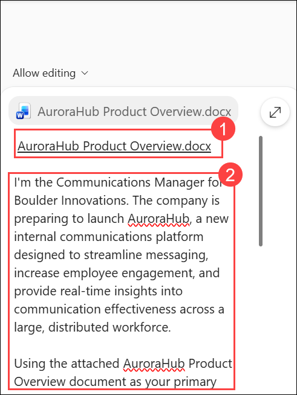

# Exercise 1, Task 1: Use Copilot in Word to develop a strategic communication brief

## Task Overview

As a member of Boulder Innovations' Communications team, you're responsible for developing a strategic communication brief for the executive leadership team. The brief will introduce **AuroraHub**, Boulder Innovations' new internal communications platform, and explain how it supports employee engagement, communication effectiveness, and organizational alignment.

In this task, you'll use **Microsoft 365 Copilot in Word** to create, refine, and enhance a communication brief that aligns with leadership expectations while incorporating communication strategy, change management, and employee adoption planning.

### Objectives

In this task, you will:

* Create a strategic communication brief using Copilot in Word.
* Communicate AuroraHub's purpose, features, and benefits.
* Align messaging with Boulder Innovations' communication and business goals.
* Enhance content organization and readability.
* Develop a change management and adoption strategy.
* Refine the document for executive stakeholders.

## Task 1: Create an initial communication brief

1. Open a new browser tab and navigate to:

   ```text
   https://www.microsoft365.com
   ```

2. Sign in using the credentials provided by your lab environment.

    - **Email/Username**: **<inject key="AzureAdUserEmail"></inject>**

    - **Password**: **<inject key="AzureAdUserPassword"></inject>**

3. In the navigation pane, select **Apps** and then select **Word**.

4. In **Word for the web**, select **Blank document**.

5. On the **Home** tab, select **Copilot**.

6. Verify that **Allow editing** is enabled in the Copilot pane.

7. In the Copilot prompt box, attach the **AuroraHub Product Overview.docx** file from OneDrive.

   

8. Enter the following prompt:

    ```text
    I'm the Communications Manager for Boulder Innovations. The company is preparing to launch AuroraHub, a new internal communications platform designed to streamline messaging, increase employee engagement, and provide real-time insights into communication effectiveness across a large, distributed workforce.

    Using the attached AuroraHub Product Overview document as your primary source, draft a strategic communication brief for Boulder’s executive leadership team. The brief should:

    - Introduce the AuroraHub platform and its purpose
    - Clearly explain its key features and benefits
    - Show how AuroraHub aligns to Boulder Innovations’ strategic goals and values
    - Describe the expected business impact, including engagement, transparency, and communication effectiveness

    Write in a concise, professional tone appropriate for executive stakeholders. Organize the brief with clear headings and short sections, focusing on clarity, relevance, and strategic value rather than technical detail.
    ```

9. Review the communication brief generated by Copilot.

## Task 2: Improve content presentation

1. Review the **Key Features and Benefits** section generated by Copilot.

2. Depending on the format that Copilot created:

   * If the content appears as a bulleted list, ask Copilot to convert it into a table.
   * If the content appears as a table, ask Copilot to convert it into a bulleted list.

3. Review the updated formatting.

4. Ask Copilot to reorganize the **Key Features and Benefits** section into an accordion-style structure using collapsible headings.

   Example prompt:

   ```text
   Reformat the Key Features and Benefits section into expandable and collapsible headings. Under each feature heading, display the related benefits as a bulleted list.
   ```

5. Verify that the feature sections can be expanded and collapsed using Word heading controls.

## Task 3: Add change management and adoption planning

1. Review the communication brief.

2. Notice that the brief doesn't yet address organizational adoption and change management activities.

3. Ask Copilot to add a new section titled:

   ```text
   Change Management & Adoption Strategy
   ```

4. Use a prompt similar to the following:

   ```text
   Add a new section titled "Change Management & Adoption Strategy." Describe how the Communications team will support the rollout of AuroraHub across the organization. Include plans for leadership communications, employee awareness campaigns, onboarding resources, training initiatives, and strategies to encourage adoption and engagement.
   ```

5. Review the newly added section.

## Task 4: Refine the communication brief

1. Ask Copilot to adjust the tone for executive stakeholders.

   Example prompt:

   ```text
   Revise the document using a professional and executive-focused tone suitable for senior leadership.
   ```

2. Review the updated content.

3. To improve readability for busy leaders, ask Copilot to shorten the document.

   Example prompt:

   ```text
   Reduce the length of this communication brief by approximately 20 percent while preserving all key messages and recommendations.
   ```

4. Review the revised document.

## Task 5: Identify and address communication gaps

1. Ask Copilot to evaluate the document from a Communications leadership perspective.

   Example prompt:

   ```text
   Review this strategic communication brief and identify any important information that may be missing or underdeveloped from the perspective of executive stakeholders and communication leaders.
   ```

2. Review the recommendations generated by Copilot.

3. Ask Copilot to incorporate the recommended additions.

   Example prompt:

   ```text
   Add the recommended sections and enhancements using executive-ready language and maintain consistency with the overall communication strategy.
   ```

4. Review the final version of the communication brief.

5. Save the document to your **OneDrive** account.

   > **Note:** You will use this communication brief later in the module when creating an executive presentation with Microsoft 365 Copilot in PowerPoint.

6. Close the Word document and proceed to the next task.

### Result

You have successfully used Microsoft 365 Copilot in Word to create and refine a strategic communication brief for AuroraHub. The document now includes executive messaging, platform benefits, business value, stakeholder-focused communication strategies, and a comprehensive change management and adoption plan.
