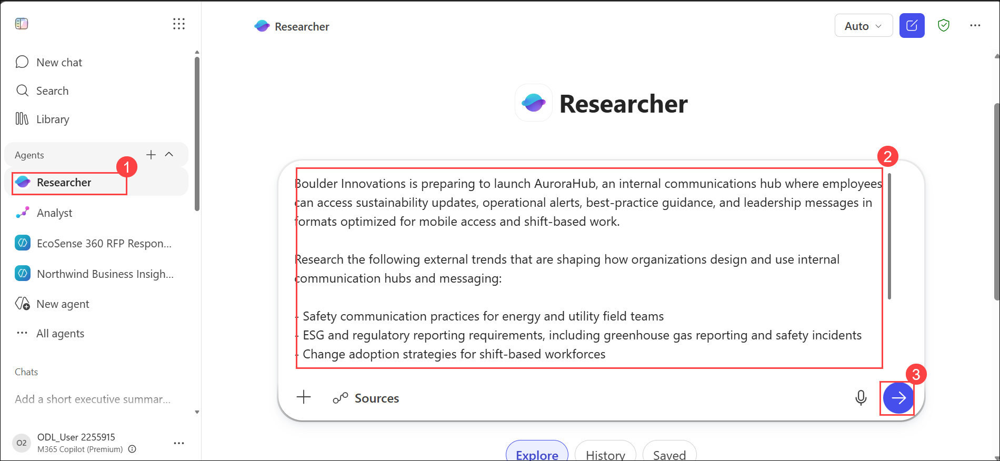
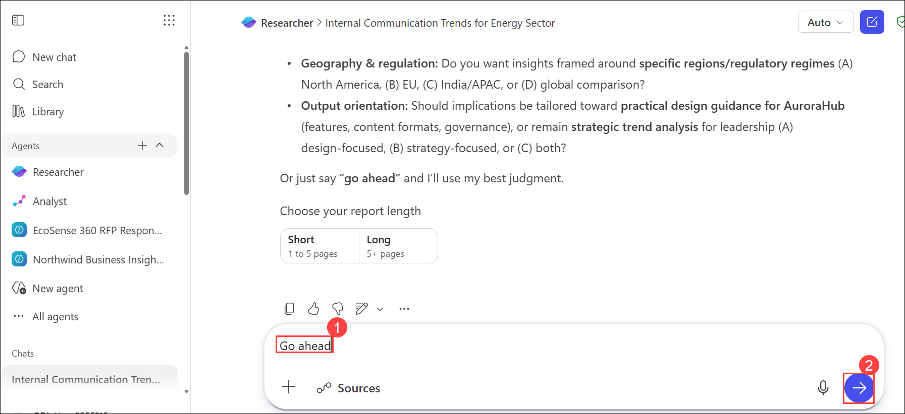
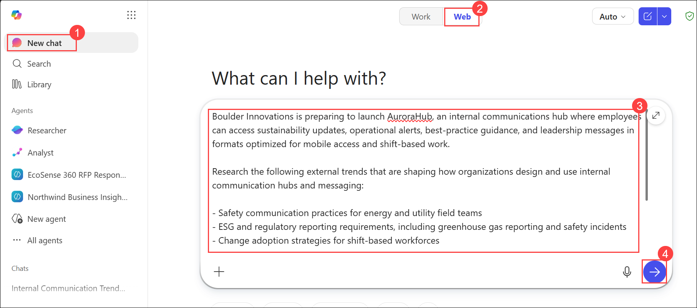

# Exercise 1, Task 2: Use Copilot’s Researcher Agent to Identify External Trends and Proof Points

## Task Overview

As Boulder Innovations prepares to launch **AuroraHub**, executive stakeholders want assurance that the platform and its communication strategy align with current industry practices and emerging workforce expectations. To strengthen the credibility of the communication strategy, the Communications team must supplement internal information with external research and industry insights.

In this task, you'll use the **Researcher agent** in Microsoft 365 Copilot to investigate communication, engagement, compliance, and workforce trends affecting organizations with distributed and shift-based employees. The findings will help validate AuroraHub's positioning, strengthen executive messaging, and provide evidence-based recommendations for communication planning.

### Objectives

In this task, you will:

* Use the Researcher agent to investigate external communication and workforce trends.
* Compare the capabilities of the Researcher agent and Copilot Chat.
* Identify communication best practices relevant to distributed workforces.
* Evaluate compliance-sensitive communication topics.
* Generate executive-ready research summaries.
* Create supporting materials for use in later presentation development activities.

## Task 1: Research external communication trends

1. In your Microsoft Edge browser, navigate to:

   ```text
   https://www.microsoft365.com
   ```

2. Sign in using the credentials provided by your lab environment.

    - **Email/Username**: **<inject key="AzureAdUserEmail"></inject>**

    - **Password**: **<inject key="AzureAdUserPassword"></inject>**

3. In the navigation pane, locate and select the **Researcher (1)** agent.

   

4. In the prompt(2) field, enter a request similar to the following:

   ```text
   Boulder Innovations is preparing to launch AuroraHub, an internal communications hub where employees can access sustainability updates, operational alerts, best-practice guidance, and leadership messages in formats optimized for mobile access and shift-based work.

   Research the following external trends that are shaping how organizations design and use internal communication hubs and messaging:

   - Safety communication practices for energy and utility field teams
   - ESG and regulatory reporting requirements, including greenhouse gas reporting and safety incidents
   - Change adoption strategies for shift-based workforces
   - Mobile access and low-bandwidth communication considerations
   - Crisis and incident communication patterns
   - Employee sentiment drivers in the energy sector

   Provide insights, emerging trends, best practices, and implications for internal communications teams.
   ```

5. Submit the prompt.

6. When prompted, enter:

   ```text
   Go ahead
   ```
   
   
7. Wait while the Researcher agent gathers and analyzes information.


## Task 2: Compare Researcher and Copilot Chat

1. Open a new browser tab.

2. Return to the Microsoft 365 home page.

3. Open **Copilot Chat**.

4. Select the **Web** mode option.

   

5. Enter the same prompt used with the Researcher agent.

6. Submit the request.

7. Review the response generated by Copilot Chat.

8. Compare the output generated by both experiences.

### Observe the differences

| Researcher Agent                      | Copilot Chat                                       |
| ------------------------------------- | -------------------------------------------------- |
| Produces detailed analysis            | Produces concise summaries                         |
| Explores trends in depth              | Focuses on quick explanations                      |
| Identifies implications and risks     | Focuses on informational responses                 |
| Provides structured research findings | Provides rapid synthesis                           |
| Better suited for strategic planning  | Better suited for brainstorming and quick research |

> **Note:** Communications professionals can use both tools effectively, depending on whether they need rapid answers or comprehensive research and analysis.

9. Close the Copilot Chat browser tab.

10. Return to the browser tab containing the Researcher agent.

---

## Task 3: Create a Word-based research report

1. Review the detailed findings generated by the Researcher agent.

2. At the end of the report, locate the available output options.

3. Select **Word**.

4. Wait while the Researcher agent generates the document.

5. Select **Open word** to open the document in a new browser tab.

6. Review the generated document.

7. Confirm that the file is automatically saved to your OneDrive.

8. Make note of the document name for future reference.

9. Close the Word tab.

## Task 4: Analyze trend relevance and compliance considerations

1. Return to the Researcher agent.

2. Enter the following prompt:

   ```text
   Score each trend as High, Medium, or Low relevance for AuroraHub and identify any compliance-sensitive topics that should be considered by Communications leadership.
   ```

3. Review the analysis.

4. Identify:

   * High-priority communication trends
   * Regulatory considerations
   * Safety-related communication requirements
   * Employee engagement opportunities
   * Communication risks

## Task 5: Create an executive summary

1. In the Researcher agent, enter the following prompt:

   ```text
   Create a one-page executive synthesis of these findings. Include a section titled "What This Means for AuroraHub" that summarizes the strategic implications and recommendations for Boulder Innovations' Communications team.
   ```

2. Review the summary generated by the Researcher agent.

3. Verify that the summary clearly connects external trends to AuroraHub's communication strategy.

## Task 6: Generate a PDF summary

1. If the Researcher agent displays a suggested prompt to create a PDF summary, select it.

2. If no suggested prompt appears, enter the following request manually:

   ```text
   Create a PDF version of this executive summary.
   ```

3. Wait for the Researcher agent to generate the file.

4. Select the download link when it becomes available.

5. Open the downloaded PDF file.

6. Review the contents of the executive summary.

7. Close the PDF file.

8. Save the PDF summary to your OneDrive or preferred project location.

   > **Note:** You will use this executive summary as supporting research material in a later task when creating an executive presentation with Microsoft 365 Copilot in PowerPoint.

### Result

You successfully used the Researcher agent to gather and analyze external trends related to employee communications, workforce engagement, compliance requirements, and organizational change. The resulting research provides evidence-based insights that strengthen AuroraHub's communication strategy and support executive-level decision making.
