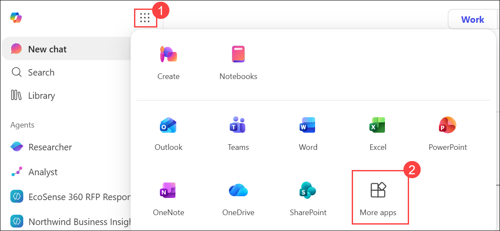
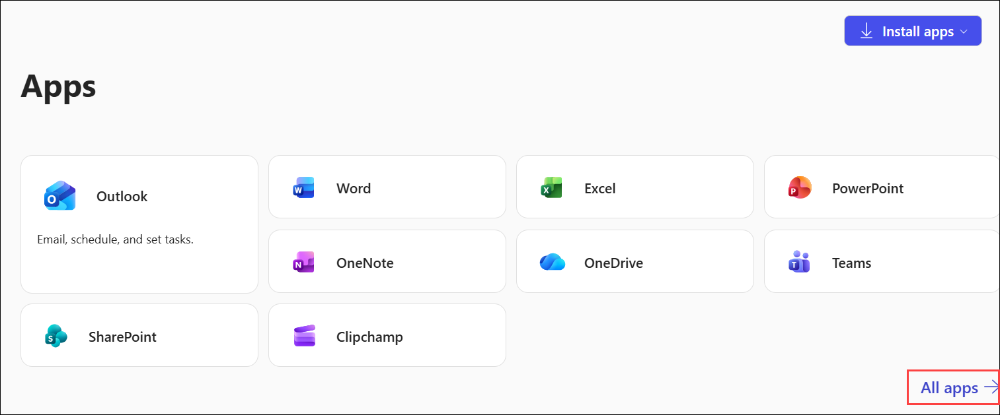
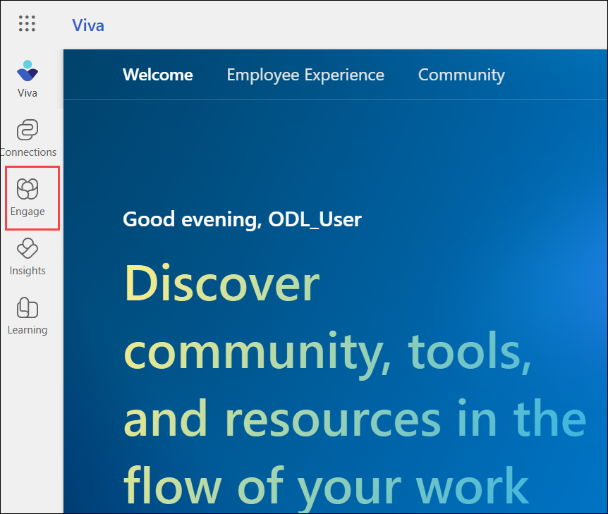
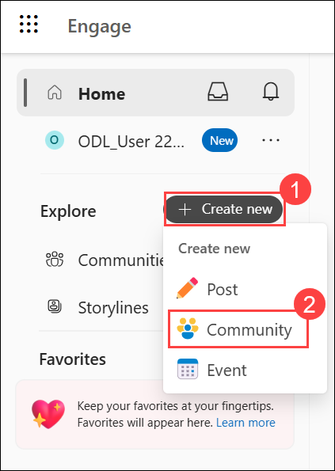
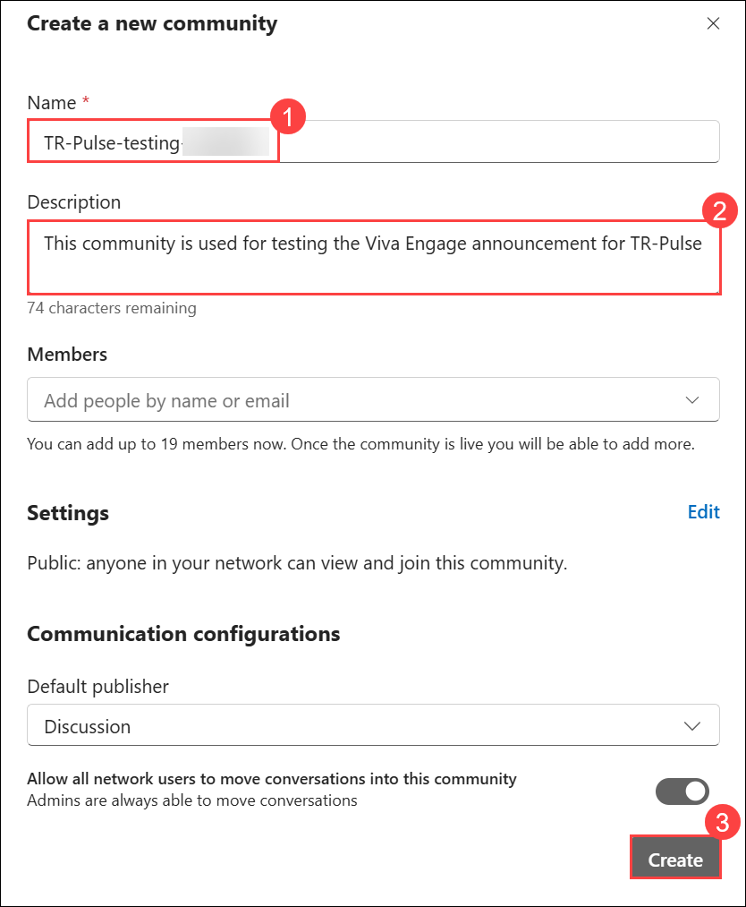
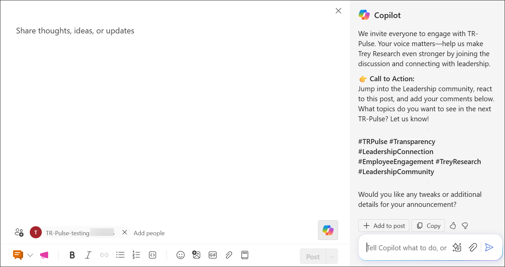
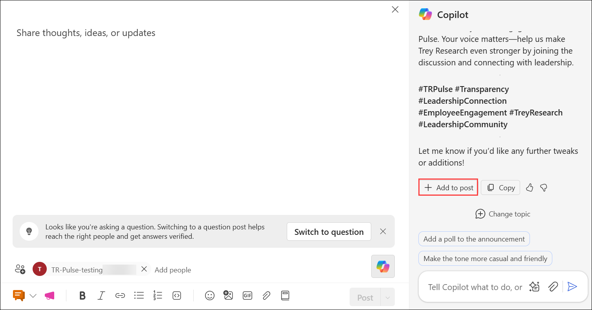
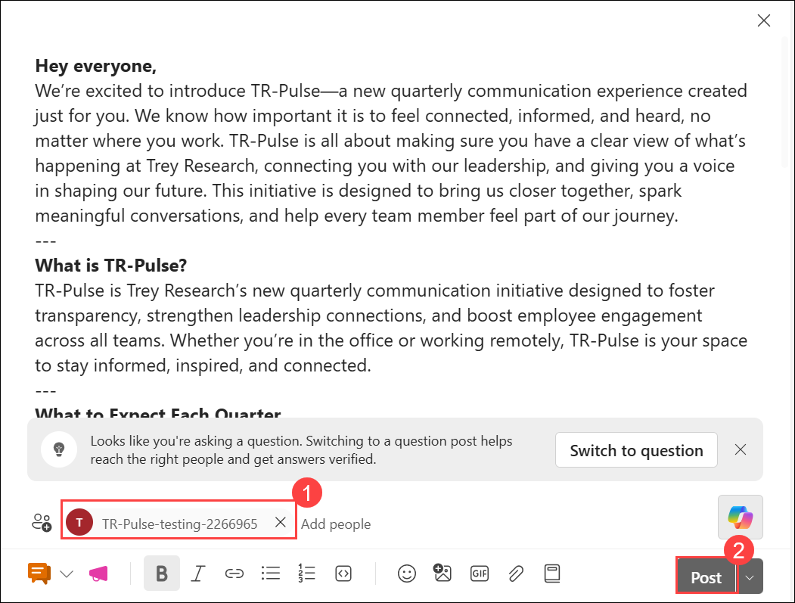

# Exercise 2, Task 1: Use Viva Engage to create a company-wide announcement

## Scenario

Trey Research is preparing to launch **TR-Pulse**, a new quarterly communication program focused on transparency, leadership connection, and employee engagement. Leadership has selected **Viva Engage** as the primary channel for announcing the initiative because it encourages open discussion, employee participation, and two-way communication across the organization.

As the Communications Manager, your goal is to create and publish a compelling announcement that introduces TR-Pulse, explains its purpose, and encourages employees to actively participate in the program.

## Lab Overview

In this lab, you will use Microsoft 365 Copilot in Viva Engage to create and publish a company-wide announcement for the TR-Pulse communication program. You will refine messaging, improve employee engagement and participation, and publish a leadership-aligned announcement that encourages discussion and collaboration across the organization.

### Task 1.1: Open Viva Engage

In this task, you will access Viva Engage from Microsoft 365 and navigate to the Engage experience.

1. In Microsoft Edge browser, navigate to the **Microsoft 365** home page, select **App launcher** in the navigation pane, and then select **More apps**.

     

1. In the **Apps** menu that appears, select **All apps**.

     

1. In the **All apps** window, scroll down and select **Viva**.

2. On the **Viva** home page, select **Engage** in the navigation pane.

    

### Task 1.2: Create a test community

In this task, you will create a dedicated Viva Engage community to test and publish the TR-Pulse announcement.

3. In **Viva Engage**, select **+ Create new (1)** at the top of the **Viva Engage** navigation pane, and then select **Community (2)** in the drop-down menu that appears.

     

3. In the **Create a new community** window, enter the following information:

   * **Name:** **TR-Pulse-testing-<inject key="DeploymentID" enableCopy="false"/> (1)**
   * **Description:** **This community is used for testing the Viva Engage announcement for TR-Pulse (2)**

4. Select **Create (3)**.

    

5. Wait for the new community to be created.

### Task 1.3: Create a new announcement draft

In this task, you will create a new Viva Engage post and open Copilot to assist with content generation.

1. In Viva Engage, select **+ Create new**.

2. Select **Post**.

3. In the post creation window, select the **Copilot** icon to open the Copilot pane.

### Task 1.4: Generate the announcement using Copilot

In this task, you will use Copilot to draft a company-wide announcement introducing the TR-Pulse communication program and encouraging employee participation.

1. In the Copilot pane, enter a prompt requesting a company-wide announcement for the TR-Pulse launch.

   Example prompt:

   ```text
   As the Communications Manager at Trey Research, I’ve been tasked with creating a company-wide launch announcement for an employee community post. Trey Research is introducing TR-Pulse, a new quarterly communication experience focused on transparency, leadership connection, and employee engagement. I plan to publish the announcement in Viva Engage to encourage conversation and visibility across distributed teams.

   Please draft an engaging Viva Engage announcement that:

   - Explains the purpose of TR-Pulse
   - Describes what employees can expect in each quarterly cycle
   - Explains how employees can participate
   - Encourages reactions, comments, and discussion
   - Includes a clear call to action

   Audience: All employees
   Tone: Friendly, transparent, inclusive, and leadership-aligned
   Style: Short paragraphs with clear headings
   Include relevant hashtags and reference the Leadership community.
   ```

2. Review the announcement generated by Copilot.

   

### Task 1.5: Improve the opening message

In this task, you will refine the introduction to make the announcement more personal, engaging, and employee-focused.

1. Review the opening paragraph of the announcement.

2. Ask Copilot to rewrite the introduction so that it feels more personal and employee-focused.

   Example prompt:

   ```text
   Rewrite the opening paragraph to speak directly to employees, explain why this initiative matters to them, and create a more conversational tone.
   ```

3. Review the revised introduction.

### Task 1.6: Improve the call to action

In this task, you will strengthen the call to action by adding clear and accessible ways for employees to participate.

1. Ask Copilot to strengthen the call to action.

   Example prompt:

   ```text
   Improve the call to action by including specific, low-effort ways employees can participate, such as joining the community, attending events, asking questions, reacting to posts, and sharing feedback.
   ```

2. Review the updated call to action.

### Task 1.7: Incorporate the revisions

In this task, you will update the full announcement with the approved improvements and finalize the content.

1. Ask Copilot to rewrite the full announcement using the revised introduction and call to action.

   Example prompt:

   ```text
   Rewrite the entire announcement using the revised opening paragraph and revised call to action while keeping the existing structure and messaging.
   ```

2. Review the updated announcement.

3. If Copilot creates new versions of the opening or call to action instead of using the previously approved versions, ask it to specifically reuse its earlier revisions.

4. Continue refining the announcement until you are satisfied with the content.

### Task 1.8: Add the announcement to the post

In this task, you will insert the finalized announcement into the Viva Engage post editor and review the content.

1. When the announcement is finalized, select **+ Add to post** in the Copilot pane.

   

2. Review the content inserted into the post editor.

3. Remove any extra Copilot-generated text that isn't part of the announcement (for example, explanatory text or prompt references).

### Task 1.9: Publish the announcement

In this task, you will publish the announcement to the TR-Pulse community and verify that it appears successfully in the community feed.

1. Verify that the **TR-Pulse-testing-<inject key="DeploymentID" enableCopy="false"/> (1)** community is selected as the destination.

   > **Note:** If the community isn't selected automatically, choose **Select a community or storyline** and then select **TR-Pulse testing**.

2. Select **Post (2)**.

   

3. Wait for the post to be published.

4. Verify that the announcement appears in the **TR-Pulse testing** community feed.

### Summary

In this task, you used Microsoft 365 Copilot in Viva Engage to:

* Draft a company-wide communication announcement.
* Refine messaging for employee engagement and participation.
* Improve the opening message and call to action.
* Create a more conversational and inclusive communication style.
* Publish the announcement in a Viva Engage community.

The TR-Pulse announcement serves as the starting point for an ongoing conversation between leadership and employees. In the next task, you'll build on this engagement by using Copilot to help prepare leadership discussion topics for the first TR-Pulse town hall.


## You have successfully completed the task. Click on Next >> to proceed with the next exercise.


