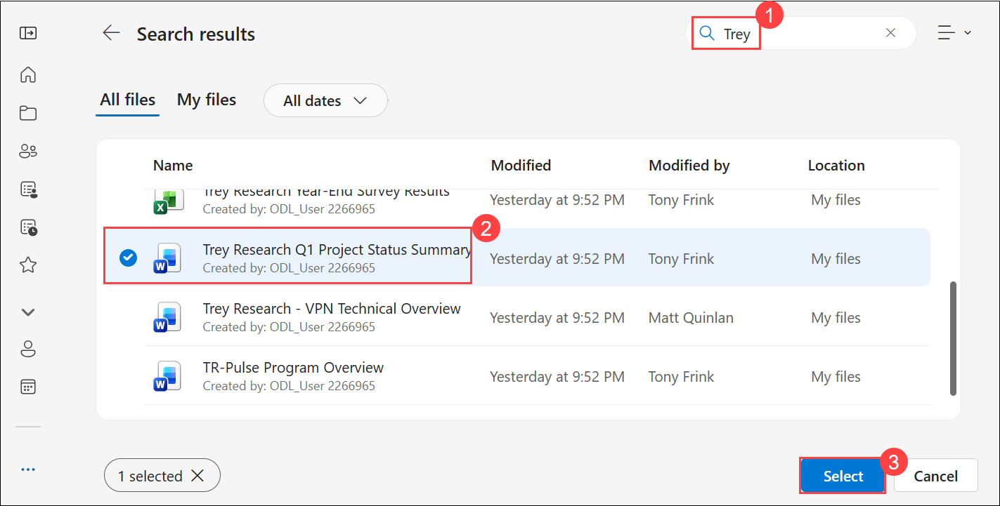
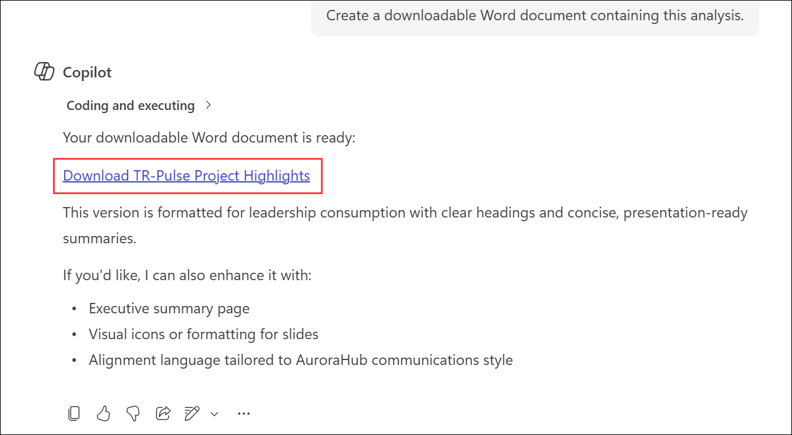
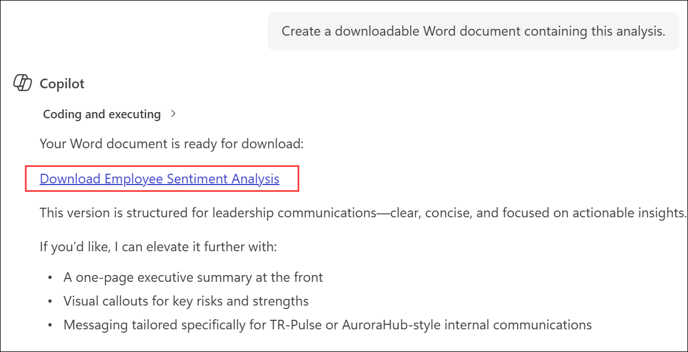
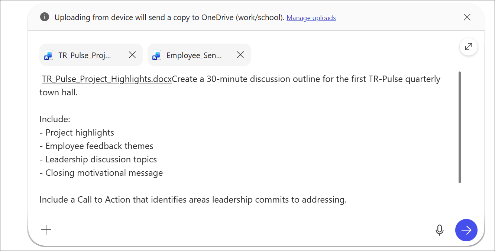
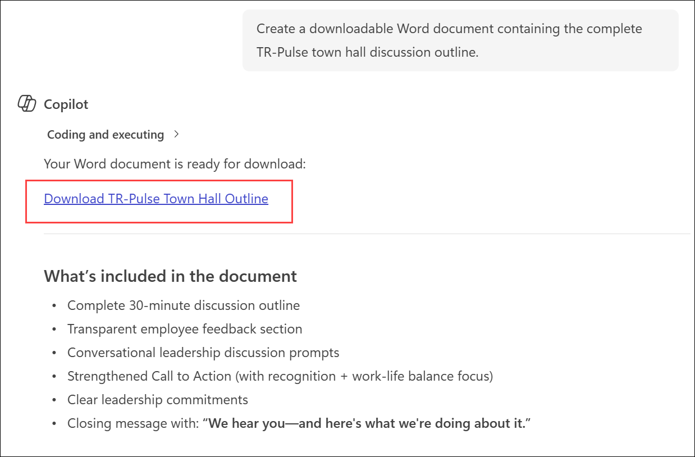

# Exercise 2, Task 2: Use Copilot Chat to prepare for a town hall meeting

## Scenario

Now that the launch announcement for TR-Pulse is live, Trey Research is preparing for its first TR-Pulse quarterly town hall—a cornerstone of the new communication experience. This town hall is designed to bring TR-Pulse to life by giving employees direct visibility into recent progress, leadership priorities, and how employee feedback is shaping next steps.

One of the core promises of TR-Pulse is responsible transparency: sharing what’s working, acknowledging what’s not, and clearly communicating what actions leadership is taking. To deliver on that promise, the Communications team must help executives translate complex project data and candid employee feedback into messaging that feels open, empathetic, and grounded in reality.

As Trey Research’s Communications Manager, your role is to support leadership by preparing employee-centered discussion topics for the TR-Pulse town hall. In this task, you'll use Microsoft 365 Copilot Chat to analyze project updates and employee survey data, generate leadership talking points, and build a discussion outline for the upcoming town hall.

## Lab Overview

In this lab, you will use Microsoft 365 Copilot Chat to analyze project updates and employee survey results, generate leadership insights, and create a discussion outline for the TR-Pulse quarterly town hall. You will refine messaging to improve transparency, engagement, and leadership accountability while producing executive-ready communication materials.

### Task Objectives

In this task, you will:

* Analyze project status updates using Copilot Chat.
* Review employee sentiment survey data.
* Generate leadership-ready summaries and insights.
* Create a structured town hall discussion outline.
* Refine messaging to improve transparency, engagement, and trust.

## Using Copilot Chat

Copilot Chat enables Communications professionals to quickly synthesize information from multiple sources and transform it into actionable communication assets.

In this exercise, you'll use **Work mode** so Copilot can securely access and analyze the files you provide. You'll then use iterative prompting techniques to improve the quality, tone, and transparency of the generated content.

## Task 2: Use Copilot Chat to prepare for a town hall meeting

In this task, you will use Copilot Chat to analyze project status updates and employee sentiment data, generate leadership-focused insights, and create a transparent, employee-centered discussion outline for the TR-Pulse quarterly town hall.

1. In Microsoft Edge browser, navigate to:

    ```
    https://www.microsoft365.com
    ```

1. Open **New Chat** and verify that **Work** mode is selected.

    

1. In the prompt field, click on **+ (1)** and then select **Attach cloud files (2)** that we should see the already files in the onedrive location. 

   

1. On the Onedrive popup wizard, search with **Trey (1)** and select the **Trey Research Q1 Project Status Summary.docx (2)** docuemnts then click on **Select (3)**:

   

7. Enter the following prompt:

    ```text
    Review the attached project status summary and identify the five most important project updates for the upcoming TR-Pulse town hall.

    Prioritize projects based on:
    - Business impact
    - Alignment with company goals such as sustainability, innovation, and efficiency
    - Level of progress
    - Cross-functional visibility

    For each project provide:
    - Project name
    - Industry segment
    - Current status
    - Strategic importance
    - Quantified outcomes or business benefits if available
    - Executive or cross-functional visibility

    Format the results for use in a leadership presentation.
    ```

8. Review the generated analysis.

1. To create a downloadable document, enter the provided prompt in the **Copilot** prompt box.

    ```
    Create a downloadable Word document containing this analysis.
    ```

1. Select the link that Copilot provides to download the document that it generated. Store the document in **OneDrive**.

    

11. Return to Copilot Chat and attach the **Trey Research Year-End Survey Results.xlsx** file.

12. Enter the following prompt:

    ```text
    Review the attached employee survey results and summarize employee sentiment related to transparency, trust, and employee engagement.

    For each category provide:
    - Overall sentiment
    - Key themes and patterns
    - Notable highs and lows
    - Opportunities for leadership improvement

    Conclude with a summary of company-wide morale and any trends that appear across categories.

    Use a tone suitable for leadership communications and provide actionable insights.
    ```

13. Review the results.

1. To create a downloadable document, enter the provided prompt in the **Copilot** prompt box.

   ```
   Create a downloadable Word document containing this analysis.
   ```

1. Select the link that Copilot provides to download the document that it generated. Store the document in **OneDrive**.

    

16. Start a new Copilot Chat conversation.

17. Attach both Word documents that you generated in the previous steps.

18. Enter the following prompt:

    ```text
    Create a 30-minute discussion outline for the first TR-Pulse quarterly town hall.

    Include:
    - Project highlights
    - Employee feedback themes
    - Leadership discussion topics
    - Closing motivational message

    Include a Call to Action that identifies areas leadership commits to addressing.

    Organize the outline in a format suitable for executive presenters.
    ```

    

19. Review the generated outline.

20. To make the content more engaging, enter the following prompt:

    ```text
    Revise the discussion outline using a warm, employee-aware voice.

    Rephrase the discussion topics so they feel more conversational, engaging, and appropriate for a live virtual town hall audience.
    ```

21. Review the revised version.

22. To increase transparency, enter the following prompt:

    ```text
    Increase transparency throughout the discussion outline.

    Call out specific unfavorable survey response percentages where applicable, identify low-performing areas directly, and add a closing statement that says:

    "We hear you—and here's what we're doing about it."

    Ensure leadership commitments are clear and specific.
    ```

23. Review the updated outline.

24. Enter the following prompt:

    ```text
    Update the Call to Action to explicitly acknowledge that leadership recognizes challenges related to employee recognition and work-life balance.

    Explain why these areas are important to morale, productivity, and employee well-being.

    Emphasize leadership's commitment to improving these areas moving forward.
    ```

1. Review the completed TR-Pulse town hall discussion outline.

1. To create a downloadable document, enter the provided prompt in the **Copilot** prompt box.

    ```
    Create a downloadable Word document containing the complete TR-Pulse town hall discussion outline.
    ```

27. Download the generated document and save it to your **OneDrive**.

    

## Summary

In this task, you used Microsoft 365 Copilot Chat to transform project updates and employee feedback into a structured, employee-focused town hall discussion plan. By combining operational progress with employee sentiment, you created communication materials that support transparency, accountability, and leadership engagement—key goals of the TR-Pulse communication program.

You can now use this town hall discussion outline as a foundation for leadership presentations, employee engagement initiatives, and future TR-Pulse communications.


## You have successfully completed the task. Click on Next >> to proceed with the next exercise.

