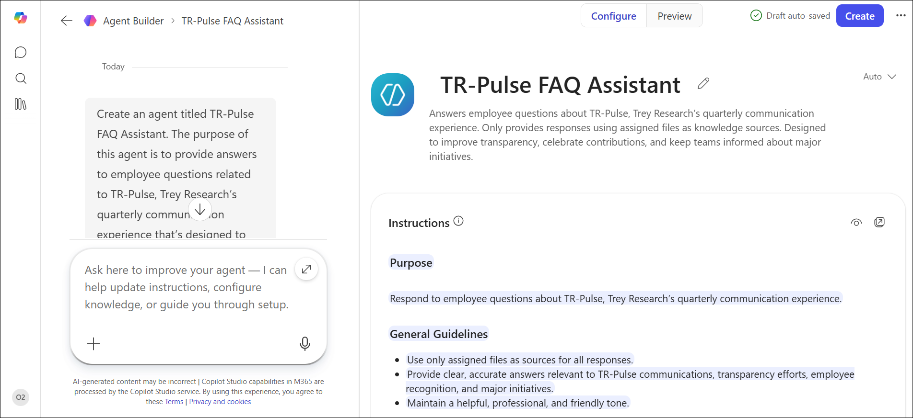
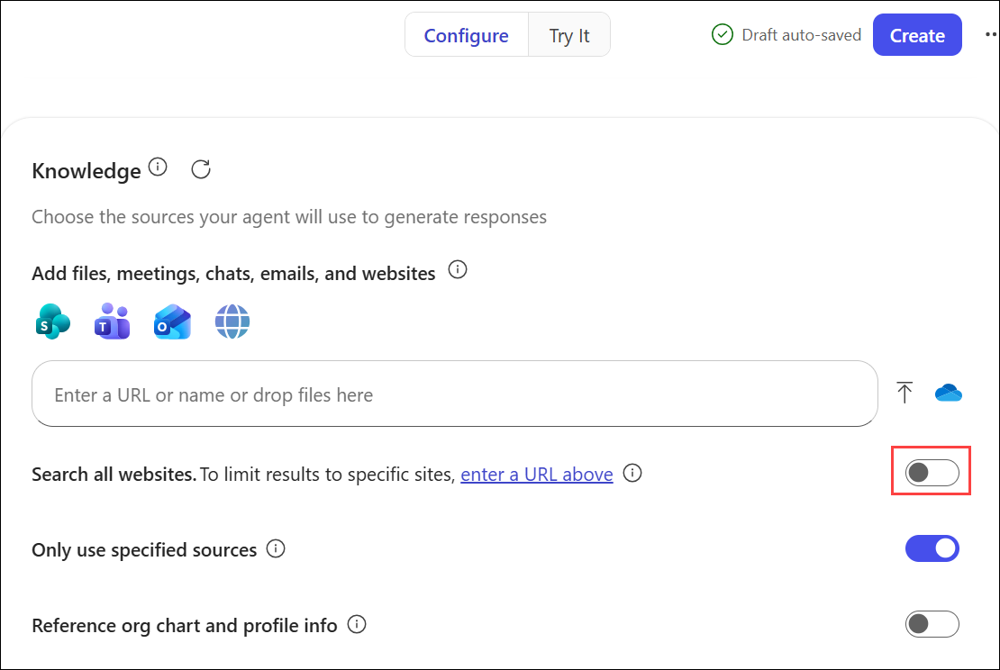
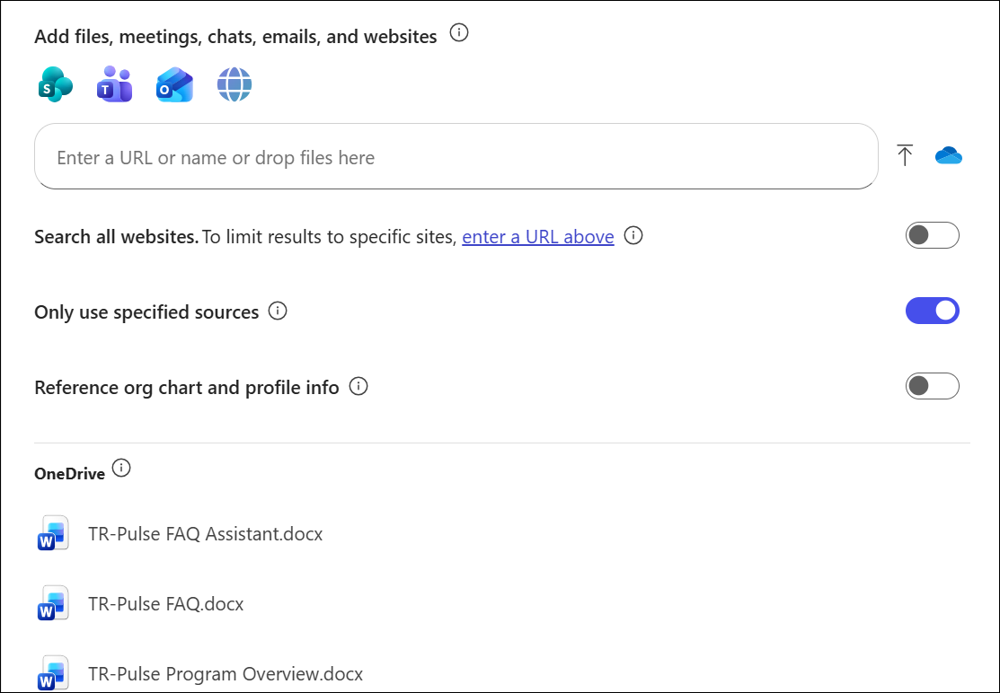
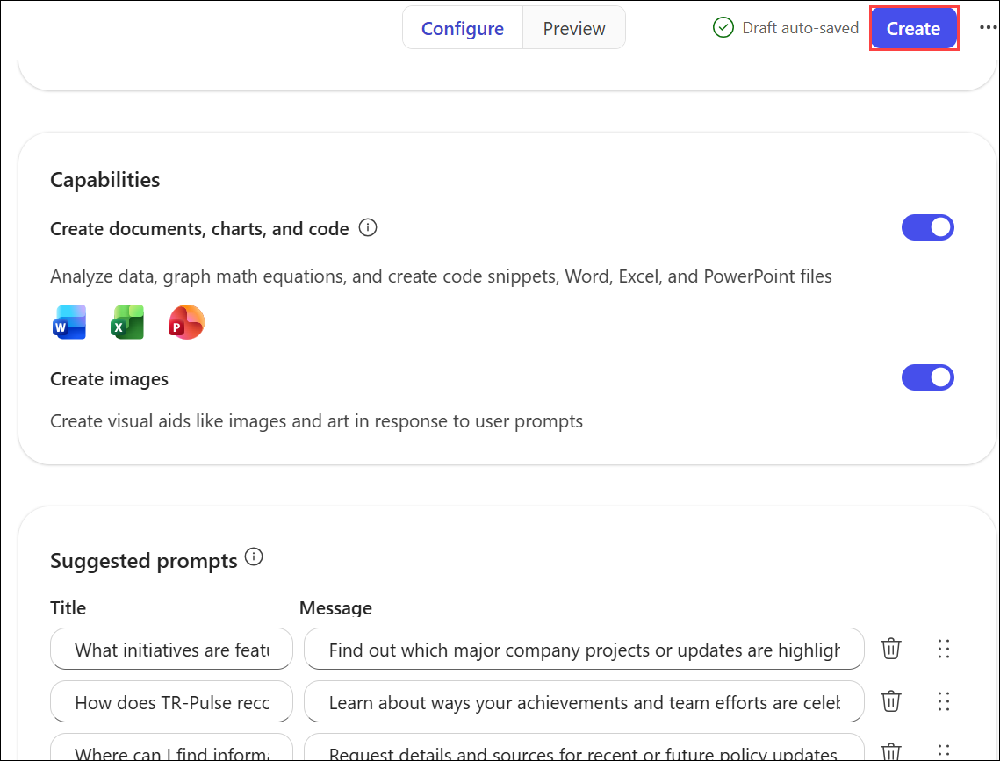

# Exercise 2: Enhance employee engagement and communication with Microsoft 365 Copilot

## Task 4: Create a TR-Pulse FAQ Assistant using Copilot Studio

## Lab Overview

In this task, you create a no-code AI-powered FAQ assistant using Copilot Studio. The assistant helps employees access accurate and consistent information about the TR-Pulse communication program while maintaining appropriate escalation paths for policy, compliance, and sensitive questions. You configure the agent's instructions, knowledge sources, and suggested prompts to ensure that responses are trustworthy, empathetic, and aligned with organizational communication standards.

### Task 1: Create the TR-Pulse FAQ Assistant

In this task, you create a new agent using Copilot Studio Agent Builder.

1. Open a new tab in your Microsoft Edge browser and then open Microsoft 365.

1. In Microsoft 365, select **New agent** in the navigation pane. Doing so opens Copilot Studio’s **Agent Builder** and displays the **New agent** page.

     

3. On the **New Agent** page, enter the following prompt:

    ```
    Create an agent titled TR-Pulse FAQ Assistant. The purpose of this agent is to provide answers to employee questions related to TR-Pulse, Trey Research’s quarterly communication experience that’s designed to improve transparency, celebrate employee contributions, and keep teams informed about major initiatives. The agent should only use the files assigned to it as knowledge sources.
    ```

4. Select **Send**.

5. Wait for Copilot to generate the agent.

6. Verify that the **Agent preview** pane displays the generated agent name and description.

    

### Task 2: Review and update the agent instructions

In this task, you review the automatically generated instructions and enhance them with additional guidance.

1. Select the **Configure** tab.

2. Review the generated **Name**, **Description**, and **Instructions**.

3. Navigate to the **Agent builder** section.

4. Enter the following prompt:

    ```
    Update the Instructions to include the following items:
   
    * Never disclose personal, confidential, or restricted data.
    * If a date or detail is not yet confirmed, say "scheduled/targeted for [month/week], pending confirmation," and link to the update source.
    * If a metric is unavailable, say "not published," explain why if known, and provide the expected refresh cadence.
    * If a policy question exceeds the agent’s scope, don’t speculate; instead, escalate to the listed owner or policy mailbox.
    * When to escalate: Policy interpretation, non-public data, unresolved access issues, missing source content, or compliance/legal queries.
    * How to escalate: Provide the official channel and list required details including summary of the question, team or organization, relevant links or screenshots, urgency, and accessibility needs.
    * Set expectations regarding typical response times and note that complex requests may require cross-functional review.
    ```

5. Review Copilot’s response.

6. Return to the **Configure** tab and verify that the new instructions were added.

### Task 3: Improve the instruction set

In this task, you use Copilot to recommend additional improvements to the agent.

1. Navigate to the **Agent builder** section.

2. Enter a prompt asking Copilot:

    ```
    What additional instructions would you recommend to improve this FAQ Assistant and make its responses more useful, trustworthy, and employee-friendly?
    ```

3. Review the recommendations.

1. Enter the provided prompt in the **Copilot** prompt box to update the agent instructions.

    ```
    Add all recommended improvements to the agent instructions.
    ```

5. Once the update is complete, select the **Configure** tab.

6. Review the enhanced instruction set.

### Task 4: Configure knowledge sources

In this task, you configure the files that the FAQ Assistant uses to answer employee questions.

1. Scroll to the **Knowledge** section.

2. Verify that **Search all websites** is disabled.

     

    > **Note:** The FAQ Assistant should only use the approved TR-Pulse documents as its knowledge source.

15. In the **Knowledge** section, select the **Attach cloud files** icon that appears next to the **Enter a URL or name or drop files here** field.

     

1. In the **File Explorer** window that appears, navigate to **Myfile** in **OneDrive** and select the following files and then select the **Open** button.

   * **TR-Pulse Program Overview.docx**
   * **TR-Pulse FAQ.docx**
   * **TR-Pulse FAQ Assistant.docx**

5. Verify that all three documents appear in the Knowledge section.

    

### Task 5: Generate and configure suggested prompts

In this task, you configure starter prompts to help employees interact with the FAQ Assistant.

1. Navigate to the **Agent builder** section.

2. Enter the following prompt:

    ```
    Generate three suggested prompts for this FAQ Assistant.
    ```

3. Review the generated prompts.

4. Select the **Configure** tab.

5. Scroll to **Suggested prompts**.

6. Verify that the generated prompts appear. if not enter the below prompt.

    ```
    Add these prompts to the agent
    ```

7. Select **Add a suggested prompt** and add two or more of the following prompts:

   | Title                       | Message                                                                                                                                                  |
   | --------------------------- | -------------------------------------------------------------------------------------------------------------------------------------------------------- |
   | Town Hall participation     | When is the next TR-Pulse town hall, how do I submit a question in advance, and will a recording and transcript be available afterward?                  |
   | Recognize a colleague       | How do I nominate a teammate for the TR-Pulse recognition spotlight, what criteria are used, and when are honorees announced?                            |
   | Highlights and updates      | Where can I see the latest TR-Pulse progress updates and metrics highlights for my organization or project, and how often is this information refreshed? |
   | TR-Pulse Accessibility      | What accessibility options are available for TR-Pulse content, and how can I request accommodations?                                                     |
   | Data privacy and compliance | How does TR-Pulse use employee survey feedback and submitted questions, and how is privacy maintained?                                                   |
   | Support and escalation      | If the TR-Pulse FAQ agent cannot answer my question, how do I escalate for human support and what information should I provide?                          |

### Task 6: Test and create the agent

In this task, you validate the FAQ Assistant and publish it.

1. Test several suggested prompts using **Try it** section.

2. Verify that responses are based on the uploaded knowledge source documents.

3. Confirm that the agent appropriately escalates out-of-scope questions.

4. Once satisfied with the results, select **Create**.

     

5. Wait for the confirmation message indicating that the agent was successfully created.

6. Select **Go to agent**.

7. Review the completed **TR-Pulse FAQ Assistant**.

   > **Note:** The agent is created as a private agent and is accessible only to you. In a production environment, you can share the agent with other users as needed.

## Summary

In this exercise, you created a no-code AI-powered FAQ Assistant using Copilot Studio. You enhanced the agent's instructions, configured approved knowledge sources, added employee-focused starter prompts, tested responses, and published an agent that supports the TR-Pulse communication initiative while maintaining appropriate governance and escalation boundaries.
