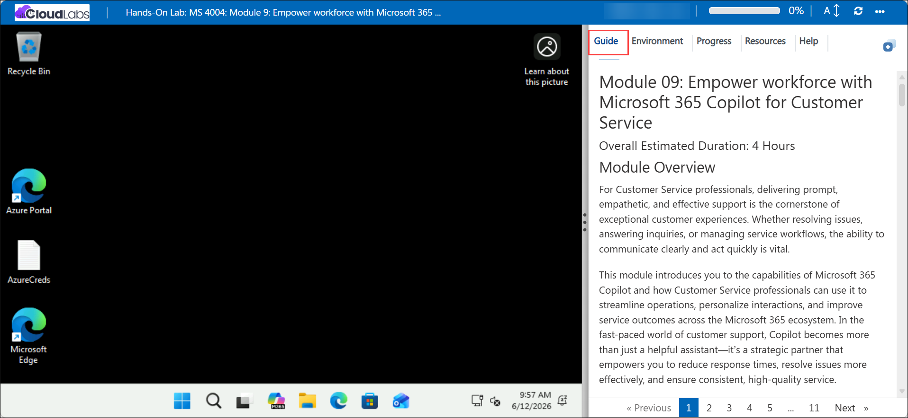
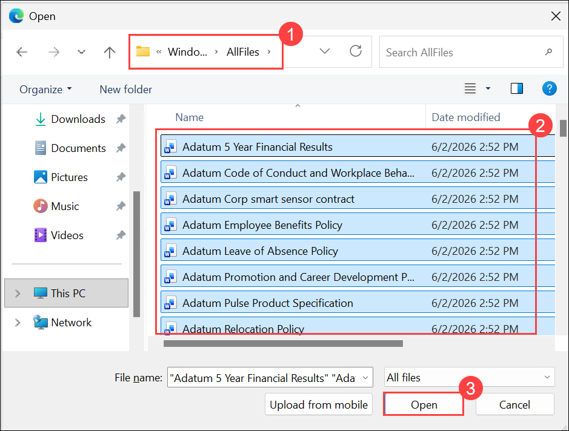

# Module 09: Empower workforce with Microsoft 365 Copilot for Customer Service

### Overall Estimated Duration: 4 Hours

## Lab Overview

For Customer Service professionals, delivering prompt, empathetic, and effective support is the cornerstone of exceptional customer experiences. Whether resolving issues, answering inquiries, or managing service workflows, the ability to communicate clearly and act quickly is vital.

This module introduces you to the capabilities of Microsoft 365 Copilot and how Customer Service professionals can use it to streamline operations, personalize interactions, and improve service outcomes across the Microsoft 365 ecosystem. In the fast-paced world of customer support, Copilot becomes more than just a helpful assistant—it’s a strategic partner that empowers you to reduce response times, resolve issues more effectively, and ensure consistent, high-quality service. 

This module equips Customer Service professionals with practical tools and techniques to help you deliver outstanding support experiences. As a professional in Customer Service, your ability to effectively use Microsoft 365 Copilot is key to:

- **Improving response quality and speed**. Copilot can help you draft clear, professional replies to customer emails. For example, it can analyze previous interactions and suggest personalized responses that match the customer’s tone and history.

- **Streamlining ticket management**. Copilot supports efficient issue tracking and documentation. For example, it can help summarize cases, autofill forms, or generate follow-up actions based on customer interactions.

- **Creating and maintaining support content**. Copilot enables faster creation of internal and customer-facing documentation. For example, it can help in drafting FAQs, step-by-step guides, or product troubleshooting articles directly in Word or Loop.

- **Enhancing team collaboration**. Copilot keeps teams aligned and informed. For example, it can summarize chats and meetings in Teams, generate task lists, and track progress on escalated issues or service improvement plans.

Microsoft 365 Copilot acts as a smart, AI-powered assistant designed to help you stay proactive, organized, and responsive. This module enables you to harness the power of Copilot to elevate customer satisfaction, streamline operations, and become a more agile and empowered Customer Service professional.

## Copilot prompting

One of the primary keys to effectively using Copilot is the quality of your Copilot prompts. A good Copilot prompt is built around the following four key elements that make your request clear, actionable, and tailored for the best results:

- **Goal**. Clearly state what you want Copilot to do. For example: “Generate three to five bullet points summarizing the latest project updates.”

- **Context**. Provide background information so Copilot understands why you need this request and who or what is involved. For example: “Prepare these bullet points for a meeting with Client X about their ‘Phase 3+’ brand campaign.”

- **Sources**. Specify where Copilot should look for information (documents, emails, Teams chats, and so on). For example: “Focus on emails and Teams chats since June.”

- **Expectations**. Define how you want the response delivered—tone, style, or level of detail. For example: “Use simple language so I can get up to speed quickly” or “Explain it as if I were a pirate.”


Keep these four elements front and center as you practice creating prompts—they’re the foundation for getting clear, accurate, and useful results from Copilot. Implementing these elements as you write prompts in these exercises can build real-world skills, so writing effective prompts becomes second nature.

## Prerequisites

To get the most out of this module, you should have:

- A basic understanding of Microsoft 365 applications such as Teams, Outlook, Word, OneNote, and Whiteboard.
- Familiarity with customer service processes, including handling support requests, troubleshooting issues, and communicating with customers.
- Basic experience using Microsoft 365 Copilot prompts.

## Getting Started with the lab

We've prepared a seamless environment for you to explore and learn about **Module 09 - Empower workforce with Microsoft 365 Copilot for Customer Service**. Let's begin by making the most of this experience!

## Accessing Your Lab Environment
 
Once the lab environment is ready, the virtual machine displayed on the left will be your primary workspace for completing the exercises, while the **Guide** on the right side provides step-by-step instructions for each task.



## Exploring Your Lab Resources
 
To get a better understanding of your lab resources and credentials, navigate to the **Environment** tab.
 


## Utilizing the Split Window Feature
 
For convenience, you can open the lab guide in a separate window by selecting the **Split Window** button from the Top right corner.


## Managing Your Virtual Machine
 
Feel free to **Start, Stop, or Restart (2)** your virtual machine as needed from the **Resources (1)** tab. Your experience is in your hands!


## Lab Setup

In this module, we'll create prompts for Microsoft 365 Copilot that reference files. First, let’s upload all required files to OneDrive to ensure they're accessible throughout the lab.

### Uploading Files to OneDrive

Follow the steps below to upload all files needed to **OneDrive**:

1. In the LabVM, open the **Microsoft Edge** browser from the from Desktop.

    

1. In the address bar, enter the following URL to navigate to Microsoft 365  and click on **Sign in**:

    ```
    https://www.microsoft365.com
    ```
1. Enter the following credentials to sign in to Microsoft 365.

    - **Email/Username**: **<inject key="AzureAdUserEmail"></inject>**

    - **Password**: **<inject key="AzureAdUserPassword"></inject>**

1. If prompted to **Stay signed in**, select **Don't show this again** and then **Yes**.

1. In the Microsoft 365 portal, click on the **App launcher  (1)** button and select **OneDrive (2)**.

    

1. In **OneDrive**, in the top-left corner, select **+ Create or upload (1)** > **Files upload (2)**.

    

1. In **File Explorer**, navigate to **`C:\AllFiles` (1)** location and select all the files **(2)** from the folder and click **Open (3)**.

    

1. Wait for all files to finish uploading to **OneDrive**.

1. Leave **Edge** open and move on to the next task.

### Referencing Files in Copilot

When using Copilot, you may find that some files aren’t immediately available in the suggestions. This occurs because certain Copilot experiences only reference files from the **Most Recently Used (MRU)** list, while others let you browse **OneDrive** directly. To ensure a file appears in the **MRU** list, simply open it in the relevant Microsoft 365 app, and it will be added automatically.

> **`Important:`** Microsoft 365 Copilot can only work with files saved to **OneDrive**. Files stored locally on your PC will need to be moved to **OneDrive** for Copilot to access them.

## Support Contact
 
The **CloudLabs support** team is available 24/7, 365 days a year, via email and live chat to ensure seamless assistance at any time. We offer dedicated support channels tailored specifically for both learners and instructors, ensuring that all your needs are promptly and efficiently addressed.
 
Learner Support Contacts:
 
- Email Support: [cloudlabs-support@spektrasystems.com](mailto:cloudlabs-support@spektrasystems.com)
- Live Chat Support: https://cloudlabs.ai/labs-support
 
Click **Next** from the bottom right corner to embark on your Lab journey!

  


