# Exercise 1, Task 1: Use Copilot in Whiteboard to map the ideal customer support journey

## Overview

As the Customer Service Manager at Lamna Healthcare Company, you’re tasked with leading a strategic initiative to design the ideal client support experience. Rather than focusing on documenting the current process, you want to begin with a clean slate. Your goal is to collaboratively envision what a seamless, efficient, and customer-centric support journey should look like from start to finish. Leadership wants to challenge assumptions and break free from legacy workflows that might be contributing to client frustration and internal inefficiencies.

To facilitate this work, you’re using Microsoft 365 Copilot for Whiteboard to lead a highly visual, team-driven planning session. You plan to use Copilot to jumpstart the structure of the ideal clinic support case workflow. Together with your team, your goal is to identify each key stage, assign ownership, highlight potential pain points, and begin layering in improvements. The Whiteboard becomes a shared canvas where cross-functional perspectives can come together in real time, enabling rich conversation and alignment.

By the end of this session, you aim to have a clear, visually engaging journey map that reflects Lamna’s aspirational support model. This artifact should serve not only as a design blueprint for process enhancements but also as a communication tool to align stakeholders and spark broader transformation across the customer service organization.

Perform the following steps to complete this task:

1.  In your Microsoft Edge browser, sign in to the **Microsoft 365** using the URL below: 

    ```
    https://www.microsoft365.com
    ```

1.  In the **Microsoft 365 Copilot Chat** window, click on the **App launcher (1)** button from the left top corner, select **More apps (2)**. From the Apps page, scroll down and select **Whiteboard (3)**.

    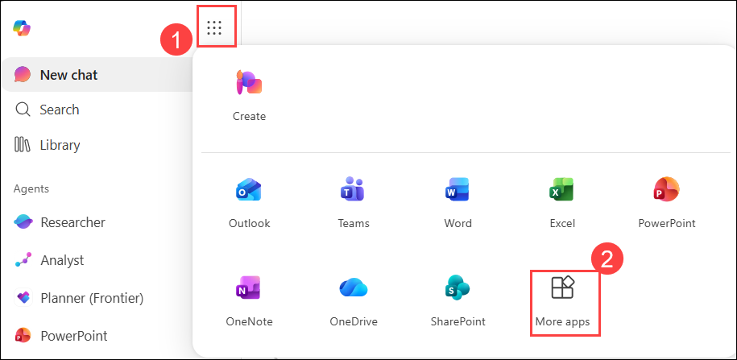

    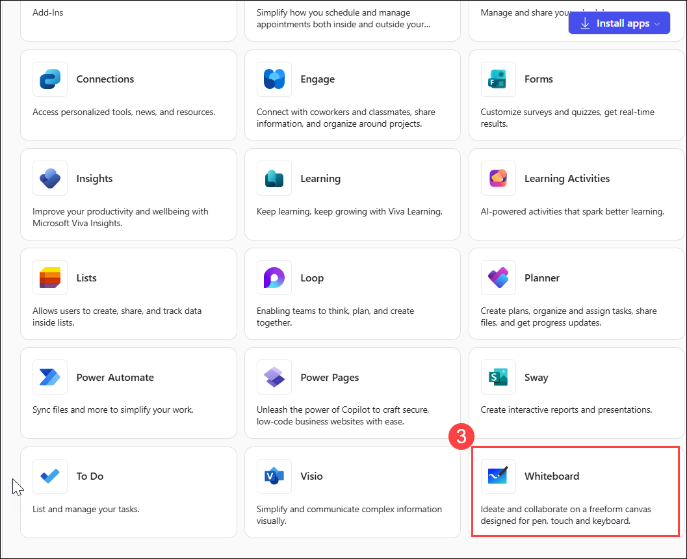

1.  In **Whiteboard**, click on **+ New Whiteboard**.

1.  Click on the Borad name **(1)**, and give the name as **Lamna’s ideal clinic support case workflow.** **(2)**

    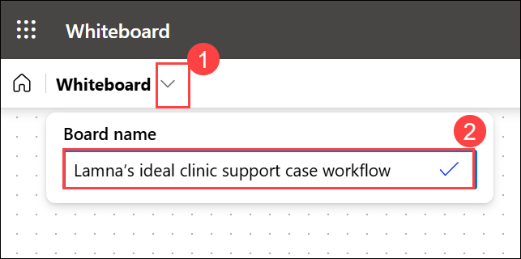

1.  Select the **Copilot** **(1)** icon next to the menu bar at the bottom of the page and then select **Suggest** **(2)** from the menu that appears.

    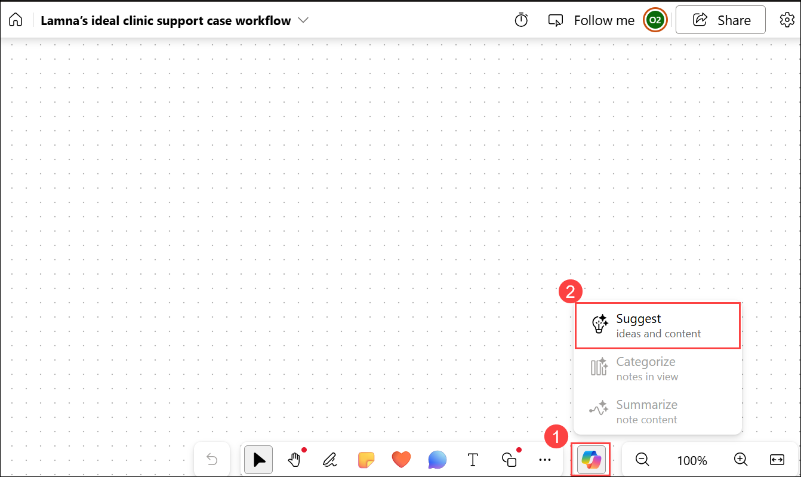

1.  In the **Suggest content with Copilot** window, enter the following prompt **(1)** and click on send button **(2)**.

    ```    
    I’m the Customer Service Manager at Lamna Healthcare Company. Lamna Healthcare Company provides an integrated platform for appointment management, patient scheduling, and clinical workflow, used by clinics and small healthcare groups across the region. Please map out the ideal clinic support case workflow for Lamna. The workflow should cover patient scheduling platform issues, intake, triage, medical-data troubleshooting, escalation paths, support workflow redesign, and so on.
    ```

    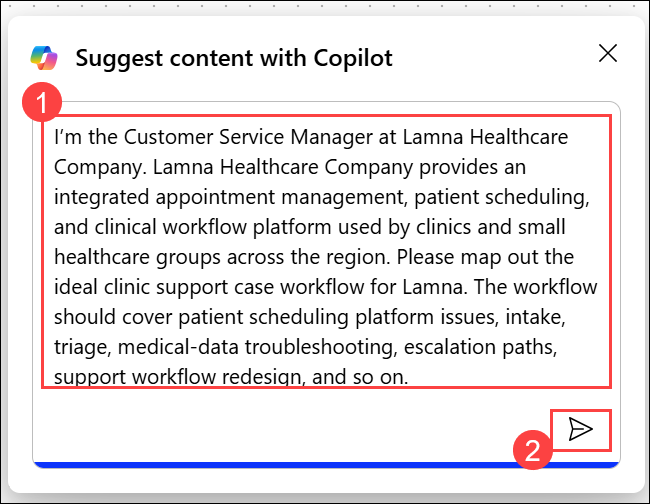    

    > **Note:** For this first prompt, we’ve provided the text to show what an effective prompt looks like when it incorporates the four key elements discussed in the Introduction unit. You must write all remaining prompts in this exercise, but in doing so, you can use this prompt as a model to emulate.

1.  By default, Copilot generates ideas in groups of six. In the **Suggest content with Copilot** window that appears, note the first six ideas that it generated. Copilot gives you two options here - you can either attach the ideas to your whiteboard if you're satisfied with the suggestions, or you can have Copilot generate more suggestions. Notice how the **Insert (6)** button indicates the number of ideas that Copilot generated - in this case, six. 

1. While six suggestions are a good starting point, you want to dig deeper into the tasks that should be included in the ideal support case workflow, so select the **Generate more** button. 

    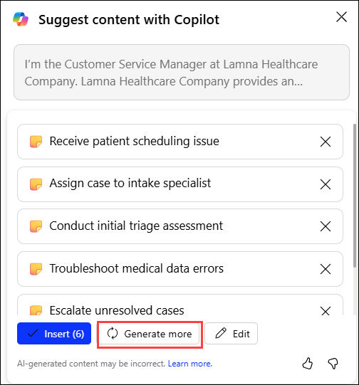   

1. Note how Copilot generated another six ideas, so the **Insert** button now displays **Insert (12)**. Since your prompt suggested an extensive number of workflow tasks, you want to ensure that your list is granular enough. Generate one more group of ideas **(1)**, and then select the **Insert (18)** button **(2)**.

    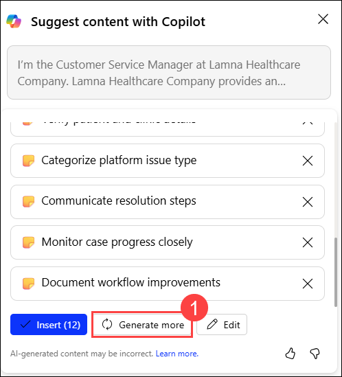 

    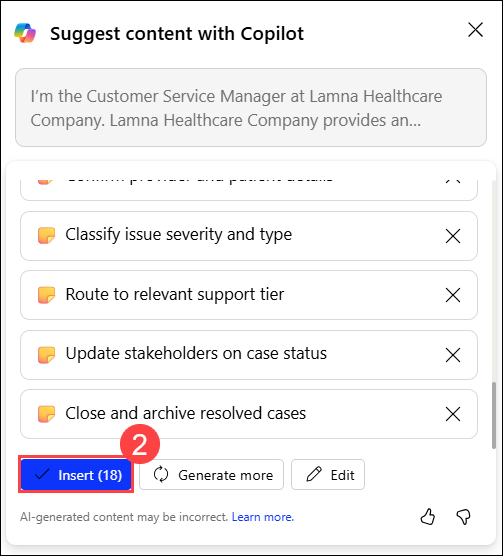 

1.  When you select the **Insert (18)** button, Copilot attaches the suggested ideas to your whiteboard in the form of yellow sticky notes. As with a real-world brainstorming session involving actual sticky notes, you can edit a particular note, delete it, lock it from future removal, and so on. In Microsoft Whiteboard, these activities are supported through standard whiteboarding functionality. 

    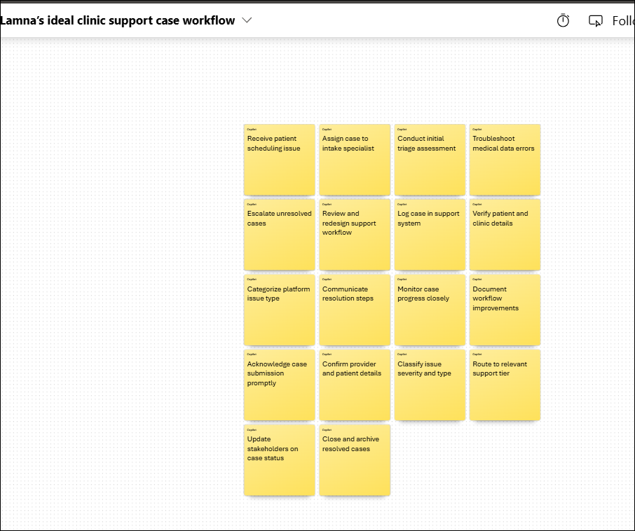 

    > **Information:** If you aren’t familiar with Whiteboard, try selecting a specific note, and then in the menu bar that appears above it, select the **Edit text** (pencil) icon or any of the other options. Selecting the ellipsis icon at the end of the menu bar displays a menu of more options, such as deleting the note. The idea behind Microsoft Whiteboard is to mimic real-world sticky-note exercises. Feel free to edit one or more notes as you wish.

1.  At this point, you should be finished with all the edits that you may want done to the notes. You now want Copilot to organize the notes by category. When you categorize the notes, Copilot determines the names of the categories and automatically organizes the notes accordingly.

1. Do **Ctrl+A** **(1)**, to select all the notes.

1. Note how Copilot selected all the sticky notes, even ones that weren’t currently in view on the canvas. If some of the notes aren’t fully in view on the canvas, select one of the edges of the border and drag the entire selection into the canvas so that all the notes are visible.

1. With all the notes now appearing within view on the canvas, select the **Copilot** **(2)** icon at the bottom of the window and select the **Categorize** **(3)** option in the menu. Doing so displays a **Categorize selected notes** window. Select the **Categorize** **(4)** button that appears in this window.

      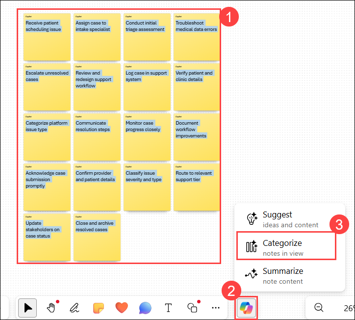 

      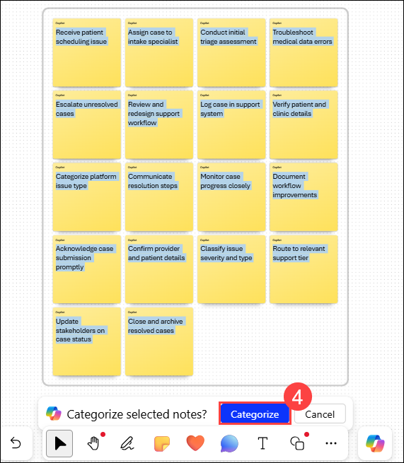 

1. Note what happened. Copilot generated a set of categories and reorganized the notes accordingly. Each category of notes was assigned a different color to help identify the differences between categories. Sometimes the rectangle containing the notes is small and hard to read. If this situation occurs, select the **Fit to Screen** icon in the bottom-right corner of the page. You can select this icon multiple times until the image is large enough to read, but not too large that it exceeds the size of the screen.

1. Note the icon tray that appears below the organized group of notes. If you aren’t satisfied with the categories, select the **Regenerate** button on the icon tray that appears.

      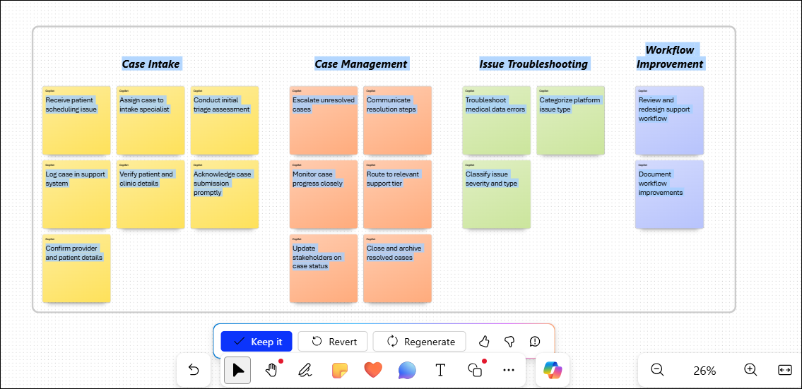 

      > **TIP:** You can select the **Regenerate** button as many times as needed until you're satisfied with the categories that Copilot provides. Select this button several times and note the changes that Copilot makes each time.

   Besides changing category names and relocating notes, Copilot might add or reduce the number of categories with each regeneration.

1. After regenerating the categories several times, you’re not sure which iteration you liked best. While Copilot doesn’t currently support going back to a previous categorization, it does allow you to start over. Select the **Revert** button to return to the starting list of 18 yellow sticky notes.

      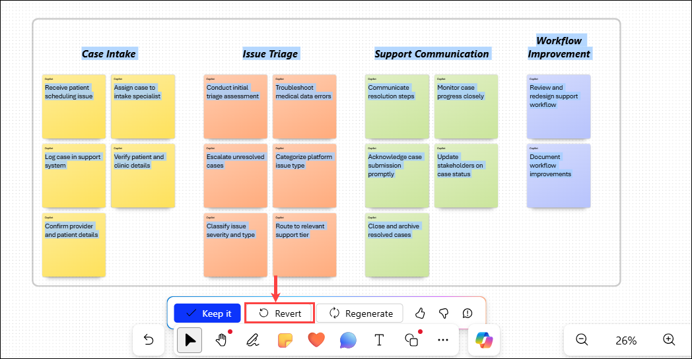 

1. To categorize the sticky notes once again, select the **Copilot** icon at the bottom of the page and then select **Categorize** from the menu. In the **Categorize selected notes?** window, select the **Categorize** button.

1. Now that you know how the **Regenerate** button works, for the sake of time, select it once or twice if necessary until you’re satisfied with the category results.

1. You now decide that you want Copilot to suggest common pain points for each stage in the ideal clinic support case workflow. To do so, select the **Copilot** **(1)** icon at the bottom of the page and then select **Suggest** **(2)** from the menu. In the Suggest content with Copilot window that appears, enter the following prompt: **Suggest common pain points that customers might encounter within each category** **(3)** and click on the Send button.

      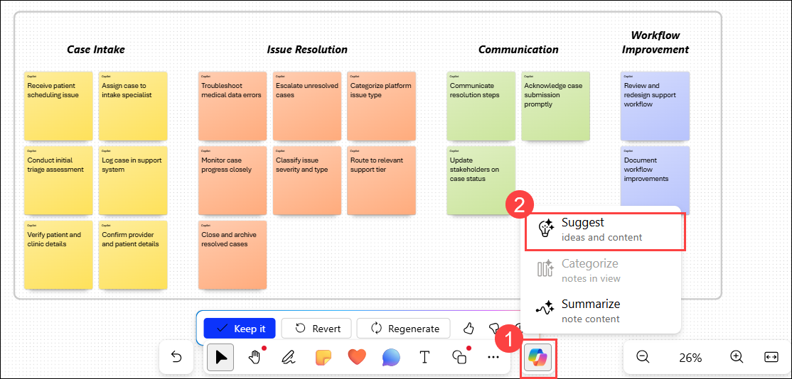 

      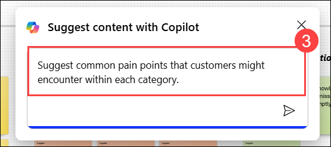

1. In the **Suggest content with Copilot** window that appears, Copilot once again provides six suggestions. You know from experience that there are more pain points than just these items, so select the **Generate more** button. At this point, select the **Insert (12)** button.

      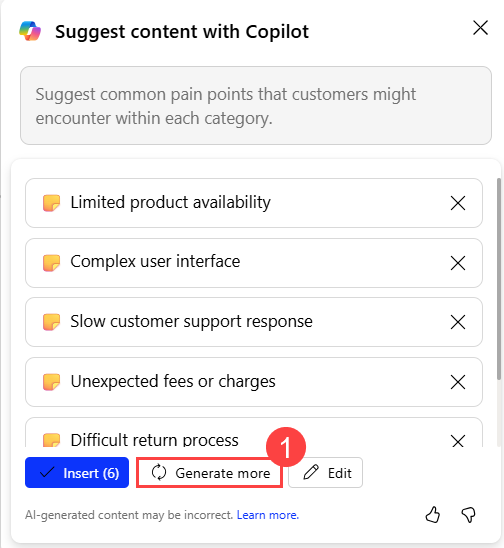 

      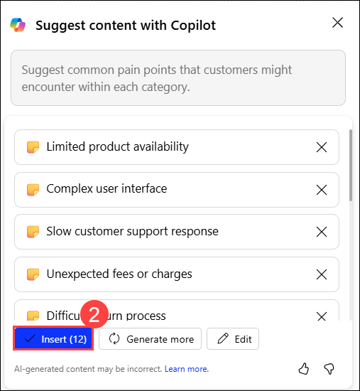

1. Note how the block of 12 pain point notes is highlighted with a line around the block. This block of notes is known as a note grid. You can move or resize a note grid just like any other element on your whiteboard. In this case, the note grid is overlaying on top of the categorized note grid. 

1. Since the pain point grid is selected, move it to the side by selecting the vertical border line and dragging and dropping the block so that it’s no longer on top of the categorized note grid. If you run out of space on the screen and part of the block falls off the screen, select the **Fit to Screen** icon on the bottom-right corner of the page (the **Fit to screen** icon appears when a block is partially off the screen). You might need to select the icon more than once to fit the entirety of the content onto the screen.

1. You're happy with the results, so select **Keep it**. And the final result would look something similar to the image below:

      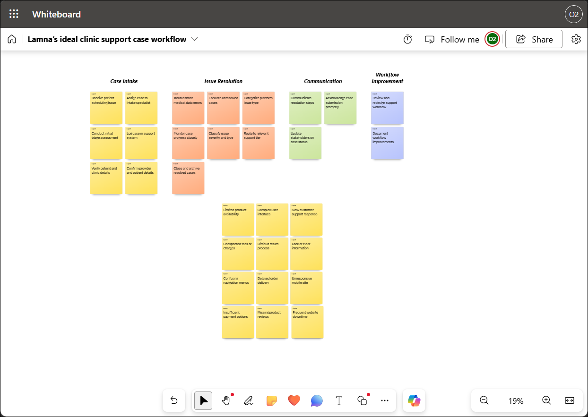

1. You realize that you would like a summary of this session added to your whiteboard content. To do so, select the **Copilot** **(1)** icon at the bottom of the page and then select **Summarize** **(2)** from the menu. Copilot generates a summary of the main themes from this whiteboarding session. Scroll down to review the entire **Summary** window. You're happy with the results, so select **Keep it**.

      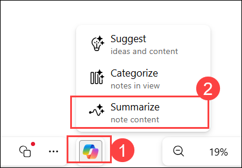

1. If all your whiteboard content doesn’t fit onto the screen, select the **Fit to Screen** icon on the bottom-right corner of the page. You might need to select this icon more than once to fit the content onto the screen. The final result would look something similar to the image:

      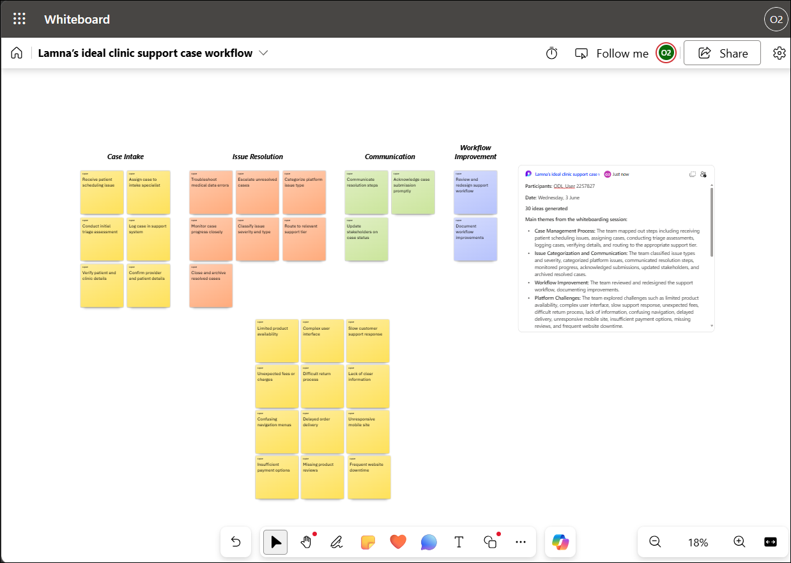

## Summary

In this task, you used Microsoft 365 Copilot in Whiteboard to design an ideal clinic support case workflow for Lamna Healthcare Company. You generated and organized workflow stages, categorized related activities, identified potential customer pain points, and created a concise summary of the session. The resulting whiteboard serves as a visual blueprint for improving customer support processes and aligning stakeholders around a customer-centric service model.
