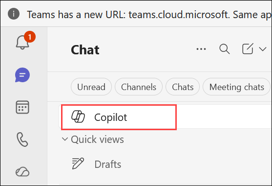
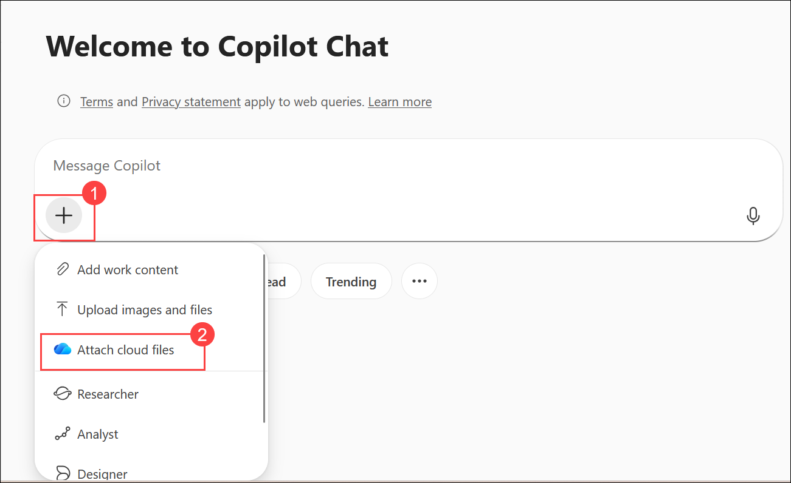
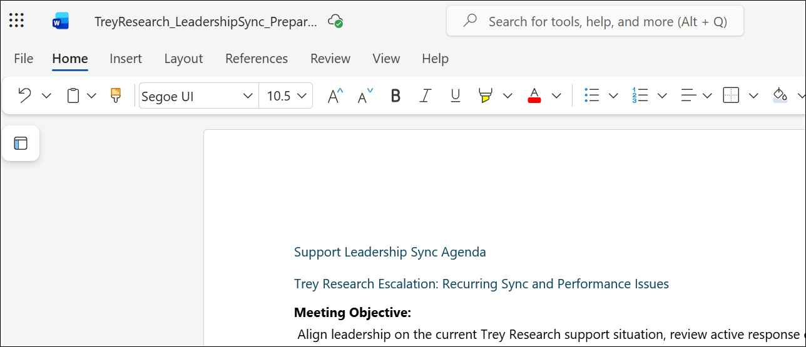

# Exercise 1, Task 2: Use Copilot in Teams to prepare for a client support meeting

## Scenario

As part of Lamna Healthcare Company’s initiative to improve support efficiency, you must prepare for a strategic sync with your Support Leadership team. The topic of discussion is the recent uptick in issues coming from Trey Research, one of Lamna’s oldest and most valuable customers.

Trey Research is a medical research organization that conducts multi‑site clinical studies and patient trials. Their coordinators rely heavily on Lamna Healthcare Company’s scheduling and participant‑tracking platform to manage study visits, monitor participant registrations, and ensure accurate data capture across research sites.

Trey Research's Customer Service department reported a pattern of appointment‑sync failures, intermittent patient‑record delays, and inconsistencies in how its support teams communicate next steps. Before you meet with leadership, you want to assemble a clear understanding of the situation:

- What issues has Trey Research reported?
- What themes or patterns are emerging?
- What actions were taken, and which ones are still unresolved?
- What recommendations should be discussed in the meeting?

In a real-world setting, you would rely on historical emails, chats, support tickets, or meeting notes. However, since the training environment uses your own Microsoft 365 tenant rather than a lab tenant with demo data, there’s no lab data for Copilot to analyze involving Lamna and Trey Research. Therefore, to support this exercise, four realistic scenario files containing sample communications, summaries, and data related to Lamna and Trey Research are provided:

- **TreyResearch_EmailThread.docx**. A short email chain between clinic staff and Lamna support.

- **TreyResearch_MeetingNotes.docx**. Notes from an internal support team discussion on recent Trey Research escalations.

- **TreyResearch_TicketSummary.xlsx**. A small dataset of support tickets with issue types and resolution times.

- **TreyResearch_ChatLog.txt**. A faux chat-log summary of internal troubleshooting discussion.

When you upload these files to your OneDrive, Copilot can analyze them as if they were part of your organization’s data. This alternative lets you learn how a Customer Service Manager can prepare for a meeting using Copilot, without requiring any real tenant messages or personal inbox data.

## Lab Overview

In this lab, you will use Microsoft 365 Copilot in Teams to analyze customer support communications and operational data related to Trey Research. You will identify recurring issues, uncover trends, prioritize business concerns, generate recommended actions, and prepare leadership-ready meeting materials to support informed decision-making and improve customer support outcomes.

## Task 2: Use Copilot in Teams to prepare for a client support meeting

In this task, you will use Microsoft 365 Copilot in Teams to analyze customer communications, support tickets, meeting notes, and troubleshooting discussions related to Trey Research. You will identify recurring issues, uncover trends, prioritize discussion topics, generate recommended actions, and prepare an executive-ready leadership meeting agenda.


1. In Microsoft Edge browser, go to the **Microsoft 365** home page, select the **App launcher (1)** and select **Teams (2)**.

     

3. In **Teams for the web**, select **Copilot** in the left navigation pane. Doing so opens the Microsoft 365 Copilot Chat experience inside Teams.

     

1. In Copilot Chat, select **Add (1)**, and then choose **Attach cloud files (2)** to browse and attach a file from OneDrive.

   

1. In **My files**, select the below files, and then click **Select**.

    - **TreyResearch_EmailThread.docx**
    - **TreyResearch_MeetingNotes.docx**
    - **TreyResearch_TicketSummary.xlsx**
    - **TreyResearch_ChatLog.txt**
    
1. Once the files are uploaded **(1)**, provide the following prompt **(2)** and then click on **Send (3)**:

    ```
    Analyze the attached files and provide a summary of the key issues, recurring themes, trends, customer concerns, and unresolved items reported by Trey Research. Highlight any patterns that appear across multiple files.
    ```

       

5. Review Copilot’s generated summary. Note any performance trends, repeated issues across files, and operational gaps or delays. If Copilot recommends any next steps that it can provide through suggested prompts, feel free to engage with it through those prompts.

6. Next, ask Copilot to list the top three recurring issues affecting Trey Research, based on the files.

    ```
    Based on the attached files, what are the top three recurring issues affecting Trey Research? Explain why each issue is significant and how frequently it appears across the available information.
    ```

7. Once Copilot responds with these issues, then ask it what it feels should be the highest‑priority items for Lamna’s upcoming leadership sync given these top three recurring issues.

    ```
    Given these top three recurring issues, what should be the highest-priority discussion items for Lamna Healthcare Company's upcoming support leadership sync? Explain the business impact of each priority.
    ```

8. To further refine your preparation for the leadership sync. Ask Copilot to provide recommended next steps for each priority item and identify which internal teams should be involved in each action.

    ```
    For each priority item, recommend next steps to address the issue and identify the internal teams or stakeholders that should be involved in implementing the solution.
    ```

9. To transform Copilot’s insights into meeting‑ready content. To do so, ask Copilot to draft a meeting agenda for a support‑leadership sync focused on resolving these Trey Research issues. Ask it to write the agenda in a concise, executive‑friendly format.

    ```
    Create a concise executive-level meeting agenda for a support leadership sync focused on addressing Trey Research's recurring issues, reviewing current actions, discussing unresolved concerns, and planning next steps.
    ```

10. Copy the final summary, action items, and agenda into a Word planning document and save in onedrive.

1. navigate to **Microsoft 365**, select **App launcher** in the navigation pane, and then select **Word** from the **Apps** menu.

4.  In **Word for the web**, click on Create a blank document. 

1. Paste the final summary in the word and rename to  `TreyResearch_LeadershipSync_Preparation`.

     

## Summary

In this task, you used Microsoft 365 Copilot in Teams to analyze customer communications, support tickets, meeting notes, and troubleshooting discussions related to Trey Research. You identified recurring issues, evaluated business priorities, generated recommended actions and stakeholders, and created an executive-ready meeting agenda to support leadership decision-making and improve customer support outcomes.

## You have successfully completed the task. Click on Next >> to proceed with the next exercise.

