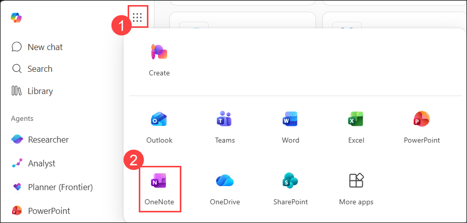
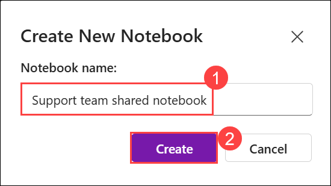
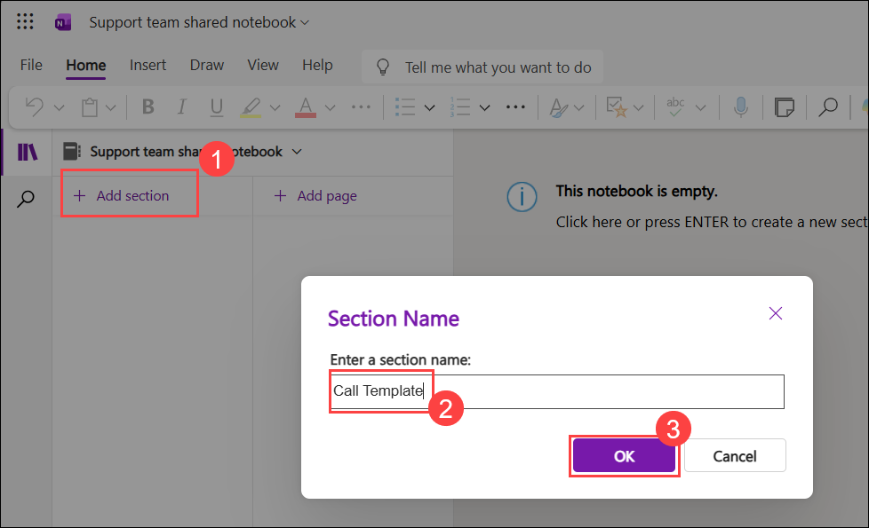
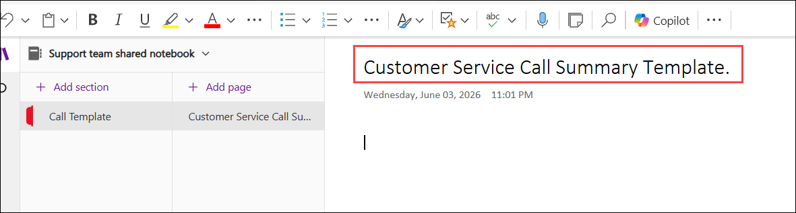
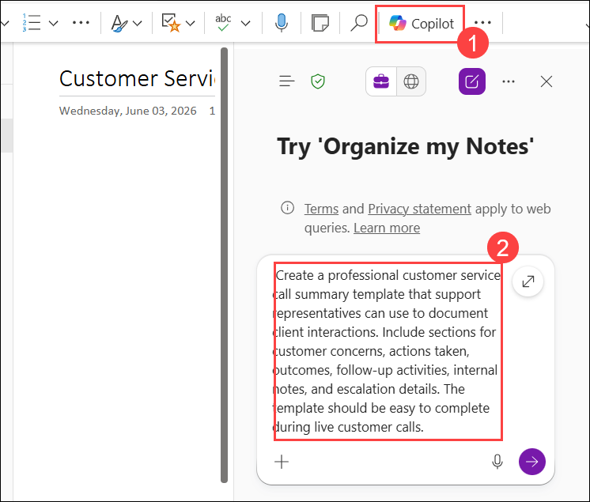

# Exercise 1, Task 3: Use Copilot in OneNote to create a call summary template

## Scenario

As the Customer Service Manager at Lamna Healthcare Company, you're looking to standardize how your team documents customer interactions during calls. Right now, customer support reps are taking notes in various formats, leading to inconsistencies in how client concerns, actions, and follow-ups are tracked. To ensure all critical information is captured efficiently and consistently, you decide to create a standardized call summary template that your team can use for every client interaction. This template should help improve internal communication, provide clarity on next steps, and ensure no critical details are overlooked.

To accomplish this goal, you plan to use Copilot in OneNote to generate a reusable template that captures all the essential elements of each client call, from the initial concern to the resolution and follow-up steps. Copilot can help in creating sections for client details, a summary of the issue, and space for internal notes that don't need to be shared with the client. By ensuring the template is easy to fill out in real time, you can create a tool that saves your team valuable time, helps improve data consistency, and supports quicker responses for future calls. You plan to save this template in a shared notebook, making it accessible to the entire customer support team for use across the board.

## Lab Overview

In this lab, you will use Microsoft 365 Copilot in OneNote to create and refine a standardized customer service call summary template for support teams. You will enhance the template with structured fields, severity classifications, and usability improvements to ensure consistent documentation of customer interactions, resolutions, escalations, and follow-up activities.

## Task 3: Use Copilot in OneNote to create a call summary template

In this task, you will use Microsoft 365 Copilot in OneNote to create a standardized customer service call summary template. You will enhance the template with severity levels, customer interaction fields, and formatting improvements to support consistent documentation, issue tracking, and follow-up management across the support team.

1. In your Microsoft Edge browser, go to the **Microsoft 365** home page, from the **App launcher (1)**, select **OneNote (2)**.

       

      > **Note:** If prompted, sign in with your lab credentials.

1. In **OneNote for the web**, click on **+ Create new Notebook**. 

1. In the **Create New Notebook** dialog, enter **Support team shared notebook (1)** as the notebook name, and then select **Create (2)**.

       

1. In the new notebook, click on **+ Add section (1)**, and give the name as **Call Templates (2)** and click on **Ok (3)**. This section can be used to keep all reusable templates for call documentation in one place, making them easy to find and expand later (for example, different templates for support, sales, or onboarding calls).

       

1. In the **Call Templates** section, verify that there is only one Untitled Page. OneNote automatically creates an Untitled Page when a new section is added, so you can use that page. If you accidentally selected **+ Add page** and created an additional untitled page, right-click the extra page and select Delete Page.

1. At the top of the page, select the area above the horizontal line that appears above the current date and time. In the page title field, enter: **Customer Service Call Summary Template**
      
       

      > **Note:** If you try to copy and paste this name into the heading field, OneNote pastes it into the body of the page, which you don’t want. You must manually type this name in the heading field.

1. On the ribbon at the top of the page, select **Copilot (1)**.

1. In the **Copilot** pane, ask Copilot to create a call summary template for customer service reps to log client concerns, actions taken, and follow-up steps.

    Use the following prompt **(2)**:

    ```
    Create a professional customer service call summary template that support representatives can use to document client interactions. Include sections for customer concerns, actions taken, outcomes, follow-up activities, internal notes, and escalation details. The template should be easy to complete during live customer calls.
    ```

       

1. Note how Copilot displays its generated response in the Copilot detail pane rather than in the OneNote page. You must copy and paste the template into the OneNote page. You can paste it right now if you are satisfied with the response, or you can run the follow-up prompts as per the steps below.

1. Review the contents of the template that Copilot created. While you’re happy with how the template is looking thus far, you want support reps to be able to assign a severity level to the issue. Ask Copilot to add severity tags in the template.

    Use the following prompt:

    ```
    Update the call summary template to include severity levels for support issues. Add severity tags such as Critical, High, Medium, and Low, along with a brief description of when each level should be used.
    ```

1. Upon reviewing the template,  notice that your original prompt was missing some key data. To address this shortcoming, ask Copilot to update the template to include fields for: Client Name, Date, Contact Method, Summary of Issue, Resolution, and Follow-Up Needed.

      Use the following prompt:

      ```
      Update the call summary template to include the following fields: Client Name, Date, Contact Method, Summary of Issue, Resolution, and Follow-Up Needed. Ensure these fields are clearly organized and easy for support representatives to complete during customer calls.
      ```

1. Review the generated response. You’re satisfied with the current template, but you want to ask Copilot how you can improve the layout. Ask Copilot how it can improve the layout to make it visually easy to scan and enable support reps to quickly fill it out during live calls with a customer?

      Use the following prompt:

      ```
      Review this customer service call summary template and recommend improvements to make it visually easy to scan, quick to complete during live calls, and effective for tracking customer issues, actions, and follow-up activities. Suggest formatting enhancements such as tables, sections, headers, or other organizational improvements.
      ```

1. Copilot might respond with formatting improvements, such as tables, headers, bullet points, or color-coded sections. You can accept, reject, or modify the suggestions if you wish.

14. Once you finish updating the template with any other changes, you can copy the final response from Copilot and paste it into the Page.

## Summary

In this task, you used Microsoft 365 Copilot in OneNote to create and refine a standardized customer service call summary template. You generated a reusable template, enhanced it with severity classifications and key customer interaction fields, and reviewed Copilot’s recommendations for improving usability and layout. The completed template provides a consistent framework for documenting customer interactions, tracking resolutions, and managing follow-up activities across the support team.

## You have successfully completed the task. Click on Next >> to proceed with the next exercise.

