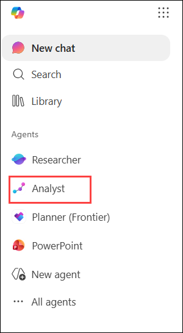
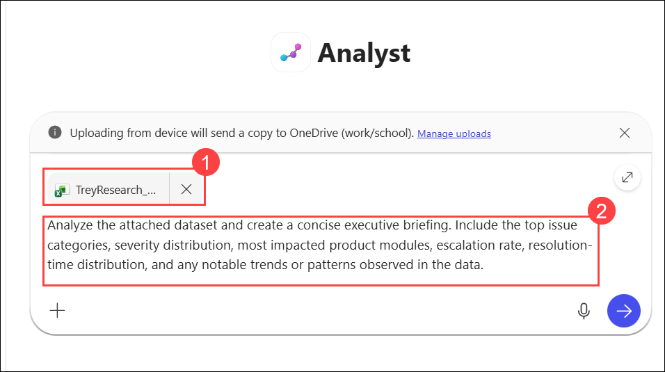
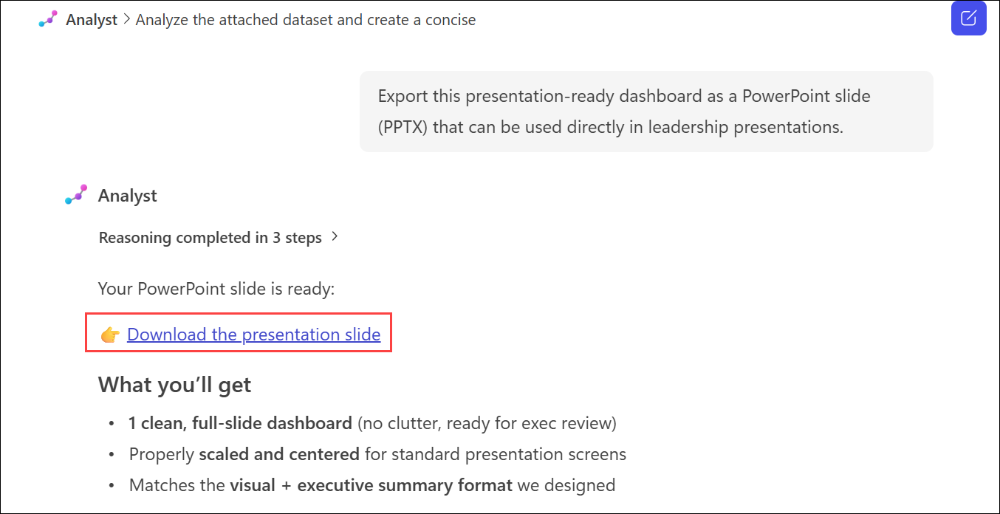

# Exercise 1, Task 4: Use the Copilot Analyst agent to analyze customer support data

## Scenario

Lamna Healthcare Company has been assisting Trey Research, a medical research organization running multi‑site clinical trials. Over the past 90 days, Lamna’s Support team recorded a surge of issues reported by Trey Research—ranging from appointment sync delays and Electronic Health Record (EHR) synchronization update lags to intermittent sync failures and slow module loads in Scheduling and EHR‑Sync components. Lamna’s Leadership team needs clear, data‑driven insight into what’s happening so they can prioritize fixes, coordinate with Engineering and Product, and prevent disruption to trial operations.

As Lamna’s Customer Service Manager, you plan to use Copilot’s Analyst agent to analyze Trey Research’s dataset, identify patterns in Trey Research’s 90‑day case history, and generate the most meaningful visuals.

## Lab Overview

In this lab, you will use the Copilot Analyst agent to analyze customer support data from Trey Research and identify key trends, issue patterns, escalation behavior, and resolution performance. You will generate visualizations, build a leadership dashboard, and create a presentation-ready report to support data-driven service improvement decisions.

## Task 4: Use the Copilot Analyst agent to analyze customer support data

In this task, you will use the Copilot Analyst agent to analyze Trey Research’s customer support dataset, identify trends and correlations, and generate executive insights. You will create visualizations, build a leadership dashboard, and export a presentation-ready PowerPoint slide for stakeholder review.

1. In Microsoft Edge browser, go to the **Microsoft 365** home page and select the **Analyst** agent in the navigation pane.

       

4. In the **Analyst** agent, attach the **TreyResearch_Support_Cases.xlsx** **(1)** spreadsheet. Then ask the agent to analyze the attached dataset and produce a concise briefing that includes: top issue categories, severity mix, modules most impacted, escalation rate, and resolution-time distribution.

    Use the following prompt **(2)**:

    ```
    Analyze the attached dataset and create a concise executive briefing. Include the top issue categories, severity distribution, most impacted product modules, escalation rate, resolution-time distribution, and any notable trends or patterns observed in the data.
    ```

      

1. Review the generated analysis. To perform additional analysis, enter the provided prompt in the **Analyst** agent prompt box.

    Use the following prompt: 

    ```
    Using the attached dataset, analyze the relationship between Severity and escalation rate, and between Module and average resolution hours. Generate the three most effective charts or visuals to communicate these findings and provide a brief explanation of each.
    ```

6. Review the visuals. The agent might provide a suggested prompt asking if you want it to combine the three visuals into one dashboard-style summary image for easy presentation. Select and submit this prompt. If the agent doesn’t display this prompt in your lab, then manually enter this request.

    ```
    Combine the three visuals into a single dashboard-style summary that can be easily shared with leadership. Organize the charts clearly and include descriptive titles for each section.
    ```

7. You really like this one-page summary. If the agent provides a suggested prompt to add annotations and key insights directly on this dashboard, then select and submit this prompt. If the agent doesn’t display this prompt in your lab, then manually enter this request.

    ```
    Add annotations and key insights directly to the dashboard. Highlight important trends, significant correlations, operational risks, and recommended focus areas that leadership should review.
    ```

8. Review the updated summary that includes the annotations and key insights. If the agent provides a suggested prompt to create a presentation-ready version with a summary text panel alongside the charts, then select and submit this prompt. If the agent doesn’t display this prompt in your lab, then manually enter this request.

    ```
    Create a presentation-ready version of the dashboard that includes a concise executive summary panel alongside the charts. Ensure the content is suitable for a leadership review meeting and focuses on actionable insights.
    ```

9. After the agent generates this presentation-ready version, it might ask if you want it to export this image as a PowerPoint slide (PPTX) for direct use in presentations. If you get a suggested prompt with this question, then select and submit it. Otherwise, manually enter this request.

    ```
    Export this presentation-ready dashboard as a PowerPoint slide (PPTX) that can be used directly in leadership presentations.
    ```

10. Select the link the agent provided to download the generated slide. Open the file once the download is complete and review the slide.

    

## Summary

In this task, you used the Copilot Analyst agent to analyze Trey Research’s 90-day customer support dataset. You identified key issue categories, severity trends, impacted product modules, escalation patterns, and resolution-time metrics. Using Copilot’s analytical capabilities, you explored correlations within the data, generated meaningful visualizations, consolidated them into a leadership dashboard, and created a presentation-ready report to support data-driven decision-making and service improvement initiatives.

## You have successfully completed the task. Click on Next >> to proceed with the next exercise.

