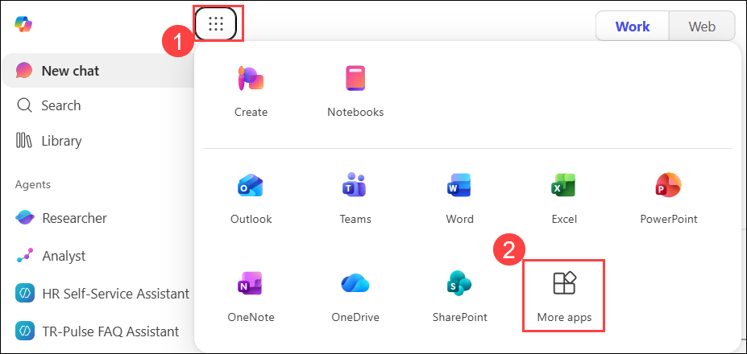
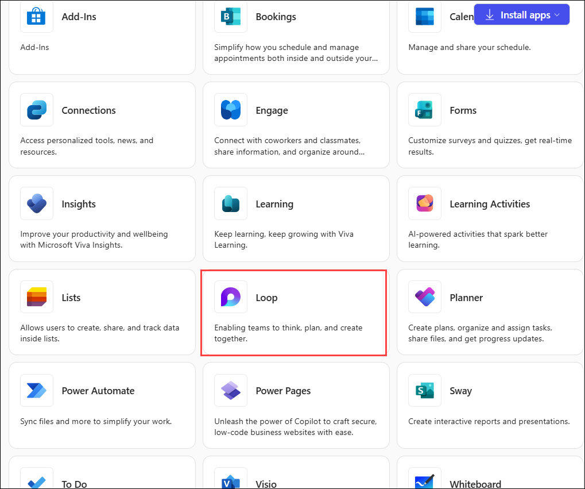
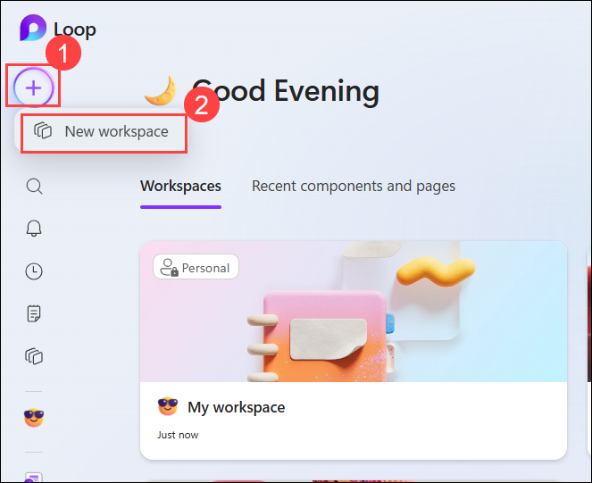
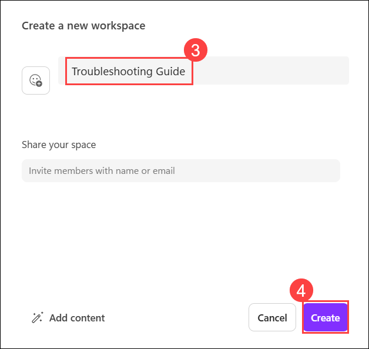
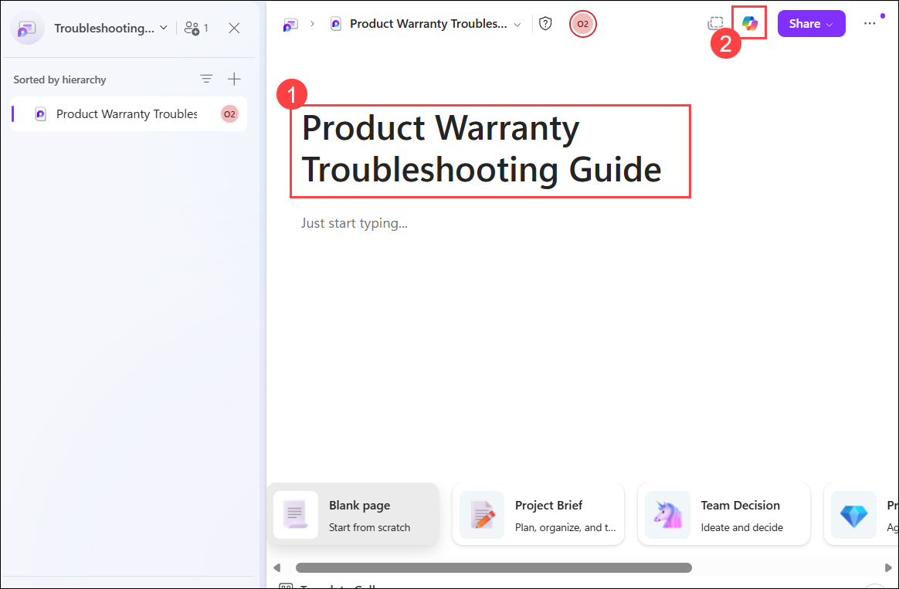

# Exercise 2, Task 1: Use Copilot in Loop to build a troubleshooting checklist

## Overview

As the Customer Service Manager at Tailwind Traders, you recently noticed a rise in product warranty validation issues coming from multiple clients using the company’s customer portal. These issues range from serial‑number mismatches to missing proof‑of‑purchase scans—each affecting customer satisfaction and putting added pressure on the support team. To address the situation quickly and consistently, you want to lead the development of a unified troubleshooting guide that other departments can also contribute to and rely upon.

To make this guide collaborative, flexible, and always up to date, you plan to use Copilot in Microsoft Loop. With input needed from Support, Warranty Operations, and Product Engineering_,_ Loop provides the ideal space to co-create a live document that outlines product warranty validation step-by-step. With the help of Copilot, you can structure the content, assign responsibilities by team, and build a checklist that everyone can contribute to in real time. Your goal is to ensure clients receive fast, accurate help, while your internal teams stay aligned and efficient.

Perform the following steps to complete this task:

1. In your Microsoft Edge browser, sign in to the **Microsoft 365** using the URL below:

    ```
    https://www.microsoft365.com
    ```

1. Select **App launcher** **(1)** in the navigation pane, and then select **More apps (2)**. From the app menu, select **Loop** **(3)**.

      

      

      > **Note:** If prompted, click on Sign in.

1. In **Loop** page, click on the **+ icon (1)** and select **New workspace (2)**. Give the name as **Troubleshooting Guide** **(3)** and click on **Create (4)**.

      

            

1. You're now in the first page for your new workspace. To begin, change the current title of the first page from **Untitled** **(1)** to **Product Warranty Troubleshooting Guide.** Note how the page name is automatically updated in the navigation pane.

1. Open the **Copilot** **(2)** pane for this page.

       

1. In the **Copilot** prompt, ask Copilot to create a Product Warranty Validation troubleshooting checklist for resolving product warranty validation issues.

    ```
    Create a Product Warranty Validation troubleshooting checklist for resolving product warranty validation issues. Include steps for validating serial numbers, verifying proof of purchase, identifying common validation failures, documenting findings, and determining next actions.
    ```

1. Review the list of items that Copilot generated. You want the items broken down by step.

    - If Copilot broke down the items by step, then select the **Copy** icon that appears at the end of Copilot’s response, then select into the Loop page and paste in the content **(Ctrl+V)**. Delete any extraneous content from the conversation that was copied and pasted along with the content (typically at the beginning and end of the content).

    - If Copilot didn’t break the troubleshooting process into clear steps, then ask it to do so. Copy its response, paste it into the Loop page, and delete any extraneous text that appears at the start and end of the content. Use the prompt below to do so.

      ```
      Reorganize this troubleshooting guide into a step-by-step process. For each step, provide clear objectives, actions to perform, expected outcomes, and decision points that representatives should follow.
      ```

1. Review Copilot’s response in the Copilot pane. While you feel like you’re off to a good start, you want to get a little more detailed in the tasks associated with each step. As such, tell Copilot that what it produced is a good start, but some of the tasks are too high-level. Ask it to get more detailed on the tasks that it identified in each step.

    ```
    This is a good start, but some of the tasks are too high-level. Expand each step with more detailed activities, verification checks, troubleshooting actions, and documentation requirements that support teams should perform.
    ```

1. Review Copilot’s response. While it looks better, there’s one thing that you feel is still missing. Nowhere does it indicate who’s responsible for each step. To address this shortcoming, ask Copilot to identify which team (such as Support, Warranty Operations, and Product Engineering) is responsible for each step.

    ```
    Update this troubleshooting checklist and identify which team is responsible for each step. Use Support, Warranty Operations, and Product Engineering as the primary teams and explain their responsibilities within the process.
    ```

1. After scanning the list one last time in the Loop page, you realize that it’s missing key contact information and the company’s escalation policy. To address these missing pieces, ask Copilot to add a section at the top with key contact information and the company’s escalation policy.

    ```
    Add a section at the beginning of this troubleshooting guide that includes key contact information, team responsibilities, escalation paths, escalation criteria, and recommended response timelines for product warranty validation issues.
    ```

1. After consulting with other members of your team, you decide to make one more change. To make the document more useful for each team, you want Copilot to change it from a simple list into a Loop checklist component. Doing so enables users to mark each step once it’s complete. To make this conversion, ask Copilot to turn this list into a Loop checklist component so teams can update it in real time.

    ```
    Convert this troubleshooting guide into a Loop checklist component so teams can track progress, mark completed tasks, and collaborate on issue resolution in real time.
    ```

1. At this point, you’re satisfied with the checklist. However, to play it safe, ask Copilot if there are any other things that should be added to this checklist to make it a more effective Product Warranty troubleshooting guide.

    ```
    Review this Product Warranty Troubleshooting Guide and recommend any additional sections, best practices, metrics, controls, or process improvements that would make it more effective for support teams and cross-functional collaboration.
    ```

1. Review Copilot’s response. Since it looks good, copy this content and then paste it into the Loop page. Delete any extraneous text that appears at the start and end of the content.

## Summary

In this task, you used Microsoft 365 Copilot in Loop to create a collaborative Product Warranty Troubleshooting Guide. You generated a structured troubleshooting checklist, expanded it with detailed procedures, assigned responsibilities across Support, Warranty Operations, and Product Engineering teams, incorporated escalation guidance and contact information, and converted the process into an interactive Loop checklist. The resulting guide provides a centralized, collaborative resource for resolving product warranty validation issues consistently and efficiently across teams.

