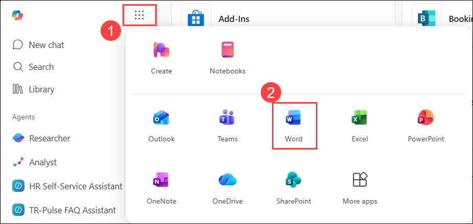
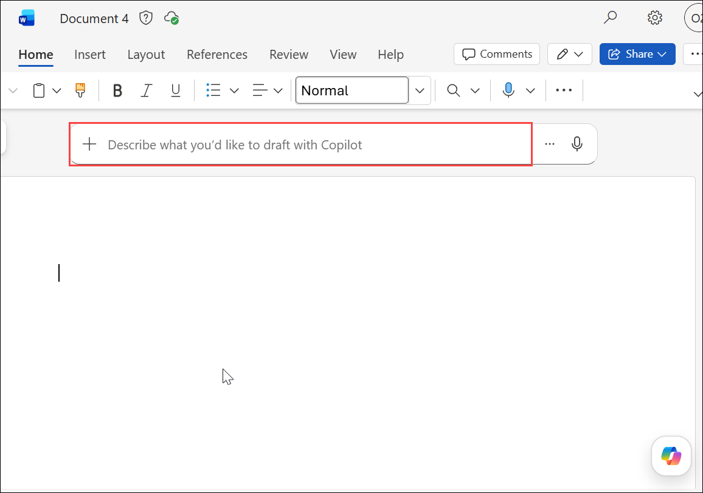
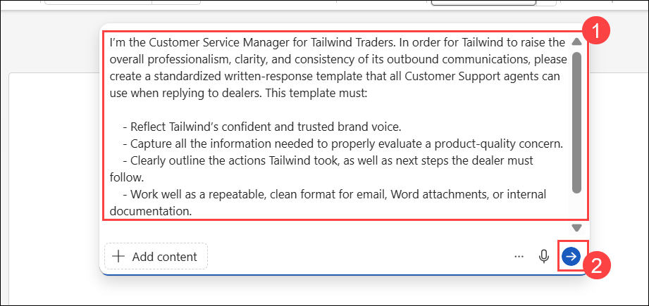
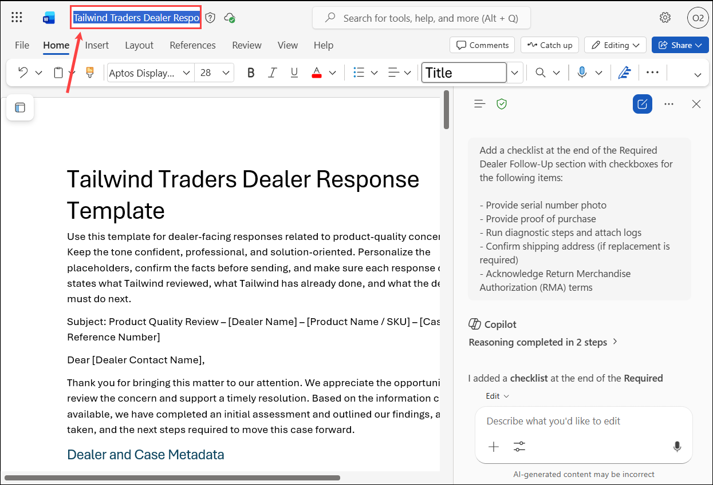
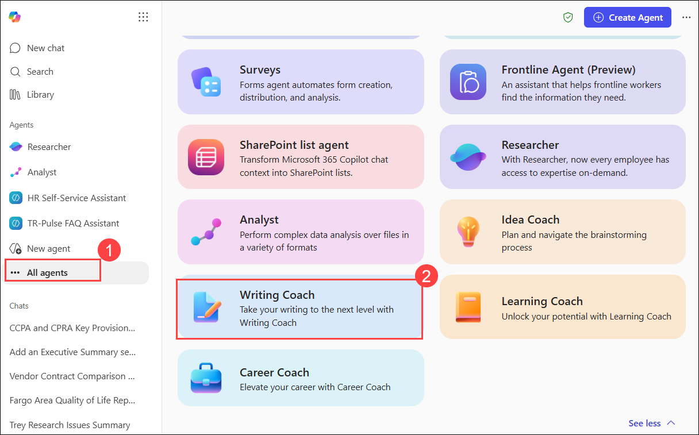

# Exercise 2, Task 2: Use Copilot in Word and Writing Coach to create a dealer-facing response template

## Overview

Tailwind Traders has been receiving an increasing number of product-quality inquiries from its B2B dealer network. Some dealers provide rich detail—photos, videos, purchase documentation—while others submit vague or incomplete information, leading to extended troubleshooting cycles and inconsistent communication. Recently, several dealers expressed frustration over response quality. Some replies were too technical, others lacked clear next steps, and many didn’t follow a consistent tone or structure.

As Tailwind’s Customer Service Manager, you're tasked with improving the overall professionalism and clarity of outbound communications. To improve consistency, your leadership team wants you to establish a standardized written-response template that all support agents must use when replying to dealers. This template must:

- Reflect Tailwind’s confident and trusted brand voice
- Capture all the information needed to properly evaluate a product-quality concern
- Clearly outline the actions Tailwind took, and the next steps the dealer must follow
- Work well as a repeatable, clean format for email, Word attachments, or internal documentation

Since Copilot in Word specializes in generating and transforming content, you plan to use it to create a reusable communication template. Because you want to create a polished document, you then plan to use Copilot’s Writing Coach agent, which specializes in coaching and improving your writing. You want to use Writing Coach to strengthen tone, improve clarity, refine grammar and structure, and ensure the template is dealer‑appropriate and ready for real‑world use. You can then share this new resource across support, operations, and product teams, ultimately improving the quality and speed of Tailwind’s customer resolutions.

### Using Copilot in Word  

Copilot in Word can behave in two different ways, depending on whether **Edit with Copilot** is enabled. Understanding this distinction is important because it affects whether Copilot can automatically apply changes to your document or just provide suggestions for you to use.

When **Edit with Copilot** is enabled, Copilot acts as an in-document author and editor. You can ask Copilot to create a document from scratch, rewrite sections, add summaries, or refine language—and it can apply those changes directly to the document, typically with your confirmation. In this experience, Copilot behaves like a collaborative writing partner that can both generate and revise content without requiring manual copy and paste. This is commonly the experience when prompting Copilot from within a Word document, such as using the drafting prompt above a blank document or the prompt field in the Copilot pane.

When **Edit with Copilot** is disabled, Copilot behaves more like Copilot Chat. It can still research topics, summarize information, and draft text, but it doesn’t automatically modify the document. Instead, responses appear in the Copilot pane, and you decide what—if anything—gets added to the document. This approach is useful when you want Copilot to act as a research assistant or idea generator while maintaining full control over what content is inserted.

This task uses the **Edit with Copilot** functionality.

Perform the following steps to complete this task:

1.  In your Microsoft Edge browser, go to the **Microsoft 365** home page, select **App launcher (1)** in the navigation pane, and then select **Word (2)** from the **Apps** menu.

      

      > **Note:** If prompted, click on Sign in and use the lab credentials.

2.  In **Word for web**, click on Create a blank document.

3.  On the Word document, in the top section of the page, you would see an option to **Describe what you'd like to draft with Copilot**, where we will enter our prompt.

      

4.  In the prompt field in the Copilot pane, ask Copilot to create a customer support template. Submit **(2)** the following prompt **(1)**:

    ```
    I’m the Customer Service Manager for Tailwind Traders. In order for Tailwind to raise the overall professionalism, clarity, and consistency of its outbound communications, please create a standardized written-response template that all Customer Support agents can use when replying to dealers. This template must:
    
    - Reflect Tailwind’s confident and trusted brand voice.
    - Capture all the information needed to properly evaluate a product-quality concern.
    - Clearly outline the actions Tailwind took, as well as the next steps the dealer must follow.
    - Work well as a repeatable, clean format for email, Word attachments, or internal documentation.
        
    The template should include the following sections: Issue Summary, Product Details, Troubleshooting Actions Taken, Required Dealer Follow‑Up, and Expected Timeline.
    ```
      

5.  Review the initial template. To ensure support agents capture all relevant case details, ask Copilot to add additional sections covering dealer information, intake details, risk assessment, escalation guidance, and communication history.

    Use the sample prompt:

    ```
    Enhance this template by adding the following sections with clear field labels:

    Dealer and Case Metadata:
    - Dealer Name
    - Dealer ID
    - Case ID
    - Priority
    - Severity
    - Date Opened
    - Date of Reply

    Intake Details:
    - Original Dealer Request Summary
    - Attachments Provided (Photo, Video, Proof of Purchase)
    - Channel
    - Contact Person

    Reproduction Steps:
    - Environment
    - Product Version/Firmware
    - Steps Tried
    - Reproduction Result (Yes/No)

    Risk and Impact Assessment:
    - Safety Impact
    - Customer Impact
    - Business Priority

    Resolution Status:
    - Current Status
    - Root Cause (if known)
    - Temporary Workaround
    - Final Fix ETA

    Escalation Path:
    - When to Escalate
    - Who to Escalate To
    - SLA for Response

    Communication Log:
    - Date
    - Contact Person
    - Interaction Summary

    Next Checkpoint:
    - Commit Dates
    - Responsible Owner
    ```

6. To make the template easier to complete during investigations, ask Copilot to replace the Product Details section with a structured table.

    Use the following prompt:

    ```
    Insert a two-column table in the Product Details section with the following rows:

    - Product Line
    - Model/SKU
    - Serial Number
    - Production Batch/Lot
    - Purchase Date
    - Warranty Status

    Format the table so it is easy for support representatives to complete during case investigations.
    ```

7.  Review the updated draft to ensure the table is correct. If there are any issues with it, ask Copilot to make the necessary corrections.

    Sample prompt:

    ```
    Review the Product Details table and make any corrections needed to improve formatting, consistency, readability, and usability for support teams.
    ```

8.  When everything looks good, ask Copilot to add a checklist at the end of the “Required Dealer Follow Up” section that provides checkboxes for each of the following items: Provide serial number photo, Provide proof of purchase, Run diagnostic steps (attach logs), Confirm shipping address (if replacement), and Acknowledge Return Merchandise Authorization (RMA) terms.

    Sample prompt: 

    ```
    Add a checklist at the end of the Required Dealer Follow-Up section with checkboxes for the following items:

    - Provide serial number photo
    - Provide proof of purchase
    - Run diagnostic steps and attach logs
    - Confirm shipping address (if replacement is required)
    - Acknowledge Return Merchandise Authorization (RMA) terms
    ```

9.  Review the final template and make note of the file name shown above the document. You'll use this file in the remaining steps with the Writing Coach agent.

      

10.  Navigate back to the browser tab where you have Microsoft 365 Copilot open and under the Agents section, select **All agents (1)**.

1. In the Agent Store, under the Built by Microsoft section, select See more. In the expanded list of Built by Microsoft, select **Writing Coach (2)**.

      

1. Click on **Add** to add the Writing Coach agent to your list of agents.

11. In the **Writing Coach** agent, attach the **Tailwind Traders Dealer Response Template** file from your OneDrive, which you created using Word in the prior steps. Ask the Writing Coach agent to rewrite the attached file with a more concise, confident tone suitable for B2B communication.

    ```
    Rewrite the attached Dealer Support Template using a concise, professional, and confident tone suitable for B2B dealer communications. Improve clarity while maintaining all required information and structure.
    ```

12.  Review the results. Note the text the agent displayed at the end of its response, which describes what it did and why the changes are better for B2B communication.

13.  While the update looks good, you’re concerned that with so much data, a dealer might have trouble following the logical sequence of information. Ask the Writing Coach agent to improve the logical flow of the template so that dealers can easily follow the issue summary, actions taken, and required next steps.

        ```
        Review the attached template and improve its logical flow so dealers can easily follow the issue summary, investigation details, actions taken, required next steps, and expected outcomes. Reorganize sections if needed to improve readability and usability.
        ```

14.  Review the document. Note the text the agent displayed at the end of its response, which indicates why the revised flow improves communication.

15. Finally, ask the agent what other changes it would suggest to improve this template.

    ```
    Review this dealer response template and recommend additional improvements that would enhance professionalism, usability, communication effectiveness, and operational consistency for support teams and dealers.
    ```

16. Review the changes the agent suggested. Feel free to ask the agent to create a redesigned version that includes one or two of these suggested improvements.

    ```
    Create a redesigned version of this template that incorporates the most valuable recommendations you identified. Maintain a professional B2B format while improving usability, readability, and dealer experience.
    ```

17. Once you’re done, in a real-world scenario, you would select the **Copy Response** icon that appears below the final version of the document that you want to use. You would then paste the content into a Word document for use by your organization. Feel free to do that now if you wish to keep a copy of the final template that you created.

## Summary

In this task, you used Microsoft 365 Copilot in Word to create a standardized dealer response template for handling product-quality concerns. You enhanced the template with detailed case-tracking fields, structured tables, escalation guidance, and dealer follow-up checklists. You then used the Writing Coach agent to improve tone, readability, and document flow, resulting in a professional, reusable communication template that promotes consistency, efficiency, and high-quality dealer interactions across Tailwind Traders' support organization.
