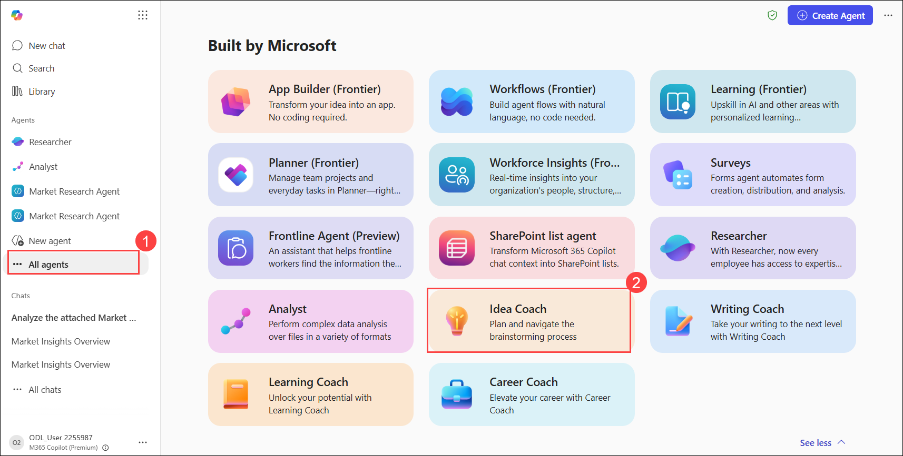
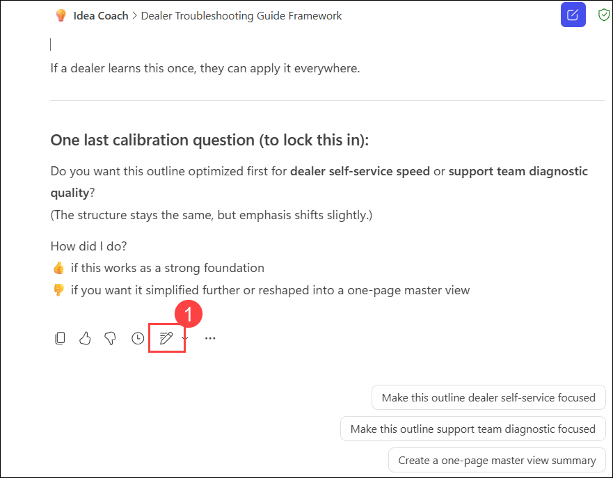
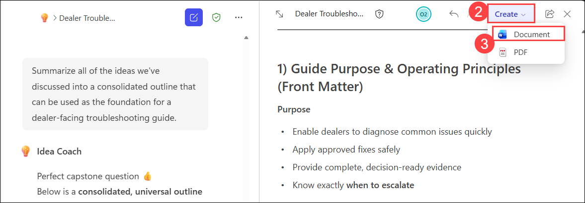

# Exercise 2, Task 3: Use Copilot’s Ideas Coach agent to create a troubleshooting guide

## Overview

Tailwind Traders uncovered a recurring customer service challenge: dealers often request troubleshooting for the same types of product issues—such as performance concerns, quality defects, setup difficulties, and compatibility questions. Currently, support reps craft responses on the fly, leading to inconsistent instructions, missing steps, and uneven quality in dealer guidance.

Leadership wants a standardized, step‑by‑step troubleshooting guide that can be shared with any dealer experiencing common issues across Tailwind’s product lines. This guide should:

- Provide a clear sequence of steps for dealers to follow
- Include quick tests, evidence requests, and common remedies
- Help reps diagnose when a replacement or escalation is required
- Maintain a professional, concise, dealer‑friendly structure
- Be easy to update or adapt for different product types

Instead of manually designing this guide from scratch, you plan to use Copilot’s Ideas Coach agent to generate the structure, breakdowns, and troubleshooting steps. Ideas Coach excels at turning vague concepts into organized, actionable frameworks—perfect for a troubleshooting guide.

You then plan to save and refine the output into a reusable Word document (or any format you choose). Doing so should help ensure Tailwind’s dealers receive clear, professional, and consistent troubleshooting instructions, improving their ability to resolve issues efficiently and reducing follow‑up workload for your support reps.

Perform the following steps to complete this task:

1. Navigate back to the browser tab where you have Microsoft 365 Copilot open and under the **Agents** section select **All agents (1)**. 

1. In the **Agent Store**, under the **Built by Microsoft** section, select **See more**. In the expanded list of **Built by Microsoft**, select **Idea Coach (2)**.

    

1. Click on **Open** to add the Idea Coach agent to your list of agents.

1. In the **Idea Coach agent**, explain that you're the Customer Service Manager at Tailwind Traders, a specialty outdoor-equipment manufacturer with a large B2B dealer network. Rather than immediately creating a troubleshooting guide, you first want to brainstorm the key elements that should be included in such a guide. Ask Idea Coach to identify the major sections, workflows, and content areas that would help dealers diagnose issues, provide the right information, and understand when escalation is required.

    Sample prompt:

    ```
    I’m the Customer Service Manager at Tailwind Traders. Help me brainstorm the key sections, workflows, and components that should be included in a dealer-facing troubleshooting guide. The goal is to help dealers diagnose common product issues, provide the right evidence, and understand when escalation is required.
    ```

1. Review the ideas generated by Idea Coach. Since Tailwind supports multiple product lines, you want the guide to be flexible rather than product-specific. Ask Idea Coach how the guide should be structured so it can be reused across different products with minimal modification.

    ```
    How can I structure this troubleshooting guide so it can be reused across different product lines without requiring major changes? Suggest a flexible framework that can be adapted to various products.
    ```

1. You now want to explore the different troubleshooting journeys that dealers might follow. Ask Idea Coach to identify separate troubleshooting paths for common categories of issues and recommend the decision points that dealers should encounter during each path.

    ```
    Help me identify separate troubleshooting paths for:
    - Performance issues
    - Quality and defect issues
    - Safety concerns
    - Usability and setup problems

    For each path, suggest key decision points and examples of if/then logic that dealers could follow.
    ```

1. Successful troubleshooting depends on collecting the right information from dealers. Ask Idea Coach to identify what evidence and supporting information dealers should provide before troubleshooting begins.

    ```
    What information and evidence should dealers provide before troubleshooting begins? Help me create a comprehensive evidence checklist that improves diagnostic accuracy and reduces support effort.
    ```

1. Once you understand what information is needed, you want to identify quick diagnostic activities that dealers can perform themselves before contacting support. Ask Idea Coach to brainstorm practical tests for different categories of issues.

    ```
    Suggest quick diagnostic tests that dealers could perform before escalating an issue. Provide ideas for:
    - Performance issues
    - Quality concerns
    - Safety-related issues
    - Usability and setup problems

    Keep the tests simple and easy for dealers to perform.
    ```

1. While many issues can be resolved through troubleshooting, some situations require escalation. Ask Idea Coach to identify the most important escalation triggers that should be included in the troubleshooting process.

    ```
    Help me identify the most important escalation triggers that should be included in a dealer troubleshooting process. Consider:
    - Safety incidents
    - Repeated troubleshooting failures
    - Product defects
    - Warranty concerns
    - Business-critical situations
    ```

1. You now have a significant amount of information and want to determine how the troubleshooting process should be visually represented. Ask Idea Coach to recommend visual approaches that would help dealers easily navigate the process.
    
    ```
    What would be the most effective way to visually represent this troubleshooting process? Suggest flowcharts, decision trees, swimlane diagrams, or other visual approaches that would be easy for dealers to follow.
    ```

1. Review the visual recommendations. To make the guide easier to use, ask Idea Coach for suggestions on how visual cues such as colors, icons, and labels could improve readability and usability.
    
    ```
    How could the troubleshooting process be made more intuitive and visually engaging? Suggest icons, labels, color coding, and other design elements that would improve usability.
    ```

1. At this point, you have enough ideas to begin organizing the guide. Ask Idea Coach to recommend a logical structure and table of contents for a dealer-facing troubleshooting guide based on all the ideas generated so far.
    
    ```
    Based on all the ideas we've discussed, suggest a table of contents and logical structure for a dealer-facing troubleshooting guide.
    ```

1. Review the proposed structure. If the response only contains a high-level outline, ask Idea Coach to expand each section and explain its purpose, key content, and how it supports dealers during troubleshooting.
    
    ```
    Expand each section of the proposed guide structure by describing its purpose, key content, and how it supports dealers during troubleshooting.
    ```

1. Before finalizing the framework, ask Idea Coach if there are any additional ideas, best practices, or process improvements that could strengthen the guide and improve the dealer experience.   
     
    ```
    What additional ideas, best practices, or dealer-support improvements would strengthen this troubleshooting guide?
    ```

1. You’re now satisfied with the ideas and framework that have been generated. Ask Idea Coach to consolidate the key recommendations into a single outline that can serve as the foundation for a formal troubleshooting guide document.
    
    ```
    Summarize all of the ideas we've discussed into a consolidated outline that can be used as the foundation for a dealer-facing troubleshooting guide.
    ```

1. Once you're satisfied with the final outline, select the **Edit in Pages** icon at the end of the response. From within Pages, select **Create**, and then select **Document**. Doing so generates a document in Word for the web that contains the framework and ideas generated during your brainstorming session. 

    Click on **Open Word** to open the document.

    

    

1. In a real-world scenario, you could now use Copilot in Word or the Writing Coach agent to transform this framework into a polished dealer-facing troubleshooting guide. Since you already worked with the Writing Coach in the previous task, we'll stop at the ideation and framework-building stage.

## Summary

In this task, you used Copilot’s Idea Coach agent to brainstorm and organize ideas for a dealer-facing troubleshooting guide. You explored troubleshooting workflows, evidence requirements, diagnostic tests, escalation criteria, visual design concepts, and guide structures. You then consolidated these ideas into a reusable framework that can serve as the foundation for a consistent troubleshooting guide across Tailwind Traders’ product lines.
