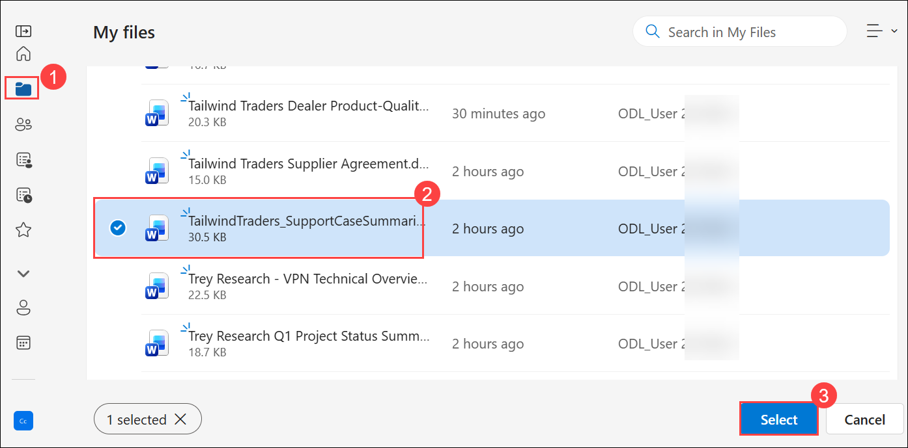
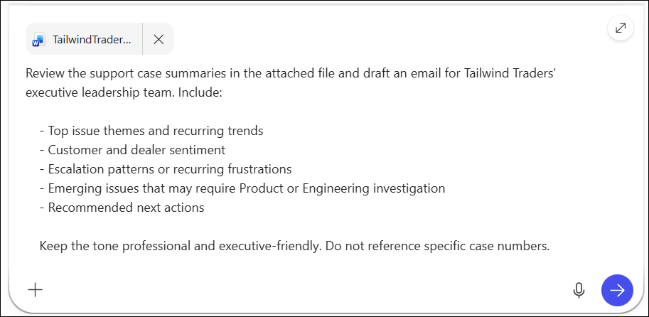
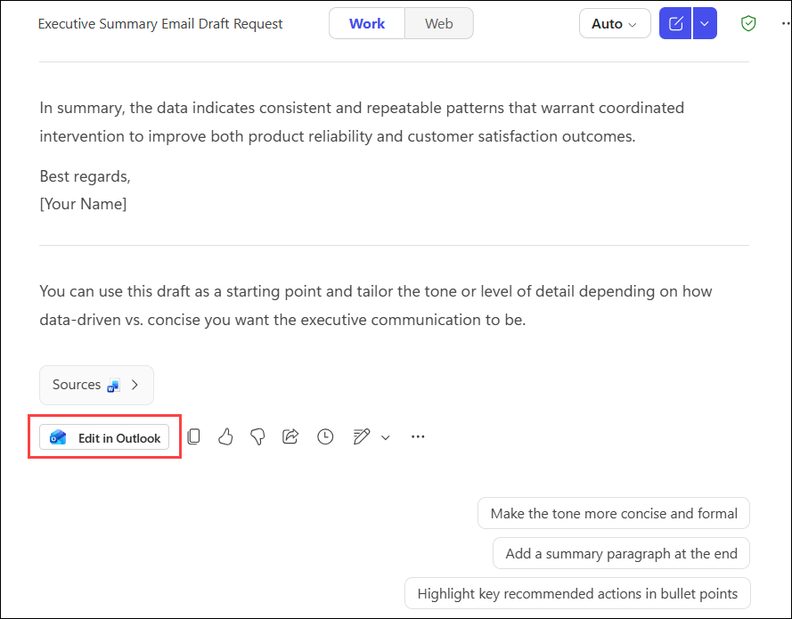
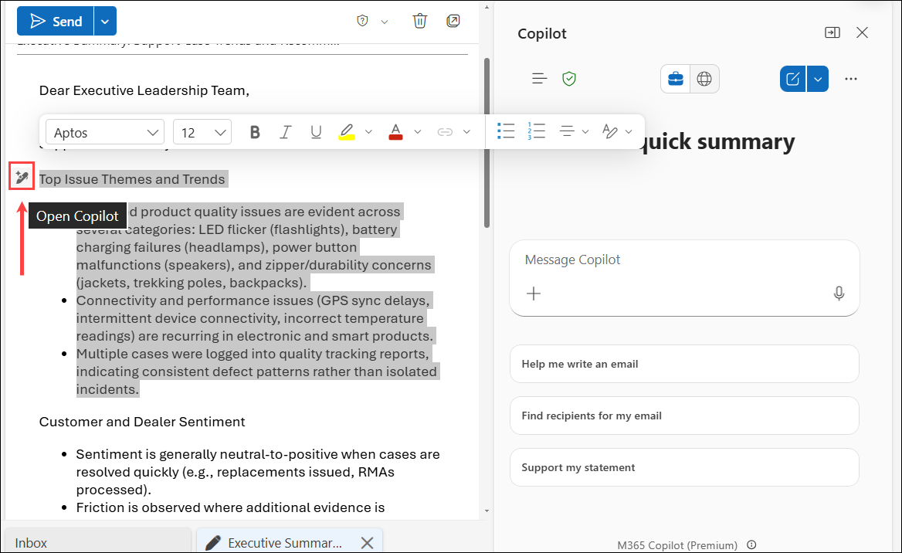
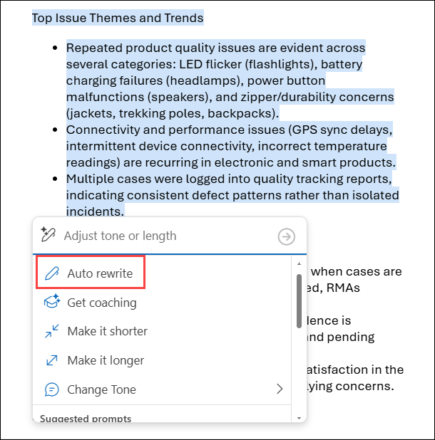
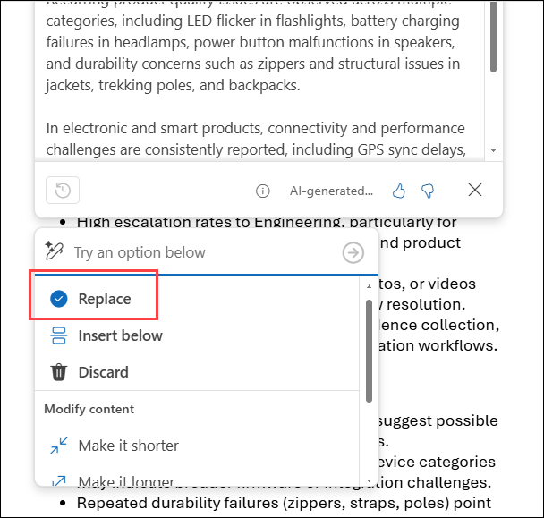
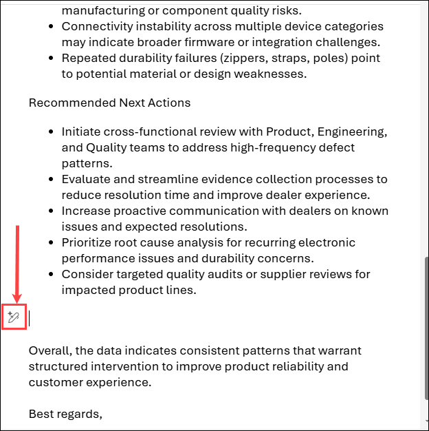
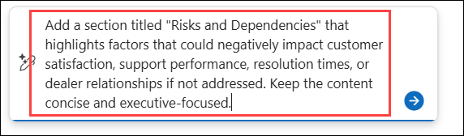
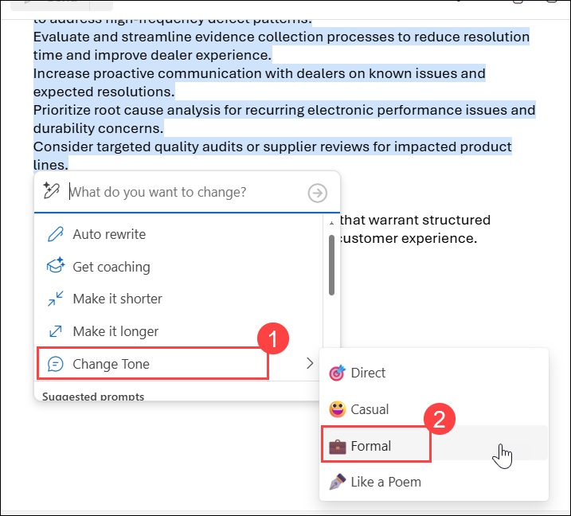

# Exercise 2, Task 4: Use Copilot Chat and Copilot in Outlook to create a Support Insights email

## Scenario

Tailwind Traders’ leadership team recently emphasized the need for better visibility into customer‑resolution trends across the dealer network. Each week, dozens of product inquiries, warranty submissions, troubleshooting requests, and quality concerns flow into the support department. These interactions contain valuable signals, such as recurring failure points, emerging quality trends, seasonal surges, and training gaps. However, much of the insight remains buried in individual tickets or conversations.

To support better decision‑making at the leadership level, your manager asked you to send a concise email summarizing what happened across support over the past three months. The email should include:

- Trends in product issues and warranty claims
- Notable escalations or dealer frustrations
- Emerging patterns that might require investigation from Product or Engineering
- Recommendations for next steps
- Any training opportunities for support agents or dealer partners

You plan to use Microsoft 365 Copilot Chat to perform the initial analysis and create an email, which you then plan to polish using Copilot in Outlook. Copilot Chat can synthesize your uploaded summaries, call notes, or internal documentation into a structured report with a professional tone. From there, you can further refine the message using Copilot in Outlook before sending it to leadership.

By creating a consistent insights email, you can help Tailwind Traders move from reactive problem‑solving to proactive, data‑guided improvements. The company's goal is for this transition to result in higher dealer satisfaction and stronger product feedback loops.

## Using Copilot Chat  

In Copilot Chat on the web, the response mode selector lets you control how much time and reasoning Copilot uses when answering your prompt. You can leave it set to **Auto** (the default option) so Copilot balances speed and depth for you, or choose a faster or more in‑depth response style depending on the task.

When Copilot Chat opens in **Work** mode, the response mode selector isn’t shown. In **Work** mode, Copilot is optimized for secure, work‑context queries, so it automatically manages response depth for you. When you switch to **Web** mode, the response mode selector appears, allowing you to choose between faster responses or deeper reasoning. Once the selector is enabled, it remains visible as you switch between **Work** and **Web** modes.  
<br/>If you’ve used Copilot in Excel, you know that it also includes a response control selector. However, its options are different from the Chat selector. In Copilot Chat, the selector controls how deeply Copilot reasons about your request. In Excel, the selector controls which AI model performs the work. Although these selectors might look similar, they control different aspects of Copilot and aren't the same setting.

## Lab Overview

In this lab, you will use Microsoft 365 Copilot Chat and Copilot in Outlook to analyze historical support case summaries, identify recurring support trends, customer concerns, escalation patterns, and operational risks, and transform those insights into an executive-ready Support Insights email for leadership review.

## Task 4: Use Copilot Chat and Copilot in Outlook to create a Support Insights email

In this task, you will use Copilot Chat to analyze support case summaries and generate an executive-level email highlighting support trends, customer sentiment, escalation patterns, emerging product issues, and recommended actions. You will then use Copilot in Outlook to refine the email’s content, structure, risk analysis, and tone for executive stakeholders.

1. In Microsoft Edge browser, navigate to the Microsoft 365 home page and select **New chat**.

1. Since this task involves reviewing a file uploaded to OneDrive and generating insights from that internal document, select the **Work** option. The **Web** option doesn’t apply here, since it searches external sources like public websites and blogs. In the Copilot Chat window, attach the **TailwindTraders_SupportCaseSummaries** file in the prompt field.

    

1. In the prompt field, click on **+ (1)** and then select **Attach cloud files (2)** that we should see the already files in the onedrive location. 

   

1. On the Onedrive popup wizard, navigate to **Myfile (1)** and select the **TailwindTraders_SupportCaseSummaries (2)** docuemnts then click on **Select (3)**:

        

7. Enter the following prompt:

    ```
    Review the support case summaries in the attached file and draft an email for Tailwind Traders' executive leadership team. Include:

    - Top issue themes and recurring trends
    - Customer and dealer sentiment
    - Escalation patterns or recurring frustrations
    - Emerging issues that may require Product or Engineering investigation
    - Recommended next actions

    Keep the tone professional and executive-friendly. Do not reference specific case numbers.
    ```

        

1. Copilot will draft an email in the chat. Review the email. Notice an **Edit in Outlook** button in the end of the response, click on it, and it will open the draft in Outlook mail.

      

1. At this point, you should now be in **Outlook on the web**. It should be displaying the email that Copilot Chat generated. 

    > **Note:** In Copilot Chat, created the email and opened it in Outlook, Copilot doesn’t open the email in draft mode. Instead, it displays its response directly within the body of the email. After that, you must highlight the specific text you want Copilot to modify, whether that’s a sentence, a paragraph, or the entire email.

1. After reviewing the email, first paragraph could be improved. To do so, highlight the first paragraph of the email (drag your cursor so that the entire opening paragraph is highlighted). Notice the **Open Copilot** (pencil) icon that appears. Select the icon to open the Copilot window.

     

1. The Copilot window includes a prompt field and a menu of editing options. Since you highlighted the opening paragraph, select the **Auto Rewrite** option. Notice how Copilot doesn’t insert the revision directly into the email. Instead, it displays a Copilot refinement window containing a draft of the revised content. Also, notice the menu options that now appear below the refinement window. 

         

    You can either:
    - Replace the highlighted text with the revised text
    - Insert the text below the highlighted text
    - Discard the rewritten text

    In this case, select the **Replace** option. Notice how the first paragraph that you highlighted is replaced with the revised text.

       

1. Now let’s add a new section to the end of the email, after the **Recommended Actions** section. In the email, select the blank line that appears after the **Recommended Actions** section, since this location is where you want the new section to appear. Then select the **Open Copilot** icon that appears.

     

1. In the prompt field, ask Copilot to add a section titled **Risks and Dependencies**. This section should include a short paragraph calling out what items could negatively affect support performance or customer satisfaction if they aren't addressed.

   ```
   Add a section titled "Risks and Dependencies" that highlights factors that could negatively impact customer satisfaction, support performance, resolution times, or dealer relationships if not addressed. Keep the content concise and executive-focused.
   ```
   

1. Review what happened. Copilot generated the new section and displayed it within the body of the email, starting at the location that you placed your cursor. You’re satisfied with the new content, so in the Copilot window, select **Replace**. 

1. Finally, let’s see what happens when you ask it to change the tone of the email. Select in the body of the email to highlight the entire email, then select the **Open Copilot** icon. In the Copilot window, one of the menu choices is **Change Tone (1)**, which provides four options: **Direct**, **Casual**, **Formal**, and **Like a poem** **(2)**. 

   

1. Scroll through the contents of the Copilot refinement window to see how Copilot rewrote the email, giving it a more executive-friendly tone. If you don’t like this version, then select **Discard** in the Copilot window. For this email, select **Replace** to accept the changes.

1. Feel free to play around with the various Copilot options when you select the **Open Copilot** icon.

## Summary

In this task, you used Microsoft 365 Copilot Chat to analyze historical support case summaries and generate an executive-level Support Insights email. You identified recurring issue trends, customer sentiment patterns, escalation themes, and opportunities for improvement. You then used Copilot in Outlook to refine the message, improve the opening narrative, add risk considerations, and adjust the tone for executive stakeholders. The resulting email provides leadership with a concise, actionable summary of support performance and emerging areas of concern.
