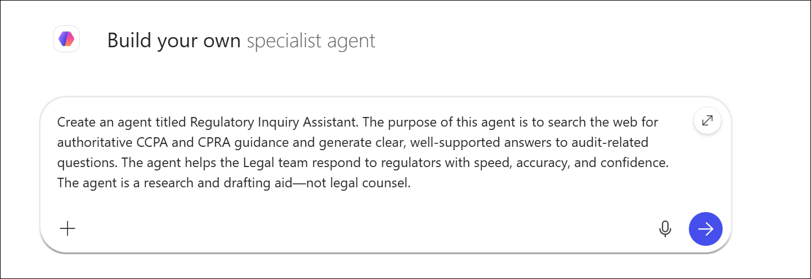

# Exercise 1 - Task 4: Use Copilot Studio to create a Regulatory Inquiry Assistant

## Scenario

As the audit window opens, the regulatory inquiries begin to trickle in—first a routine clarification, then a request for supporting documentation, then a surprise follow‑up asking for a deeper explanation of data‑handling obligations. Boulder Innovation knows how quickly these routine checks can escalate into a flood.

To help the Legal Team stay ahead of the curve, you’re tasked with creating a Copilot Studio agent that can search the Web for authoritative regulatory sources on demand. Instead of spending hours digging for official guidance, the team gains a smart, dependable research assistant in their corner every time a new question associated with the state audit related to the California Consumer Privacy Act (CCPA) and California Privacy Rights Act (CPRA) hits their inbox.

   > **NOTE:** In this exercise, you use the Copilot Studio lite experience to create the Regulatory Inquiry Assistant agent. This simplified experience is designed for everyday business users and requires no programming skills. By contrast, software developers who build more complex, advanced agents typically use the full Copilot Studio experience.

## Lab Overview

In this hands-on lab, you will use Copilot Studio to create a Regulatory Inquiry Assistant that helps Boulder Innovations respond to audit-related privacy and compliance questions. You will configure the agent to research authoritative CCPA and CPRA guidance, generate well-supported responses, and provide citations from trusted sources. The resulting agent will serve as a valuable research tool that helps the Legal team prepare for regulatory reviews and audits.

## Task 4: Use Copilot Studio to create a Regulatory Inquiry Assistant

In this task, you will use Copilot Studio's Agent Builder to create and configure a Regulatory Inquiry Assistant. You will define the agent's purpose, refine its instructions, enable web-based knowledge sources, add suggested prompts, and test its ability to provide accurate, citation-backed responses to regulatory inquiries.

1. In your Microsoft Edge browser, sign in to the **Microsoft 365** home page **(https://www.microsoft365.com)**. 

1. In Microsoft 365, select **All agents(1)** in the navigation pane, click on **+ Creat Agent (2)**.

    

1. Doing so opens Copilot Studio’s **Agent Builder** and displays the **New agent** page.

3. On the New Agent page, you want to ask Copilot to create an agent. In the prompt, you should enter the agent’s name and a general description of what the agent is about, who its target audience is, and what you want it to do.
    ```
    Create an agent titled Regulatory Inquiry Assistant. The purpose of this agent is to search the web for authoritative CCPA and CPRA guidance and generate clear, well-supported answers to audit-related questions. The agent helps the Legal team respond to regulators with speed, accuracy, and confidence. The agent is a research and drafting aid—not legal counsel. 
    ```
    
    

4. After you select the forward arrow, the **Agent Builder page** appears for your new agent. The page opens in the conversational builder experience, where Copilot creates the agent based on your prompt and displays the generated agent name, description, instructions, and knowledge settings. Verfiy all the details and make changes according to your choice.

    - The conversational builder on the left enables you to continue refining the agent by chatting with Copilot.
    - The **Configure tab**, located at the top of the page, enables you to review and modify the agent’s detailed settings, instructions, knowledge sources, and capabilities.

1. After reviewing the Instructions, you decide that you want to have Copilot add a couple of other items to the instruction set. To do so, select the **Describe** tab and enter the following prompt:

    ```
    Update the Instructions to include the following items: Responses should be written in a professional, precise, and neutral legal tone. The agent should flag uncertainties, version changes, or pending rulemaking when relevant.
    ```

8. Review Copilot’s response after updating the instructions. To verify the changes that Copilot made, select the **Configure** tab and then scroll down to the **Instructions** field. Verify that Copilot added the two new instructions that you requested.

9. While the current instructions look good, you wonder if they could be improved upon. You aren't sure how to improve them, so you decide to ask Copilot what it thinks.To do so, select the Describe tab. This time, enter a prompt that asks Copilot what other instructions it would recommend that could improve this agent.

    ```
    What other instructions would you recommend adding to improve this agent?
    ```

10. Review Copilot’s recommendations. You’re pleased with its suggestions, so ask Copilot to add them all to the agent's instructions.

     ```
     Add all of the recommended instructions to the agent.
     ```

11. Once Copilot responds that it updated the instructions, select the **Configure** tab and scroll through the **Instructions**. Note the new items that Copilot added.

1. In the **Configure** tab, scroll down to the **Knowledge** section and verify the Search all websites toggle switch is enabled. Copilot should have enabled this toggle switch when it created the agent based on the description you provided in your original prompt (that is, “The purpose of this agent is to search the web…”). If the toggle switch isn’t enabled, then do so now.

     

1. For **Suggested prompts**, you can have Copilot generate prompts for you, or you can manually create your own prompts. Let’s try both methods.

1. To have Copilot generate suggested prompts, select the **Describe** tab and then ask Copilot to generate three suggested prompts for the agent. Note how each prompt has a title and a message.

    ```
    Generate three suggested prompts for this agent and add these to the agent.
    ```
1. You now want to enter several of your own prompts. Select the **Configure** tab and scroll down to the **Suggested prompts** section. You should see the three prompts that Copilot added to the agent. 

    

1. For each prompt that you want to manually add, select the **Add a suggested prompt** option that appears below the prompts. 
    
1. Six suggested prompts are displayed below that are related to popular regulatory topics. Review these prompts, select two or three that you like, and then add them to the agent.

    | Title | Message |
    |---------|---------|
    | Consumer Rights Timelines | What response timelines and verification requirements apply to verified consumer requests under CCPA/CPRA (access, deletion, correction), and what exceptions could limit fulfillment? |
    | Sharing vs. Selling Definitions & Impacts | How does CPRA define and distinguish “sharing” from “selling” personal information, and what are the practical compliance impacts for opt-out rights and cross-context behavioral advertising? |
    | Breach Notification Basics | What are the core elements, timelines, and recipient requirements for breach notifications affecting California residents, and which authoritative sources should be cited in regulatory communications? |
    | Data Retention & Minimization Guidance | Summarize current CPRA requirements for data retention, minimization, and purpose limitation in plain language suitable for Legal review. Provide a concise explanation of disclosure expectations, then list five operational steps a business should take to build or update a retention schedule. Prefer authoritative web sources (for example, California Privacy Protection Agency, statute pages) and include citations with direct links to the most recent guidance. |
    | Service Provider/Contractor Obligations | Outline the contractual obligations for service providers and contractors under CCPA/CPRA, describing required clauses (use restrictions, assistance with consumer requests, onward-transfer controls, audits/assessments) and practical implications for vendor management. Present a brief table of “clause name → purpose” to aid template drafting and cite authoritative sources (.gov or official agency guidance) with links to the relevant statutory text. |
    | Enforcement & Penalties Risk Brief | Develop a concise risk brief that explains enforcement mechanisms and penalties under CCPA/CPRA, noting the roles of the California Privacy Protection Agency and the Attorney General. Include a risk matrix (low/medium/high) for three common noncompliance scenarios—failure to honor opt-outs, inadequate consumer-request handling, and insufficient disclosures—and add recommended corrective actions. Ground the brief in authoritative web sources and provide citations with direct links. |
    
    

15. Test several of the suggested prompts. Verify the agent includes citations/links for each response.

1. Wait a minute or two for Copilot to generate the agent. Once complete, the agent’s name, description, and configuration details appear on the right side of the page, where you can review them before selecting **Create**.

    

1. Once after creating the agent, on the popup window click on **Go to agent** it will navigate to agent chat window.

    

    >**NOTE:** At this stage, the agent is private and accessible only to you. In a real-world scenario where the agent needs to be used by multiple team members, you would share it with those individuals. For this training exercise, sharing isn’t required since you’re working within your own tenant.

## Summary

In this task, you used Copilot Studio to build a Regulatory Inquiry Assistant designed to support Boulder Innovations' Legal team during privacy and compliance audits. You configured the agent to research authoritative CCPA and CPRA guidance, enhanced its instructions to improve response quality, enabled web search capabilities, and added suggested prompts for common regulatory topics. You then tested the agent to verify that it provides professional, well-supported responses with citations, creating a useful resource for audit preparation and regulatory research.

## You have successfully completed the task. Click on Next >> to proceed with the next exercise.


