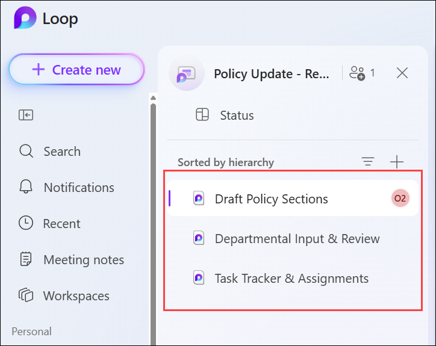
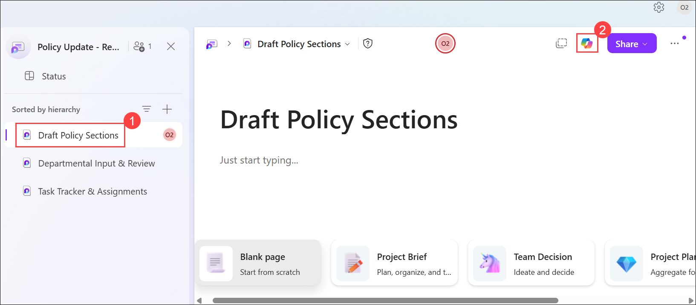
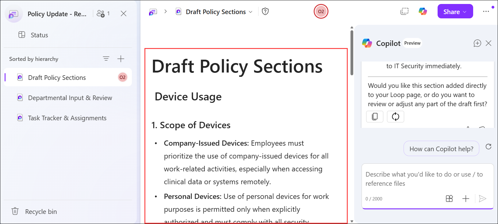
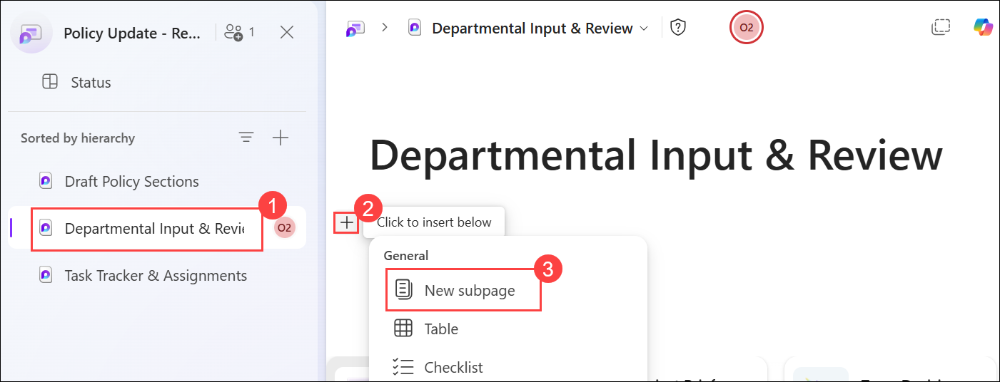
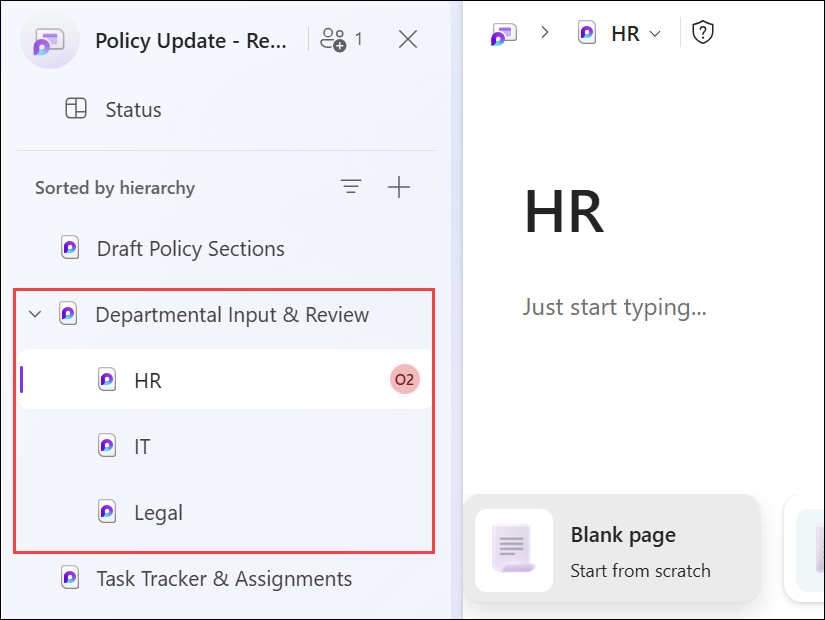
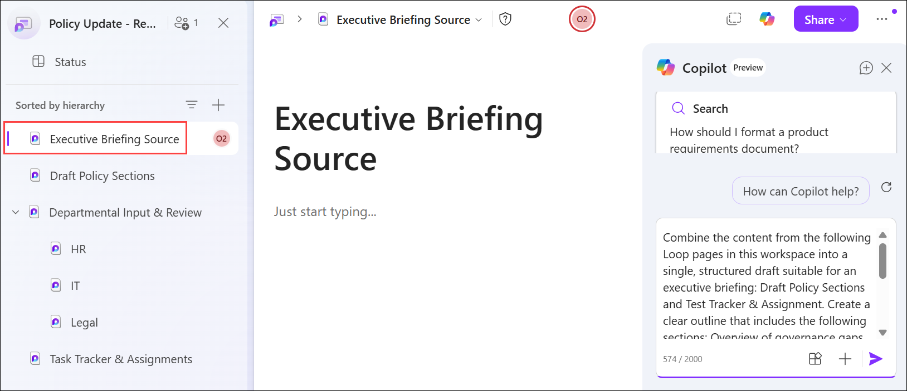
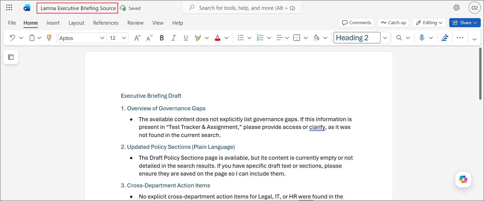

# Exercise 2 - Task 1: Use Copilot in Loop to collaborate on updating a company policy

## Scenario

As General Counsel for Lamna Healthcare Company, you’re part of a cross-functional team tasked with updating the company’s Device Handling and Remote Clinical Access Policy to reflect new guidelines for remote work. With an increasing number of employees working from home, there’s a growing need to address how devices, data access, and security protocols should be managed in a remote environment. Legal, IT, and HR personnel are meeting together to ensure the policy is comprehensive, clear, and compliant with current regulations while aligning with the company’s operational needs. Your role is to collaborate with these teams, using Copilot in Microsoft Loop to co-draft and refine the updated policy. Your goal is to ensure that all necessary elements are covered and the policy is aligned across departments.

To facilitate collaboration, you plan to use Copilot in Loop to help draft and revise key sections of the policy. Copilot can help generate content for device use, access control, and security measures. You also plan work with IT and HR to add actionable items, such as ensuring that personal devices are used securely, and tag specific tasks for each department to ensure alignment. Once the Device Handling and Remote Clinical Access Policy is collaboratively reviewed and finalized, you can convert it into a Word or PDF document for distribution and publication across the company. This exercise helps ensure that all relevant stakeholders contribute to the policy, making it clear and enforceable while also improving communication and efficiency within the team.

## Lab Overview

In this hands-on lab, you will use Microsoft 365 Copilot in Loop to collaboratively update Lamna Healthcare Company's Device Handling and Remote Clinical Access Policy. You will create a structured workspace, generate policy content with Copilot, collect departmental feedback, and track action items across Legal, IT, and HR teams. Finally, you will consolidate the policy updates into an executive briefing document for review and distribution.

## Task 1: Use Copilot in Loop to collaborate on updating a company policy

In this task, you will use Microsoft 365 Copilot in Loop to draft and refine policy sections related to remote work, device usage, access control, and security measures. You will organize departmental reviews, create action plans, and prepare content that can be used to generate an executive briefing document.

1. In the **Microsoft 365 Copilot Chat** window, select the **Apps (1)** icon in the navigation pane. In the **Apps** menu that appears, select **More apps (2)**. 

   

1. Under the top section of apps in the **Apps launcher** window, select **All apps→ (1)**. In the **All apps** window, scroll down and select **Loop (2)**.

   

   

2. In **Loop for the web**, Click on **+ Create new (1) > New Workspace (2)** to create a new workspace, name it as **Policy Update - Remote Work Guidelines (3)** then click on **Create (4)**.

    

    

3. You plan to create the following pages under this Loop workspace (in this order):

    - Draft Policy Sections

    - Departmental Input & Review

    - Task Tracker & Assignments

1. Once the workspace is created you will notice an **Untitled** page, change the current title of the first page from **Untitled** to **Draft Policy Sections**. Note how the page name is automatically updated in the middle navigation pane.

    

4. Repeat the prior step to create the two remaining pages for this workspace.

    

5. The **Policy Update - Remote Work Guidelines** workspace should now include these three pages. However, the pages appear in the reverse order from which they were created, so that the last page appears first. You want to rearrange their order, so select the **Draft Policy Sections** page in the navigation pane and drag and drop it to the top of the list. Then repeat this process for the **Departmental Input & Review** page to move it up to the second page. The pages should appear in this order:

    - Draft Policy Sections

    - Departmental Input & Review

    - Task Tracker & Assignments

      

1. Select **Draft Policy Sections (1)**, and then select **Copilot (2)** in the upper-right corner of the page to open the Copilot pane.
    
    

1. In the Copilot pane, enter the provided prompt to generate a **Device Usage** section for the **Draft Policy Sections** page, and then submit the prompt.
    
    ```
    Lamna Healthcare Company is updating its Device Handling and Remote Clinical Access Policy to reflect new guidelines for remote work. The existing policy provides only basic expectations for device use and doesn’t address personal devices, remote clinical data access, multi-factor authentication, or security behaviors outside the workplace. In this Draft Policy Sections page, draft a new Device Usage section that expands the original policy to cover personal vs. company-issued devices, secure handling of clinical data off-site, role-based access expectations, and baseline security controls required for remote work.
    ```

1. Review Copilot’s response. Select **Copy** below the Copilot response, paste (**Ctrl+V**) the generated **Device Usage** content into the **Draft Policy Sections** page, and then remove any extraneous text that was copied with the response (see the start and end of the content).

    

1. In the Copilot pane, enter the provided prompt to generate an **Access Control** section for the **Draft Policy Sections** page, and then submit the prompt.  
    
     ```
     Lamna Healthcare Company is updating its Device Handling and Remote Clinical Access Policy to reflect new requirements for secure remote work. The existing policy contains only basic statements about login access and doesn’t address secured clinical data gateways, device chain-of-custody expectations, authentication standards, session management, or controls for accessing clinical systems off-site.

     Draft a new Access Control section for this Draft Policy Sections page that expands the old policy to cover secured clinical data gateways, device chain-of-custody tracking, user authentication requirements, session timeout expectations, and any baseline controls needed to protect clinical data accessed remotely.
     ```

1. Review Copilot’s response, select **Copy** below the Copilot response, paste the generated **Access Control** content at the end of the **Draft Policy Sections** page, and then remove any extraneous text that was copied with the response (see the start and end of the content).


11. In the Copilot pane, enter the following prompt to have Copilot create a **Security Measures** section: 

    ```
    Lamna Healthcare Company is updating its Device Handling and Remote Clinical Access Policy to strengthen security expectations for remote work and clinical data handling. The current policy contains only high-level statements about protecting company equipment and does not provide detailed guidance on data encryption requirements, incident reporting protocols, secure handling of clinical data, or expectations for detecting and responding to potential security events outside the corporate network.

    Draft a new Security Measures section for this Draft Policy Sections page that fills these gaps. Your updated section should address data encryption standards for clinical information, expectations for remote incident reporting and escalation timelines, baseline endpoint security controls for off-site devices, and any additional safeguards necessary to protect sensitive clinical data accessed from remote locations.
    ```

12. Review Copilot’s response. Select **Copy** below the Copilot response, paste the generated **Security Measures** content at the end of the **Draft Policy Sections** page, and then remove any extraneous text that was copied with the response (see the start and end of the content).

1. In the left navigation pane, select **Departmental Input & Review (1)**. 

1. On the **Departmental Input & Review** page, locate the text `Just start typing...` Hover over the text until the **+** icon appears. Select **+ (2)**, choose **New subpage (3)**, and then rename the **Untitled** subpage to **Legal**.

    

1. Select **Departmental Input & Review**, select **+**, choose **New subpage**, and then rename the **Untitled** subpage to **IT**.

    >**Note:** Before creating each new subpage, make sure you're on the **Departmental Input & Review** page. If you create a subpage while viewing the **Legal** or **IT** subpage, the new subpage is created as a child of that subpage rather than under **Departmental Input & Review**, resulting in an incorrect page hierarchy.

15. Repeat this process one last time to create a third subpage titled **HR**.

16. In the worksheet menu, you should now see three subpages under the **Departmental Input & Review** page – **Legal**, **IT**, and **HR**. Representatives from each department can now select their respective subpage and enter their feedback.

    

1. Select the **Task Tracker and Assignment** page in the navigation pane, open the **Copilot** pane, enter the provided prompt to generate department-specific action tables for **Legal**, **IT**, and **Human Resources**, and then submit the prompt.

    ```
    Lamna Healthcare Company is expanding its Device Handling and Remote Clinical Access Policy to clarify department-specific responsibilities for secure remote work. Use only best practices from healthcare compliance and remote-work security (for example, HIPAA-aligned operational controls, clinical data handling safeguards, role-based access governance, security awareness training) to define actions for each department.

    Create three tables—Legal, IT, and Human Resources—that list realistic, best-practice actions aligned to these policy updates. For each table, include the following columns:

    - Action name. Define the name of the action, such as policy review, access governance, device audits, incident escalation, employee training, and policy communication.

    - Short description. Describe what the department must do and why it supports compliant remote clinical access.

    Don’t reference internal drafts or internal documentation. Ground each action in authoritative best-practice guidance from healthcare compliance and remote-work security, and write in plain, professional language suitable for legal/compliance review.
    ```

18. Review the three tables with actionable items that Copilot generated in the Copilot pane. Select the **Copy** icon that appears below Copilot's response and then paste the content into the Loop page. Delete any extraneous text that was copied and pasted along with the results (see the start and end of the content).

1. Create a new page in the workspace, and then rename it to **Executive Briefing Source**.

20. In the **Executive Briefing Source** page, open the **Copilot** pane and enter the following prompt:  
    
    ```
    Combine the content from the following Loop pages in this workspace into a single, structured draft suitable for an executive briefing: Draft Policy Sections and Test Tracker & Assignment. Create a clear outline that includes the following sections: Overview of governance gaps, Updated policy sections (plain language), Cross-department action items for the Legal, IT, and HR departments, 90-day corrective action roadmap, and Metrics and accountability. Write in a professional, concise tone for Legal/Compliance. Don’t invent new findings. Use only what’s on these pages.
    ```

    

1. Select **Copy** below the Copilot response.

1. In Microsoft Edge browser, navigate to the **Microsoft 365** home page, select **App launcher (1)** in the navigation pane, and then select **Word (2)** from the **Apps** menu.

     

2. In **Word for the web**, create a blank document.

1. Paste the copied content in document and delete any extraneous text that was copied and pasted along with the results (see the start and end of the content). 

21. Save the file as **Lamna Executive Briefing Source.docx** in OneDrive folder.

    

## Summary

In this task, you used Microsoft 365 Copilot in Loop to collaborate on updating Lamna Healthcare Company's Device Handling and Remote Clinical Access Policy. You generated policy content for device usage, access control, and security measures, organized departmental review pages, and created department-specific action plans. You then consolidated the policy updates and action items into an executive briefing source document and saved the final briefing in Word for future review and publication.

## You have successfully completed the task. Click on Next >> to proceed with the next exercise.


