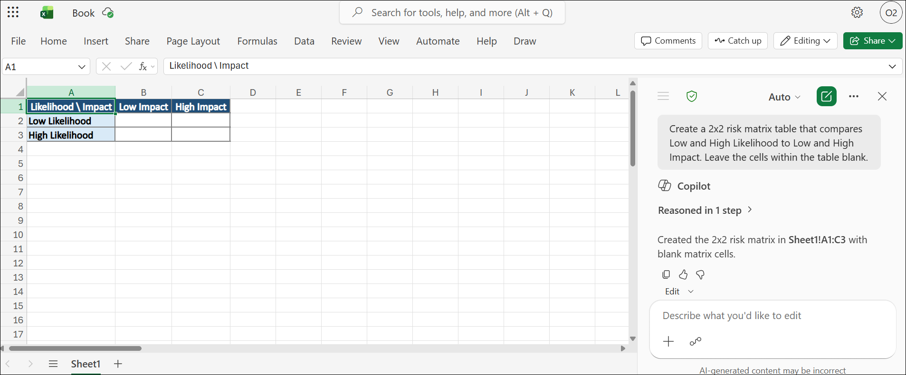
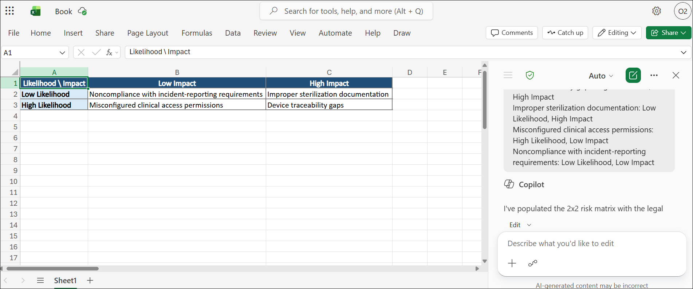
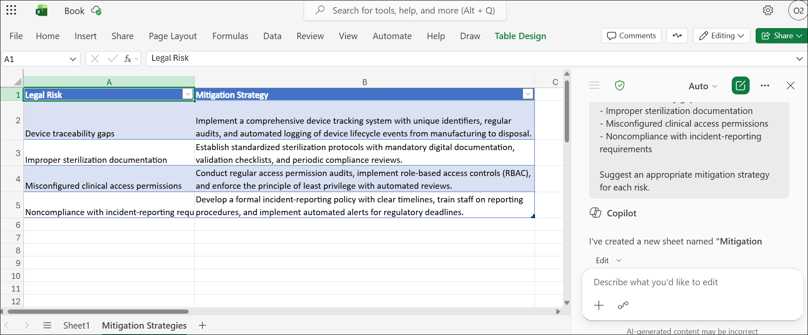
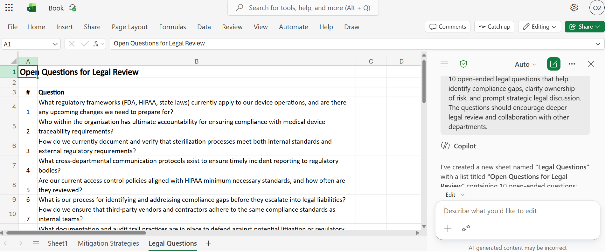

# Exercise 2, Task 2: Use Copilot in Excel to visualize cross department risk areas

## Scenario

At Lamna Healthcare Company, the Legal team is working on building a comprehensive risk assessment framework to identify and categorize potential legal or compliance risks within the business. With increasing regulations and the complexity of managing multiple legal requirements, the team wants to streamline their risk management process. To do so, they need a visual tool that helps them map out the risks and their associated mitigation strategies. As General Counsel, you’re tasked with helping the Legal team create and visualize this framework using Copilot in Microsoft Excel. You want to use Excel to help organize the data into a risk matrix and identify medical device compliance risks. This information can then be presented to department heads for further review and collaboration.

Your role is to guide your team in using Copilot in Excel to generate a 2x2 risk matrix, with axes for Likelihood and Impact. Copilot can then add key device compliance risks, including:

- Device traceability gaps

- Improper sterilization documentation

- Misconfigured clinical access permissions

- Noncompliance with incident‑reporting requirements

Copilot can then categorize each risk based on their risk levels. You want Copilot to color-code each quadrant to reflect the risk priority and help suggest mitigation actions for each identified risk. You also want to add a section for open questions, which can facilitate further legal review and discussion. This visual risk assessment should be a valuable tool for the Legal team to communicate with other departments, ensuring alignment and action on key compliance risks across Adatum Corporation.

This task uses the **Edit with Copilot** functionality and uses the default **Auto** selector mode.

## Lab Overview

In this hands-on lab, you will use Microsoft 365 Copilot in Excel to create and visualize a legal risk assessment framework for Lamna Healthcare Company. You will build a risk matrix, categorize compliance risks based on likelihood and impact, generate mitigation strategies, and identify key legal review questions. These visualizations will help support cross-department collaboration and informed compliance decision-making.

## Task 2: Use Copilot in Excel to visualize cross department risk areas

In this task, you will use Microsoft 365 Copilot in Excel to create a 2x2 risk matrix and map legal compliance risks according to their likelihood and impact. You will also generate mitigation strategies and open-ended legal review questions to support risk management and compliance discussions across departments.

1. In Microsoft Edge browser, navigate to the **Microsoft 365** home page, select **App launcher** in the navigation pane, and then select **Excel**.

2. In **Excel for the web**, create a new blank workbook.

3. From the Excel workbook, select the **Copilot** icon located at the bottom-right corner of the screen to open the Copilot pane.

1. In the Copilot pane, enter the provided prompt to create a 2x2 risk matrix comparing **Low** and **High Likelihood** against **Low** and **High Impact**, and then submit the prompt.

   ```
   Create a 2x2 risk matrix table that compares Low and High Likelihood to Low and High Impact. Leave the cells within the table blank.
   ```

5. Review the results. In cell **A1**, replace the **Column 1** value with **Likelihood/Impact**. If necessary, drag the column border to the right to see the entire value you just entered in A1.

    

1. In the **Copilot** prompt box, enter the provided prompt to populate the risk matrix with the specified legal risks based on their likelihood and impact, and then submit the prompt.

   ```
   Populate the matrix with the following legal risks in appropriate cells based on their Likelihood and Impact:

   Device traceability gaps: High Likelihood, High Impact
   Improper sterilization documentation: Low Likelihood, High Impact
   Misconfigured clinical access permissions: High Likelihood, Low Impact
   Noncompliance with incident-reporting requirements: Low Likelihood, Low Impact
   ```

1. Verify that each legal risk appears in the correct matrix cell based on its likelihood and impact, and then use **Edit with Copilot** to bold the values in cells **A2** and **A3**.

    

1. In the **Copilot** prompt box, enter:

   ```
   Bold the values in cells A2 and A3.
   ```

1. In the **Copilot** prompt box, enter the provided prompt to create a **Mitigation Strategies** worksheet containing a table of legal risks and suggested mitigation strategies, and then submit the prompt.

   ```
   Add a new sheet named Mitigation Strategies. Create a table with two columns: Legal Risk and Mitigation Strategy. Include the following risks in the Legal Risk column:

   - Device traceability gaps
   - Improper sterilization documentation
   - Misconfigured clinical access permissions
   - Noncompliance with incident-reporting requirements

   Suggest an appropriate mitigation strategy for each risk.
   ```

1. Review the **Mitigation Strategies** worksheet and verify that the table includes the **Legal Risk** and **Mitigation Strategy** columns with mitigation strategies for each listed legal risk.

    

1. In the **Copilot** prompt box, enter the provided prompt to create a worksheet titled **Open Questions for Legal Review** containing 10 open-ended legal review questions, and then submit the prompt.

   ```
   Add a new sheet that contains legal questions for review. Create a list titled "Open Questions for Legal Review". Include 10 open-ended legal questions that help identify compliance gaps, clarify ownership of risk, and prompt strategic legal discussion. The questions should encourage deeper legal review and collaboration with other departments.
   ```

1. Review the **Open Questions for Legal Review** worksheet and verify that it contains 10 open-ended questions focused on compliance gaps, risk ownership, and cross-department legal review.

   

10. Review the results. Feel free to have Copilot make other changes to any of the worksheets. For example, to format for readability and sharing, you could optionally adjust column widths and center text in the risk matrix table. Or you could submit any of Copilot’s suggested prompts that are of interest to you.

11. Once you finish updating the sheets in this workbook, you can close this tab in your Microsoft Edge browser.

## Summary

In this task, you used Microsoft 365 Copilot in Excel to create a visual risk assessment framework for legal and compliance risks. You built a risk matrix, categorized identified risks, generated mitigation strategies, and created a worksheet containing legal review questions. The completed workbook provides a structured way to evaluate compliance risks, track mitigation efforts, and facilitate cross-functional legal and compliance reviews.

## You have successfully completed the task. Click on Next >> to proceed with the next exercise.


