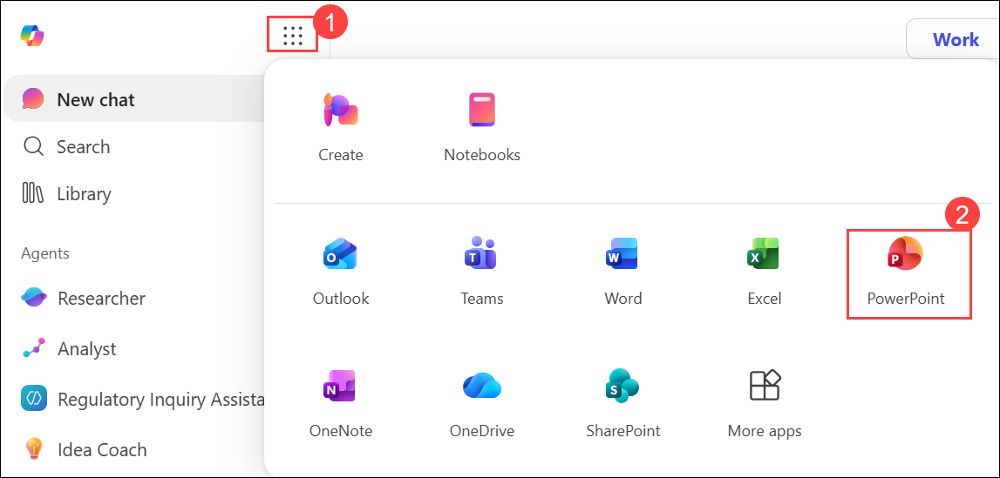
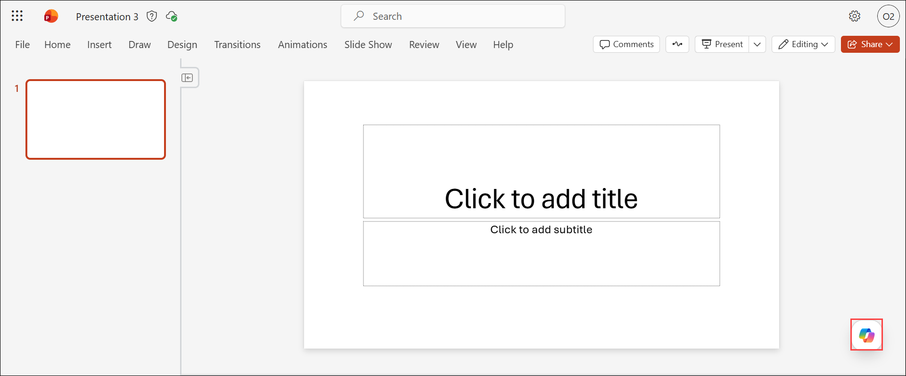
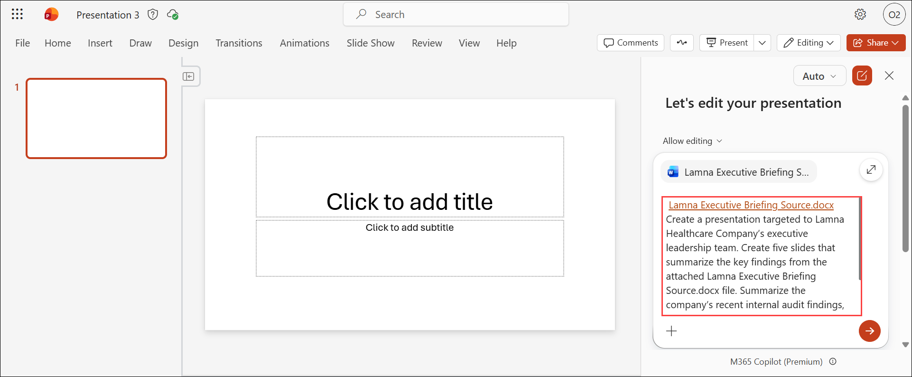
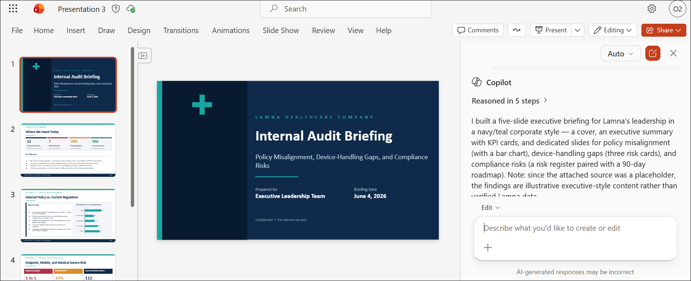
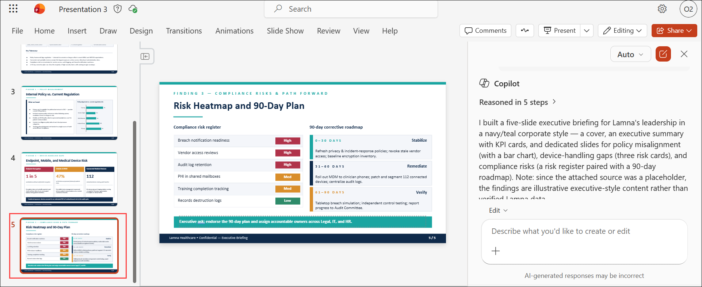
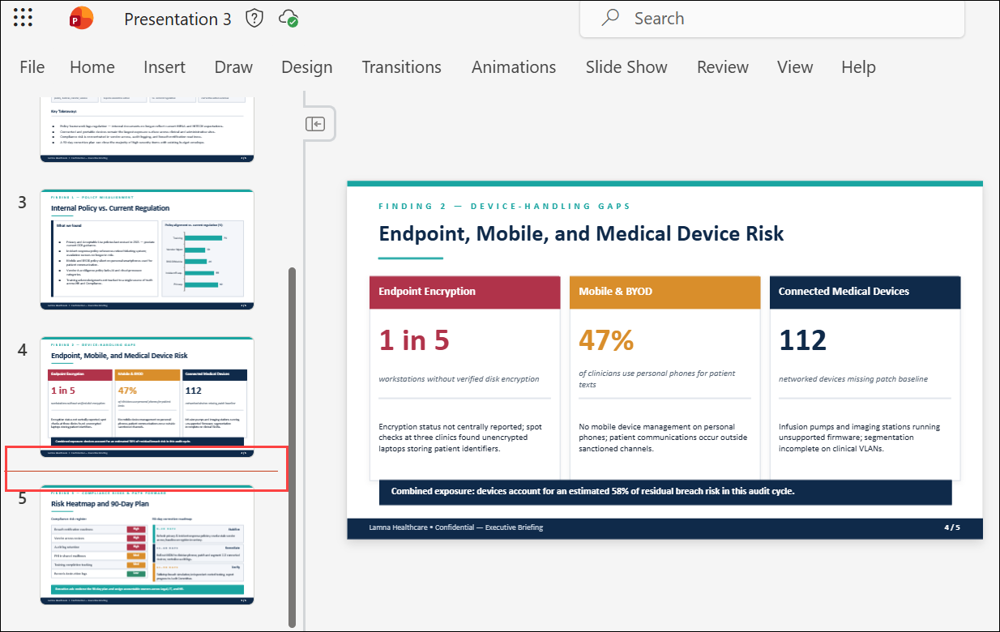
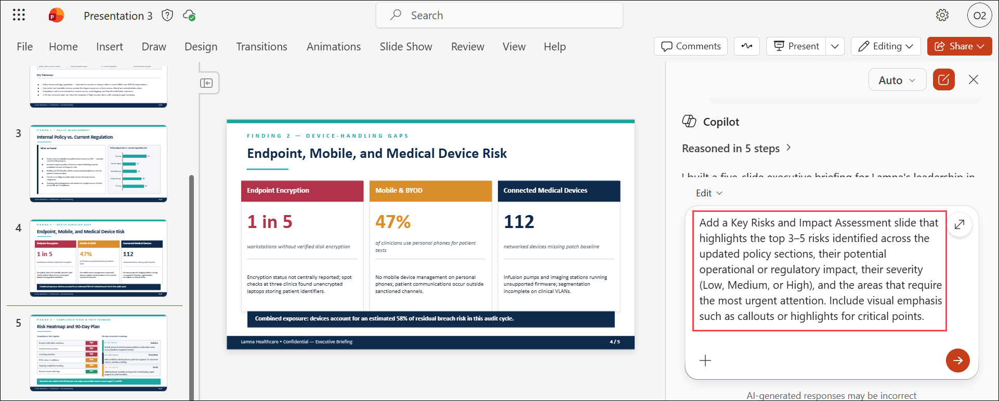
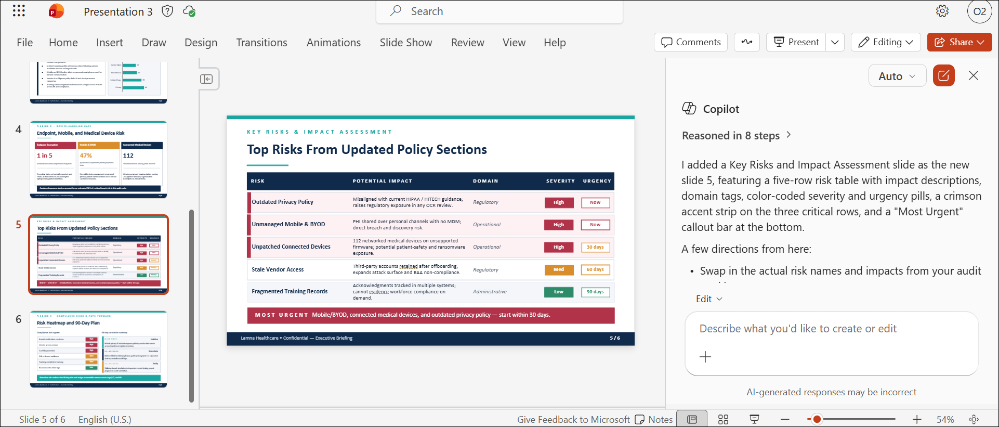
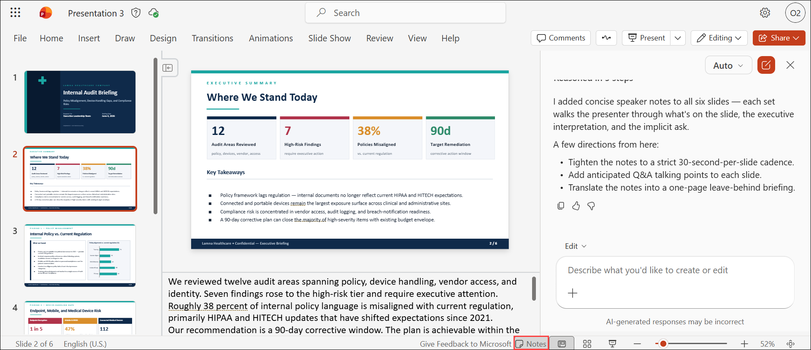

# Exercise 2, Task 3: Use Copilot in PowerPoint to create a legal presentation

## Scenario

Lamna Healthcare Company is preparing to present audit‑related findings to both executive leadership and its Board of Directors. The internal audit report highlighted multiple areas where department practices were inconsistent or insufficient, including device‑handling oversight, remote clinical access protocols, and documentation gaps tied to regulatory standards. As the company’s General Counsel, you tracked these findings in Loop (in Task 1) and compiled them into a document titled **Lamna Executive Briefing Source.docx** in your OneDrive folder.

You now want to create a **clean, executive‑ready slide deck** that distills these findings into a high‑level, visually compelling story. Using PowerPoint with Copilot, you plan to generate a briefing deck that summarizes the issues, illustrates departmental responsibilities, and presents a 90‑day corrective action roadmap. You want this deck to serve as the foundation for Lamna’s compliance reform initiative and board‑level reporting.

This task uses the **Edit with Copilot** functionality.

## Lab Overview

In this hands-on lab, you will use Microsoft 365 Copilot in PowerPoint to create an executive-ready presentation based on audit findings and policy updates for Lamna Healthcare Company. You will generate a professional slide deck from an existing briefing document, enhance it with risk analysis content, and prepare speaker notes for executive and board-level presentations. The resulting presentation will support compliance initiatives, governance reviews, and strategic decision-making.

## Task 3: Use Copilot in PowerPoint to create a legal presentation

In this task, you will use Microsoft 365 Copilot in PowerPoint to generate a five-slide executive briefing presentation from the Lamna Executive Briefing Source.docx document. You will add a risk assessment slide, review the generated content, and create speaker notes to support delivery to executive leadership and the Board of Directors.

1. In Microsoft Edge browser, navigate to the **Microsoft 365** home page, select **Apps launcher** in the navigation pane, and then select **PowerPoint**.

   

2. In **PowerPoint for the web**, create a blank presentation.

3. From the PowerPoint presentation, select **Copilot** icon located at the bottom-right corner of the screen to open the Copilot pane.

     

4. In the Copilot pane, select the **plus (+)** sign in the prompt field and then select **Add work content** in the drop-down menu. Attach the **Lamna Executive Briefing Source.docx** file that you created in Task 1.

5. Verify the **Allow editing** icon appears next to the plus (+) sign in the prompt field. 

1. In the **Copilot** prompt box, enter the provided prompt to create a five-slide executive presentation based on **Lamna Executive Briefing Source.docx**, and then submit the prompt.

     

1. Review the follow-up questions, select the options you want to apply, and then select **Confirm**. If prompted to choose a presentation template, either select a template or choose **Skip all** to let Copilot determine the presentation design.

8. Copilot in PowerPoint uses this information to generate a list of slides, which might take a few minutes.

1. If Copilot generates an outline instead of slides, select the option to create the slides based on the generated outline.

1. Review the results.

    

1. In the slide thumbnail pane, select the location between **Slide 4** and **Slide 5 (Risk Heatmap and 90-Day Plan)**, and verify that an red insertion line appears before the slide.

    

    

1. After selecting that insertion point, enter this prompt in Copilot pane:

     ```
     Add a Key Risks and Impact Assessment slide that highlights the top 3–5 risks identified across the updated policy sections, their potential operational or regulatory impact, their severity (Low, Medium, or High), and the areas that require the most urgent attention. Include visual emphasis such as callouts or highlights for critical points.
     ```

     

1. Review the **Key Risks and Impact Assessment** slide and verify that it includes risk details, impact information, severity indicators, and visual emphasis for critical points.

    

1. Verify that the **Key Risks and Impact Assessment** slide appears immediately before the **Risk Heatmap and 90-Day Plan** slide.

14. One of the requirements is to include speaker notes for each slide. Check several of the slides to verify whether speaker notes were assigned at the time Copilot created the slides. 
    
1. Select **Notes** in the bottom-right corner of the PowerPoint window. Sometimes, all the slides included proper speaker notes. Other times, some slides had speaker notes and others didn’t.

1. If speaker notes aren't available, use **Edit with Copilot** to create concise speaker notes for every slide, and then review the generated notes.
    
    ```
    Create concise speaker notes for every slide. The notes should explain the content on each slide and summarize the key points for presentation to Lamna Healthcare Company’s executive leadership team.
    ```

15. Review the speaker notes that Copilot generated.

     

## Summary

In this task, you used Microsoft 365 Copilot in PowerPoint to create an executive presentation based on Lamna Healthcare Company's audit findings and policy updates. You generated slides from an existing briefing document, added a Key Risks and Impact Assessment slide, and reviewed the presentation structure and content. You also verified and generated speaker notes to ensure the deck was ready for executive and board-level discussions on compliance improvements and corrective action planning.

## You have successfully completed the task. Click on Next >> to proceed with the next exercise.


