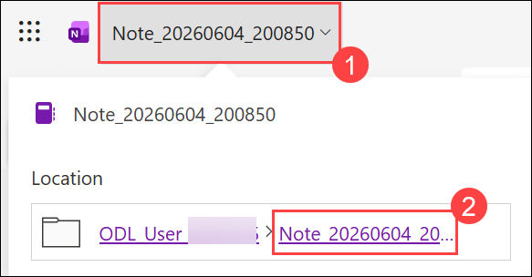
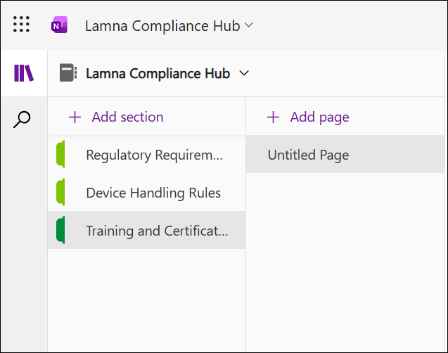
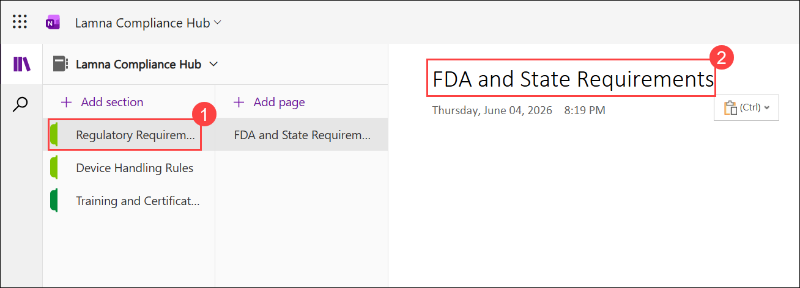
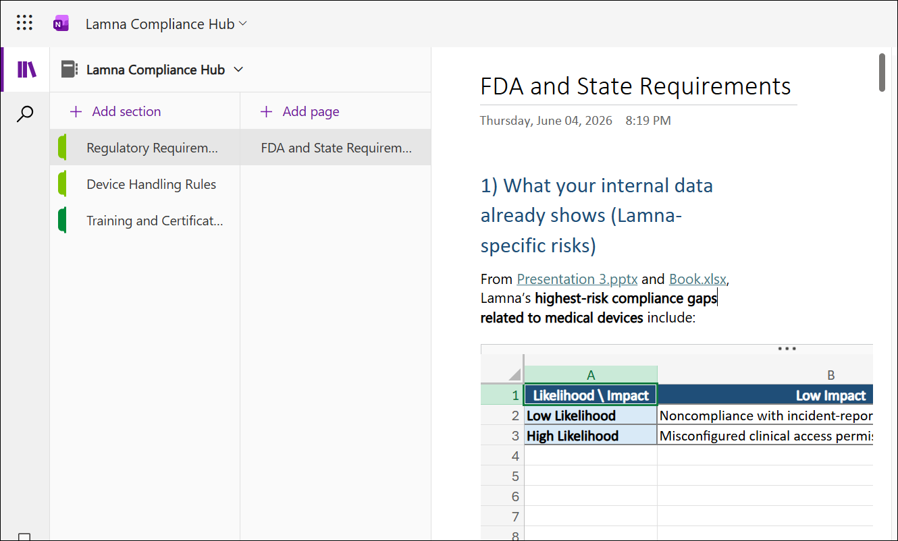

# Exercise 2, Task 4: Use Copilot in OneNote to create a compliance notebook

## Scenario

Lamna Healthcare Company’s compliance issues stem partly from teams using different versions of policies, outdated reference materials, or relying on tribal knowledge. The Legal and Compliance departments need a single, consistently updated knowledge hub where employees across IT, Legal, Clinical Operations, and QA can access the latest rules, role requirements, checklists, and training expectations.

You’re tasked with creating a Lamna Compliance Hub in OneNote. To do so, you plan to use Copilot to draft the foundational content. Lamna plans to use this notebook as the operational playbook for its compliance overhaul, ensuring every team remains aligned with  accurate, easily accessible guidance as reform efforts roll out.

## Lab Overview

In this hands-on lab, you will use Microsoft 365 Copilot in OneNote to build a centralized compliance knowledge hub for Lamna Healthcare Company. You will create structured sections covering regulatory requirements, device handling procedures, training obligations, and compliance planning. The resulting notebook will provide employees with a single source of truth for compliance guidance, operational procedures, and certification requirements.

## Task 4: Use Copilot in OneNote to create a compliance notebook

In this task, you will use Microsoft 365 Copilot in OneNote to generate compliance-related content for a compliance notebook. You will create pages for regulatory requirements, chain-of-custody procedures, certifications, and compliance planning, while organizing the information into a user-friendly knowledge hub.

1. In Microsoft Edge browser, navigate to the **Microsoft 365** home page, select **App launcher** in the navigation pane, and then select **OneNote**.

2. In **OneNote for the web**, create a new notebook. 

1. Click the notebook name **(1)** at the top-left. In the menu that appears, locate the notebook under Location and click the notebook name link **(2)**.

    

1. In OneDrive. Right-click the notebook and select Rename.

1. Enter the name as **Lamna Compliance Hub** and select **Update**.

1. Create the **Regulatory Requirements**, **Device Handling Rules**, and **Training and Certification** sections in the **Lamna Compliance Hub** notebook.

3. Navigate back to the notebook, add the following sections by clicking **+ Add section**:

    - Regulatory Requirements

    - Device Handling Rules

    - Training and Certification

      

4. Select **Copilot** in the menu bar to open the Copilot pane. If announcements appear, select the **Skip** button at the bottom of the Copilot pane to close them.

5. Select the **Regulatory Requirements (1)** section. Change the title of the page to **FDA and State Requirements (2)**. 

    

1. Enter the provided prompt in the Copilot pane, and then submit the prompt.

   ```
   Summarize the primary FDA and state-level compliance requirements relevant to Lamna Healthcare Company’s medical devices in plain, actionable language.
   ```

1. Review Copilot’s response. Select **Copy** below the Copilot response, paste the generated content into the **FDA and State Requirements** page, and then remove any extraneous conversational text that was copied in at the start and end of the content.

   

1. In the Copilot pane, enter a prompt to generate an **FDA and state compliance matrix** for medical devices, and then submit the prompt.

   ```
   Create an FDA and state compliance matrix for Lamna Healthcare Company’s medical devices. Include key regulatory areas, applicable FDA and state requirements, responsible departments, required documentation, review frequency, and compliance considerations. Present the results in a clear matrix format suitable for a compliance knowledge hub.
   ```

1. Review the generated compliance matrix, select **Copy**, paste the content at the end of the **FDA and State Requirements** page, and then remove any extraneous conversational text that was copied with the response.

8. Select the **Device Handling Rules** section. Change the title of the page to **Chain of Custody Checklist**, then enter the provided prompt in the Copilot pane.

   ```
   Draft a checklist for maintaining chain-of-custody for remote clinical devices.
   ```

1. Review the content. Ask Copilot to convert the generated content into a fillable checklist, copy the generated checklist, paste it into the **Chain of Custody Checklist** page, and then remove any extraneous conversational text that was copied in at the start and end of the content..

   ```
   Convert this content into a fillable checklist.
   ```

10. Select the **Training and Certification** section. Change the title of the page to **Roles and Certifications** and then enter the provided prompt in the Copilot pane.

    ```
    Create a table listing required roles and mandatory compliance certifications for Lamna Healthcare Company.
    ```

1. Review the content. Select **Copy** below the Copilot response, paste the generated table into the **Roles and Certifications** page, and then remove any extraneous conversational text.

1. Verify that the **Roles and Certifications** page contains the generated roles and certifications table.

1. In the Copilot pane, enter the provided prompt to generate a compliance roadmap, and then submit the prompt.

   ```
   Generate a compliance roadmap that outlines the steps needed to implement these compliance measures.
   ```

1. Ask Copilot to convert the compliance roadmap into a OneNote-formatted Compliance Program page that uses headings, indentation, bullets, and checkboxes.

   ```
   Turn this content into a OneNote-formatted Compliance Program page that uses OneNote-friendly headings, indentation, bullets, and checkboxes.
   ```

1. Review the content. Select **Copy** below the Copilot response, paste the generated Compliance Program content at the end of the **Roles and Certifications** page, and then remove any extraneous conversational text.

14. Review the content. This revised content version looks clean and user-friendly, copy the content and paste it at the end of the **Roles and Certifications** page. Delete any extraneous conversational text that was copied in at the start and end of the content.

1. Review the completed **Lamna Compliance Hub** notebook and verify that the **FDA and State Requirements**, **Chain of Custody Checklist**, and **Roles and Certifications** pages contain the generated compliance guidance and supporting content.

## Summary

In this task, you used Microsoft 365 Copilot in OneNote to create the Lamna Compliance Hub notebook. You generated regulatory guidance, compliance matrices, chain-of-custody checklists, role-based certification requirements, and a compliance implementation roadmap. The completed notebook provides a centralized repository of compliance information that supports consistent policy adoption, employee training, and ongoing regulatory compliance efforts across the organization.

## You have successfully completed the task. Click on Next >> to proceed with the next exercise.


